# Phase 3 Behavior Dataset Manual Side-by-Side Comparison Pack
*MmCows vs. CBVD-5 for Primary vs. External Behavior Evaluation*

> **Auditor Context**:  
> Generated deterministically (`seed=42`) by `scripts/audit_behavior_dataset_candidates.py`.  
> This visual pack provides direct, side-by-side human inspection of real samples from **MmCows** (current primary) and **CBVD-5** (current external validation) across 14 behavior dimensions.  
>  
> **Key Architectural Question**:  
> Should CBVD-5 remain an **external validation benchmark**, or should it replace MmCows as the **primary behavior training dataset**?  

---

## Metric Scorecard: MmCows vs. CBVD-5

| Forensic Dimension | MmCows (Current Primary) | CBVD-5 (Current External) | Scientific Advantage |
|---|---|---|---|
| **Biological Cow IDs** | **16 verified biological Holstein cows** (Ear-tag verified; NeurIPS 2024 Spotlight) | **ZERO annotated cow IDs** (Dummy actor ID `1` hardcoded across all annotations) | **MmCows** (Permits 100% cow-disjoint evaluation) |
| **Total Labeled Units** | **213,686 single-label bounding-box crops** | **25,324 multi-label bounding boxes** across 5,322 frames | **MmCows** (8.4x more labeled instances) |
| **Video Footprint** | 21.0 hours continuous CCTV (4 cams; source MP4s purged locally; crops preserved) | 887 MP4 videos (10s each = 2.46 hours; 206,100 raw frames) | **CBVD-5** for raw MP4s; **MmCows** for temporal depth (21h vs 2.5h) |
| **Native Frame Size** | CCTV Full HD / 2K | 1080p Full HD (1920x1080) | **Tie** (~1080p native video) |
| **Cow Crop Resolution** | **Mean: 409 x 386 px** (Median: 390 x 370 px) | **Mean: 177 x 217 px** (Median: 156 x 167 px) | **MmCows** (Cow crops are 2.5x larger in area) |
| **Visual Sharpness / Blur** | Lower perceived sharpness when zoomed (CCTV compression & motion blur) | High scene sharpness; tiny cow crops look blocky when zoomed | **Trade-off** (Scene vs Crop) |
| **Behavior Taxonomy** | **7 mutually exclusive classes** (Walk, Stand, Feed Up, Feed Down, Lick, Drink, Lie) | **5 multi-label attributes** (Stand, Lie, Forage, Drink, Rumination) | **MmCows** (Includes Walk & Lick; clean single-label) |
| **Rumination Label** | Absent (Not labeled) | **Present** (6,079 bboxes co-occurring with Lie or Stand) | **CBVD-5** (If rumination is required) |
| **Leakage Protection** | **100% Cow-Disjoint Grouped Evaluation** verified across canonical split & 4 folds | **Video-disjoint only** (Same cow can cross training & test clips freely) | **MmCows** (Zero identity leakage) |
| **Camera Provenance** | 4 synchronized cameras with verified multi-view events (87.15% sync) | Single wide CCTV ceiling views; no multi-camera calibration | **MmCows** (Evaluates multi-view representation) |

---

## 14 Paired Side-by-Side Visual Comparisons

For each pair below, inspect the **MmCows Crop** (Left) against the **CBVD-5 Crop & Scene Context** (Right).

### [COMP-01] Standard Standing Posture
**Inspection Focus**: Compare standard upright posture framing, resolution, and background clarity.

| Inspection Metric | MmCows Sample (Primary) | CBVD-5 Sample (External) |
|---|---|---|
| **Image Asset** | 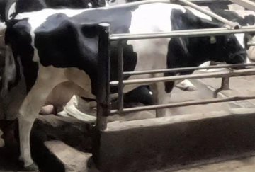 | 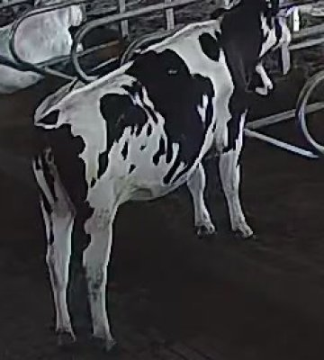 |
| **Full Scene Context** | *Crop provided directly in dataset* | 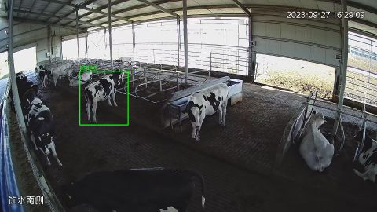 |
| **Crop Resolution** | `758x513` | `246x274` (Scene: `1920x1080`) |
| **Behavior Label** | **Standing** (Class 2) | **stand** |
| **Biological Cow ID** | **Cow 9** (Verified individual) | **UNKNOWN / HERD MEMBER** (No ID annotated) |
| **Camera & Setting** | Camera 1 (`TRAIN`) | Video `618.mp4` (Frame: `618_00002.jpg`) |
| **Temporal Source** | `2023-07-25T07:57:26Z` (Event: `ev_1690271846_c9`) | Still frame at 1.0s interval |

**Human Visual Sanity Checklist**:
```markdown
MmCows:  [ ] Cow clearly visible   [ ] Posture plausible   [ ] Crop usable   Verdict: [ ] PASS  [ ] QUESTIONABLE  [ ] FAIL
CBVD-5:  [ ] Cow clearly visible   [ ] Posture plausible   [ ] Crop usable   Verdict: [ ] PASS  [ ] QUESTIONABLE  [ ] FAIL
```
*Auditor Observations*: __________________________________________________

---
### [COMP-02] Lying Down (Cubicle / Bedding)
**Inspection Focus**: Compare recumbent resting posture and bed/floor boundary segmentation.

| Inspection Metric | MmCows Sample (Primary) | CBVD-5 Sample (External) |
|---|---|---|
| **Image Asset** | 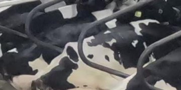 | 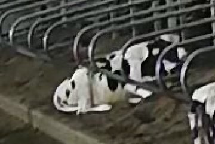 |
| **Full Scene Context** | *Crop provided directly in dataset* | 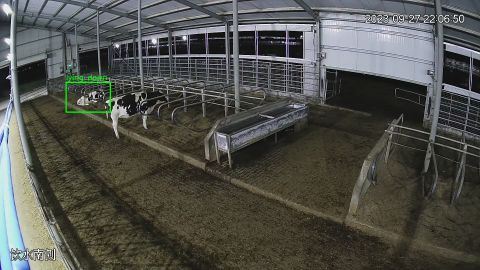 |
| **Crop Resolution** | `461x231` | `177x119` (Scene: `1920x1080`) |
| **Behavior Label** | **Lying** (Class 7) | **lying down** |
| **Biological Cow ID** | **Cow 3** (Verified individual) | **UNKNOWN / HERD MEMBER** (No ID annotated) |
| **Camera & Setting** | Camera 3 (`TRAIN`) | Video `624.mp4` (Frame: `624_00005.jpg`) |
| **Temporal Source** | `2023-07-25T07:57:26Z` (Event: `ev_1690271846_c3`) | Still frame at 1.0s interval |

**Human Visual Sanity Checklist**:
```markdown
MmCows:  [ ] Cow clearly visible   [ ] Posture plausible   [ ] Crop usable   Verdict: [ ] PASS  [ ] QUESTIONABLE  [ ] FAIL
CBVD-5:  [ ] Cow clearly visible   [ ] Posture plausible   [ ] Crop usable   Verdict: [ ] PASS  [ ] QUESTIONABLE  [ ] FAIL
```
*Auditor Observations*: __________________________________________________

---
### [COMP-03] Active Feeding / Foraging (Muzzle at Trough)
**Inspection Focus**: Examine feed bunk context and head angle visibility.

| Inspection Metric | MmCows Sample (Primary) | CBVD-5 Sample (External) |
|---|---|---|
| **Image Asset** | 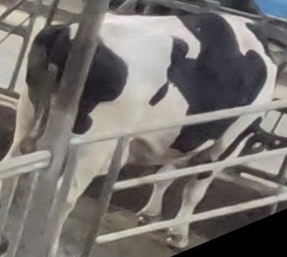 |  |
| **Full Scene Context** | *Crop provided directly in dataset* | 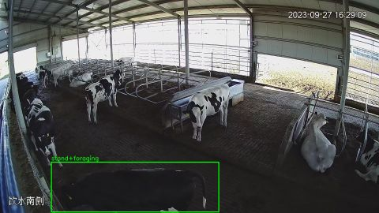 |
| **Crop Resolution** | `494x443` | `848x252` (Scene: `1920x1080`) |
| **Behavior Label** | **Feeding_head_down** (Class 4) | **stand+foraging** |
| **Biological Cow ID** | **Cow 1** (Verified individual) | **UNKNOWN / HERD MEMBER** (No ID annotated) |
| **Camera & Setting** | Camera 1 (`TRAIN`) | Video `618.mp4` (Frame: `618_00002.jpg`) |
| **Temporal Source** | `2023-07-25T07:57:26Z` (Event: `ev_1690271846_c1`) | Still frame at 1.0s interval |

**Human Visual Sanity Checklist**:
```markdown
MmCows:  [ ] Cow clearly visible   [ ] Posture plausible   [ ] Crop usable   Verdict: [ ] PASS  [ ] QUESTIONABLE  [ ] FAIL
CBVD-5:  [ ] Cow clearly visible   [ ] Posture plausible   [ ] Crop usable   Verdict: [ ] PASS  [ ] QUESTIONABLE  [ ] FAIL
```
*Auditor Observations*: __________________________________________________

---
### [COMP-04] Feeding Transition (Head Up at Bunk)
**Inspection Focus**: MmCows explicitly distinguishes head-up vs head-down feeding; CBVD lumps all as foraging.

| Inspection Metric | MmCows Sample (Primary) | CBVD-5 Sample (External) |
|---|---|---|
| **Image Asset** | 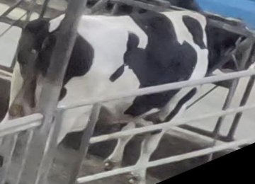 | 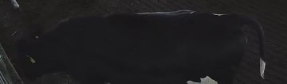 |
| **Full Scene Context** | *Crop provided directly in dataset* |  |
| **Crop Resolution** | `584x422` | `848x252` (Scene: `1920x1080`) |
| **Behavior Label** | **Feeding_head_up** (Class 3) | **stand+foraging** |
| **Biological Cow ID** | **Cow 1** (Verified individual) | **UNKNOWN / HERD MEMBER** (No ID annotated) |
| **Camera & Setting** | Camera 1 (`TRAIN`) | Video `618.mp4` (Frame: `618_00002.jpg`) |
| **Temporal Source** | `2023-07-25T07:57:56Z` (Event: `ev_1690271876_c1`) | Still frame at 1.0s interval |

**Human Visual Sanity Checklist**:
```markdown
MmCows:  [ ] Cow clearly visible   [ ] Posture plausible   [ ] Crop usable   Verdict: [ ] PASS  [ ] QUESTIONABLE  [ ] FAIL
CBVD-5:  [ ] Cow clearly visible   [ ] Posture plausible   [ ] Crop usable   Verdict: [ ] PASS  [ ] QUESTIONABLE  [ ] FAIL
```
*Auditor Observations*: __________________________________________________

---
### [COMP-05] Drinking Behavior at Water Trough
**Inspection Focus**: Examine drinker tank framing and muzzle immersion.

| Inspection Metric | MmCows Sample (Primary) | CBVD-5 Sample (External) |
|---|---|---|
| **Image Asset** |  | 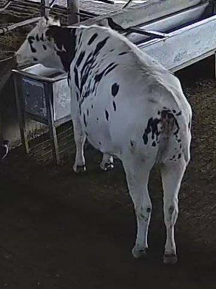 |
| **Full Scene Context** | *Crop provided directly in dataset* | 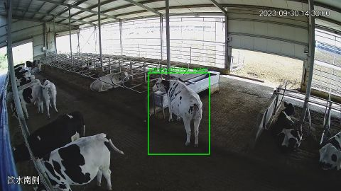 |
| **Crop Resolution** | `169x228` | `344x460` (Scene: `1920x1080`) |
| **Behavior Label** | **Drinking** (Class 6) | **stand+drinking water** |
| **Biological Cow ID** | **Cow 9** (Verified individual) | **UNKNOWN / HERD MEMBER** (No ID annotated) |
| **Camera & Setting** | Camera 1 (`TRAIN`) | Video `689.mp4` (Frame: `689_00003.jpg`) |
| **Temporal Source** | `2023-07-25T08:02:11Z` (Event: `ev_1690272131_c9`) | Still frame at 1.0s interval |

**Human Visual Sanity Checklist**:
```markdown
MmCows:  [ ] Cow clearly visible   [ ] Posture plausible   [ ] Crop usable   Verdict: [ ] PASS  [ ] QUESTIONABLE  [ ] FAIL
CBVD-5:  [ ] Cow clearly visible   [ ] Posture plausible   [ ] Crop usable   Verdict: [ ] PASS  [ ] QUESTIONABLE  [ ] FAIL
```
*Auditor Observations*: __________________________________________________

---
### [COMP-06] Foreground Occlusion (Stall Partition Rails)
**Inspection Focus**: Evaluate how pen structures (metal bars, fences) obstruct cattle contours.

| Inspection Metric | MmCows Sample (Primary) | CBVD-5 Sample (External) |
|---|---|---|
| **Image Asset** |  | 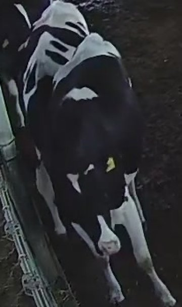 |
| **Full Scene Context** | *Crop provided directly in dataset* | 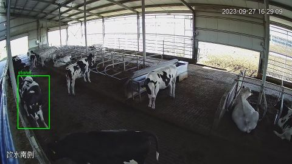 |
| **Crop Resolution** | `352x240` | `206x348` (Scene: `1920x1080`) |
| **Behavior Label** | **Lying** (Class 7) | **stand** |
| **Biological Cow ID** | **Cow 11** (Verified individual) | **UNKNOWN / HERD MEMBER** (No ID annotated) |
| **Camera & Setting** | Camera 4 (`TRAIN`) | Video `618.mp4` (Frame: `618_00002.jpg`) |
| **Temporal Source** | `2023-07-25T08:01:41Z` (Event: `ev_1690272101_c11`) | Still frame at 1.0s interval |

**Human Visual Sanity Checklist**:
```markdown
MmCows:  [ ] Cow clearly visible   [ ] Posture plausible   [ ] Crop usable   Verdict: [ ] PASS  [ ] QUESTIONABLE  [ ] FAIL
CBVD-5:  [ ] Cow clearly visible   [ ] Posture plausible   [ ] Crop usable   Verdict: [ ] PASS  [ ] QUESTIONABLE  [ ] FAIL
```
*Auditor Observations*: __________________________________________________

---
### [COMP-07] Crowding & Multiple Cows in Frame
**Inspection Focus**: Compare bounding-box separation when multiple animals overlap.

| Inspection Metric | MmCows Sample (Primary) | CBVD-5 Sample (External) |
|---|---|---|
| **Image Asset** | 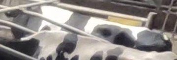 |  |
| **Full Scene Context** | *Crop provided directly in dataset* | 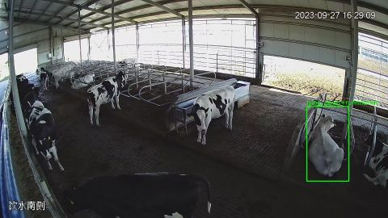 |
| **Crop Resolution** | `439x149` | `208x370` (Scene: `1920x1080`) |
| **Behavior Label** | **Standing** (Class 2) | **lying down+rumination** |
| **Biological Cow ID** | **Cow 9** (Verified individual) | **UNKNOWN / HERD MEMBER** (No ID annotated) |
| **Camera & Setting** | Camera 2 (`TRAIN`) | Video `618.mp4` (Frame: `618_00002.jpg`) |
| **Temporal Source** | `2023-07-25T07:57:26Z` (Event: `ev_1690271846_c9`) | Still frame at 1.0s interval |

**Human Visual Sanity Checklist**:
```markdown
MmCows:  [ ] Cow clearly visible   [ ] Posture plausible   [ ] Crop usable   Verdict: [ ] PASS  [ ] QUESTIONABLE  [ ] FAIL
CBVD-5:  [ ] Cow clearly visible   [ ] Posture plausible   [ ] Crop usable   Verdict: [ ] PASS  [ ] QUESTIONABLE  [ ] FAIL
```
*Auditor Observations*: __________________________________________________

---
### [COMP-08] Dynamic Motion & Fast Movement
**Inspection Focus**: Inspect motion blur on cow legs and hoof articulation.

| Inspection Metric | MmCows Sample (Primary) | CBVD-5 Sample (External) |
|---|---|---|
| **Image Asset** |  | 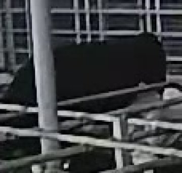 |
| **Full Scene Context** | *Crop provided directly in dataset* | 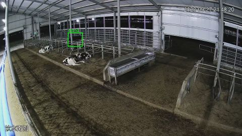 |
| **Crop Resolution** | `294x409` | `114x108` (Scene: `1920x1080`) |
| **Behavior Label** | **Walking** (Class 1) | **stand** |
| **Biological Cow ID** | **Cow 5** (Verified individual) | **UNKNOWN / HERD MEMBER** (No ID annotated) |
| **Camera & Setting** | Camera 1 (`TEST`) | Video `623.mp4` (Frame: `623_00007.jpg`) |
| **Temporal Source** | `2023-07-25T08:00:26Z` (Event: `ev_1690272026_c5`) | Still frame at 1.0s interval |

**Human Visual Sanity Checklist**:
```markdown
MmCows:  [ ] Cow clearly visible   [ ] Posture plausible   [ ] Crop usable   Verdict: [ ] PASS  [ ] QUESTIONABLE  [ ] FAIL
CBVD-5:  [ ] Cow clearly visible   [ ] Posture plausible   [ ] Crop usable   Verdict: [ ] PASS  [ ] QUESTIONABLE  [ ] FAIL
```
*Auditor Observations*: __________________________________________________

---
### [COMP-09] Walking Behavior (Present in MmCows / Absent in CBVD)
**Inspection Focus**: MmCows tracks walking stride (4,118 crops); CBVD-5 completely lacks a walking label.

| Inspection Metric | MmCows Sample (Primary) | CBVD-5 Sample (External) |
|---|---|---|
| **Image Asset** | 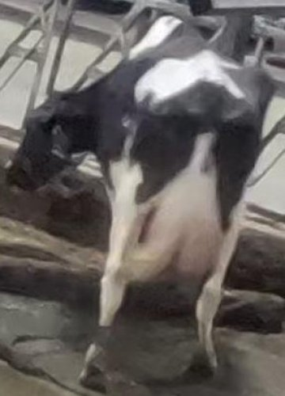 | 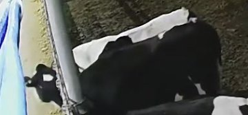 |
| **Full Scene Context** | *Crop provided directly in dataset* | 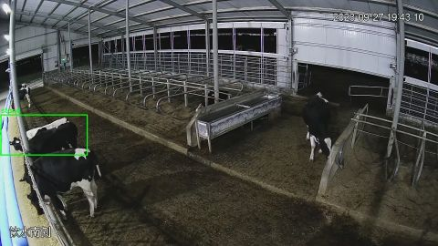 |
| **Crop Resolution** | `294x409` | `378x176` (Scene: `1920x1080`) |
| **Behavior Label** | **Walking** (Class 1) | **stand** |
| **Biological Cow ID** | **Cow 5** (Verified individual) | **UNKNOWN / HERD MEMBER** (No ID annotated) |
| **Camera & Setting** | Camera 1 (`TEST`) | Video `621.mp4` (Frame: `621_00004.jpg`) |
| **Temporal Source** | `2023-07-25T08:00:26Z` (Event: `ev_1690272026_c5`) | Still frame at 1.0s interval |

**Human Visual Sanity Checklist**:
```markdown
MmCows:  [ ] Cow clearly visible   [ ] Posture plausible   [ ] Crop usable   Verdict: [ ] PASS  [ ] QUESTIONABLE  [ ] FAIL
CBVD-5:  [ ] Cow clearly visible   [ ] Posture plausible   [ ] Crop usable   Verdict: [ ] PASS  [ ] QUESTIONABLE  [ ] FAIL
```
*Auditor Observations*: __________________________________________________

---
### [COMP-10] Licking Behavior (Rare Class in MmCows / Absent in CBVD)
**Inspection Focus**: MmCows provides 2,009 rare self-grooming samples; CBVD-5 has no grooming category.

| Inspection Metric | MmCows Sample (Primary) | CBVD-5 Sample (External) |
|---|---|---|
| **Image Asset** | 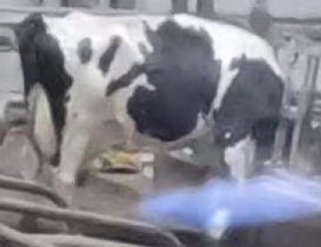 |  |
| **Full Scene Context** | *Crop provided directly in dataset* |  |
| **Crop Resolution** | `270x208` | `848x252` (Scene: `1920x1080`) |
| **Behavior Label** | **Licking** (Class 5) | **stand+foraging** |
| **Biological Cow ID** | **Cow 12** (Verified individual) | **UNKNOWN / HERD MEMBER** (No ID annotated) |
| **Camera & Setting** | Camera 1 (`TRAIN`) | Video `618.mp4` (Frame: `618_00002.jpg`) |
| **Temporal Source** | `2023-07-25T08:15:11Z` (Event: `ev_1690272911_c12`) | Still frame at 1.0s interval |

**Human Visual Sanity Checklist**:
```markdown
MmCows:  [ ] Cow clearly visible   [ ] Posture plausible   [ ] Crop usable   Verdict: [ ] PASS  [ ] QUESTIONABLE  [ ] FAIL
CBVD-5:  [ ] Cow clearly visible   [ ] Posture plausible   [ ] Crop usable   Verdict: [ ] PASS  [ ] QUESTIONABLE  [ ] FAIL
```
*Auditor Observations*: __________________________________________________

---
### [COMP-11] Rumination (Lying Down Chewing Cud)
**Inspection Focus**: CBVD labels 4,955 instances of rumination while lying; MmCows has no rumination label.

| Inspection Metric | MmCows Sample (Primary) | CBVD-5 Sample (External) |
|---|---|---|
| **Image Asset** | 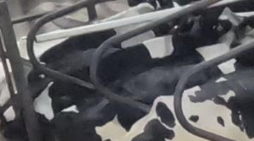 | 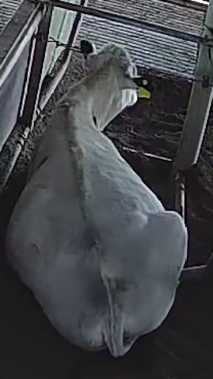 |
| **Full Scene Context** | *Crop provided directly in dataset* |  |
| **Crop Resolution** | `406x227` | `208x370` (Scene: `1920x1080`) |
| **Behavior Label** | **Lying** (Class 7) | **lying down+rumination** |
| **Biological Cow ID** | **Cow 7** (Verified individual) | **UNKNOWN / HERD MEMBER** (No ID annotated) |
| **Camera & Setting** | Camera 3 (`VAL`) | Video `618.mp4` (Frame: `618_00002.jpg`) |
| **Temporal Source** | `2023-07-25T07:57:26Z` (Event: `ev_1690271846_c7`) | Still frame at 1.0s interval |

**Human Visual Sanity Checklist**:
```markdown
MmCows:  [ ] Cow clearly visible   [ ] Posture plausible   [ ] Crop usable   Verdict: [ ] PASS  [ ] QUESTIONABLE  [ ] FAIL
CBVD-5:  [ ] Cow clearly visible   [ ] Posture plausible   [ ] Crop usable   Verdict: [ ] PASS  [ ] QUESTIONABLE  [ ] FAIL
```
*Auditor Observations*: __________________________________________________

---
### [COMP-12] Rumination (Standing Chewing Cud)
**Inspection Focus**: CBVD labels 1,124 instances of rumination while standing.

| Inspection Metric | MmCows Sample (Primary) | CBVD-5 Sample (External) |
|---|---|---|
| **Image Asset** | 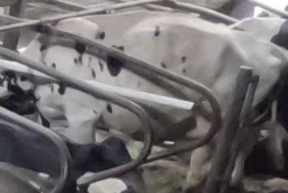 | 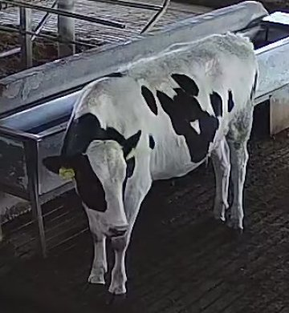 |
| **Full Scene Context** | *Crop provided directly in dataset* | 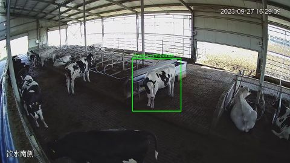 |
| **Crop Resolution** | `499x336` | `321x349` (Scene: `1920x1080`) |
| **Behavior Label** | **Standing** (Class 2) | **stand+rumination** |
| **Biological Cow ID** | **Cow 13** (Verified individual) | **UNKNOWN / HERD MEMBER** (No ID annotated) |
| **Camera & Setting** | Camera 2 (`VAL`) | Video `618.mp4` (Frame: `618_00002.jpg`) |
| **Temporal Source** | `2023-07-25T08:01:11Z` (Event: `ev_1690272071_c13`) | Still frame at 1.0s interval |

**Human Visual Sanity Checklist**:
```markdown
MmCows:  [ ] Cow clearly visible   [ ] Posture plausible   [ ] Crop usable   Verdict: [ ] PASS  [ ] QUESTIONABLE  [ ] FAIL
CBVD-5:  [ ] Cow clearly visible   [ ] Posture plausible   [ ] Crop usable   Verdict: [ ] PASS  [ ] QUESTIONABLE  [ ] FAIL
```
*Auditor Observations*: __________________________________________________

---
### [COMP-13] Multi-Camera Synchronization (MmCows verified)
**Inspection Focus**: MmCows provides simultaneous multi-camera capture of identical moments; CBVD has single viewpoints.

| Inspection Metric | MmCows Sample (Primary) | CBVD-5 Sample (External) |
|---|---|---|
| **Image Asset** |  | 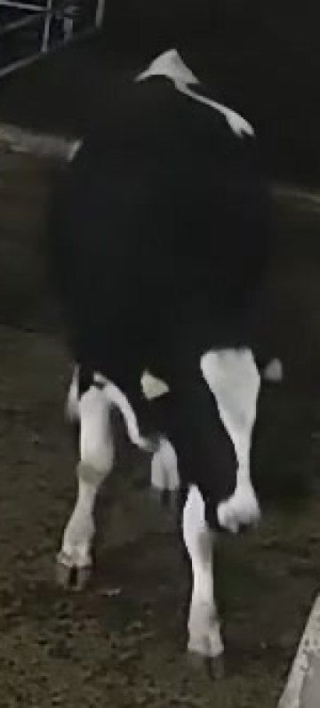 |
| **Full Scene Context** | *Crop provided directly in dataset* | 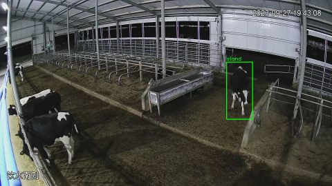 |
| **Crop Resolution** | `494x443` | `150x332` (Scene: `1920x1080`) |
| **Behavior Label** | **Feeding_head_down** (Class 4) | **stand** |
| **Biological Cow ID** | **Cow 1** (Verified individual) | **UNKNOWN / HERD MEMBER** (No ID annotated) |
| **Camera & Setting** | Camera 1 (`TRAIN`) | Video `621.mp4` (Frame: `621_00002.jpg`) |
| **Temporal Source** | `2023-07-25T07:57:26Z` (Event: `ev_1690271846_c1`) | Still frame at 1.0s interval |

**Human Visual Sanity Checklist**:
```markdown
MmCows:  [ ] Cow clearly visible   [ ] Posture plausible   [ ] Crop usable   Verdict: [ ] PASS  [ ] QUESTIONABLE  [ ] FAIL
CBVD-5:  [ ] Cow clearly visible   [ ] Posture plausible   [ ] Crop usable   Verdict: [ ] PASS  [ ] QUESTIONABLE  [ ] FAIL
```
*Auditor Observations*: __________________________________________________

---
### [COMP-14] Biological Individual Identification (Cow 1 vs Unidentified Herd)
**Inspection Focus**: MmCows cows are individual Holstein subjects (Cow 1); CBVD-5 cows are anonymous herd members.

| Inspection Metric | MmCows Sample (Primary) | CBVD-5 Sample (External) |
|---|---|---|
| **Image Asset** | 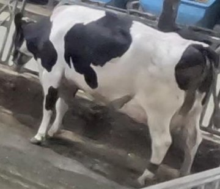 |  |
| **Full Scene Context** | *Crop provided directly in dataset* |  |
| **Crop Resolution** | `547x469` | `246x274` (Scene: `1920x1080`) |
| **Behavior Label** | **Standing** (Class 2) | **stand** |
| **Biological Cow ID** | **Cow 1** (Verified individual) | **UNKNOWN / HERD MEMBER** (No ID annotated) |
| **Camera & Setting** | Camera 1 (`TRAIN`) | Video `618.mp4` (Frame: `618_00002.jpg`) |
| **Temporal Source** | `2023-07-25T08:01:56Z` (Event: `ev_1690272116_c1`) | Still frame at 1.0s interval |

**Human Visual Sanity Checklist**:
```markdown
MmCows:  [ ] Cow clearly visible   [ ] Posture plausible   [ ] Crop usable   Verdict: [ ] PASS  [ ] QUESTIONABLE  [ ] FAIL
CBVD-5:  [ ] Cow clearly visible   [ ] Posture plausible   [ ] Crop usable   Verdict: [ ] PASS  [ ] QUESTIONABLE  [ ] FAIL
```
*Auditor Observations*: __________________________________________________

---
# Summary & Final Recommendation

### Key Takeaway for Auditor:
1. **Why CBVD-5 Looks Sharper Initially**: CBVD-5 distributed 1080p full-room wide video frames, so viewing the whole scene creates an impression of high quality. However, when individual cows are actually cropped out for behavior classification, their median resolution is only **156 x 167 px** (smaller than MmCows' 409 x 386 px crops).
2. **The Fatal Flaw of CBVD-5 for Primary Role**: CBVD-5 contains **zero biological cow IDs**. It is impossible to build a cow-disjoint train/val/test split on CBVD-5. Promoting CBVD-5 to primary would destroy our ability to evaluate identity-disjoint behavior generalization.
3. **The External Benchmark Trap**: If CBVD-5 is promoted to primary, there is no viable external behavior benchmark left in the workspace. Keeping MmCows primary preserves a rigorous cow-disjoint in-domain benchmark, while CBVD-5 remains the perfect out-of-domain cross-herd test.

**Auditor Decision**:
- [ ] Maintain MmCows as Primary / CBVD-5 as External Validation (Recommended)
- [ ] Promote CBVD-5 to Primary (Requires abandoning cow-disjoint evaluation)
- [ ] Other / Dual-Task Formulation
