# Phase 3 Primary Dataset Manual Visual Verification Pack

> **Purpose & Guardrails**:  
> This document is for **manual human sanity checking only**. Automated forensic audits, exact byte hashing, and perceptual near-duplicate checks already exist and remain authoritative. Human visual inspection is used here as a final defense against obvious labeling blunders, corrupted crops, inverted masks, or camera artifacts before starting Step 2.  
>  
> *Rules for Auditor*:  
> - Visual inspection cannot prove exact numerical BCS scores or biological identity.  
> - Single-frame behavior can be ambiguous (e.g. standing near trough vs feeding); mark `QUESTIONABLE` where uncertain.  
> - ScienceDB does **not** have biological cow IDs; only burst groups are tracked.  

---

## Quick Review Guide

For every visual check, inspect the embedded image and check off the 5 verification criteria:
```markdown
- [ ] Target cow / anatomy is clearly visible
- [ ] Image quality / framing is usable for the task
- [ ] Stated label appears visually plausible
- [ ] No obvious corruption, wrong crop, or inverted mask
- Verdict: [ ] PASS   [ ] QUESTIONABLE   [ ] FAIL
```

---

# Part 1: ScienceDB — Primary Body Condition Scoring (BCS)
*Objective: Verify rear/pelvic view visibility, camera angle across farms, and plausibility of 5-point discrete BCS categories (3.25 to 4.25). Biological cow IDs are NOT provided by publisher.*

### Check [SC-01]: BCS 3.25 Lean Cow (GS Farm, Train)
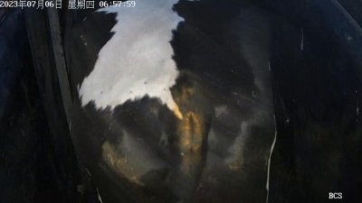

| Field | Value |
|---|---|
| **Dataset** | ScienceDB Cattle BCS |
| **Filename** | `GS_1003_1.jpg` |
| **BCS Label** | **3.25** |
| **Split Partition** | `TRAIN` |
| **Farm Source** | `GS_Gansu` |
| **Burst Group ID** | `GS_burst_0007` (Original Passage: `GS_1003`) |
| **Biological Cow ID** | *N/A (Publisher did not release cow IDs)* |
| **Inspection Focus** | Inspect visible angularity in rear pelvic bones (hooks and pins). |

**Manual Inspection Checklist:**
- [ ] Cattle pelvic / rear anatomy is visible
- [ ] Image is usable for visual condition scoring
- [ ] Stated BCS label (3.25) appears plausible (hook/pin fat coverage)
- [ ] No obvious non-cattle image, corruption, or unusable framing
- **Verdict:** `[ ] PASS   [ ] QUESTIONABLE   [ ] FAIL`
- *Auditor Notes:* _______________________________________

---
### Check [SC-02]: BCS 3.50 Moderate-Lean Cow (GS Farm, Train)
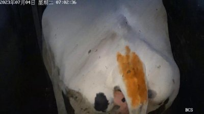

| Field | Value |
|---|---|
| **Dataset** | ScienceDB Cattle BCS |
| **Filename** | `GS_1008_1.jpg` |
| **BCS Label** | **3.5** |
| **Split Partition** | `TRAIN` |
| **Farm Source** | `GS_Gansu` |
| **Burst Group ID** | `GS_burst_0012` (Original Passage: `GS_1008`) |
| **Biological Cow ID** | *N/A (Publisher did not release cow IDs)* |
| **Inspection Focus** | Inspect pelvic cavity depression and thurl curvature. |

**Manual Inspection Checklist:**
- [ ] Cattle pelvic / rear anatomy is visible
- [ ] Image is usable for visual condition scoring
- [ ] Stated BCS label (3.5) appears plausible (hook/pin fat coverage)
- [ ] No obvious non-cattle image, corruption, or unusable framing
- **Verdict:** `[ ] PASS   [ ] QUESTIONABLE   [ ] FAIL`
- *Auditor Notes:* _______________________________________

---
### Check [SC-03]: BCS 3.75 Moderate Cow (GS Farm, Train)
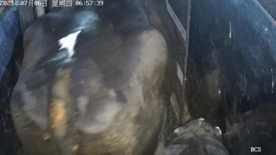

| Field | Value |
|---|---|
| **Dataset** | ScienceDB Cattle BCS |
| **Filename** | `GS_1000_1.jpg` |
| **BCS Label** | **3.75** |
| **Split Partition** | `TRAIN` |
| **Farm Source** | `GS_Gansu` |
| **Burst Group ID** | `GS_burst_0004` (Original Passage: `GS_1000`) |
| **Biological Cow ID** | *N/A (Publisher did not release cow IDs)* |
| **Inspection Focus** | Inspect smooth fat coverage over the tailhead and loin edge. |

**Manual Inspection Checklist:**
- [ ] Cattle pelvic / rear anatomy is visible
- [ ] Image is usable for visual condition scoring
- [ ] Stated BCS label (3.75) appears plausible (hook/pin fat coverage)
- [ ] No obvious non-cattle image, corruption, or unusable framing
- **Verdict:** `[ ] PASS   [ ] QUESTIONABLE   [ ] FAIL`
- *Auditor Notes:* _______________________________________

---
### Check [SC-04]: BCS 4.00 Fleshy Cow (GS Farm, Train)
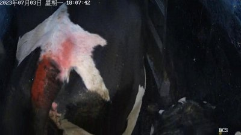

| Field | Value |
|---|---|
| **Dataset** | ScienceDB Cattle BCS |
| **Filename** | `GS_1004_1.jpg` |
| **BCS Label** | **4.0** |
| **Split Partition** | `TRAIN` |
| **Farm Source** | `GS_Gansu` |
| **Burst Group ID** | `GS_burst_0008` (Original Passage: `GS_1004`) |
| **Biological Cow ID** | *N/A (Publisher did not release cow IDs)* |
| **Inspection Focus** | Inspect rounded rump contour and filled cavity between hook and pin. |

**Manual Inspection Checklist:**
- [ ] Cattle pelvic / rear anatomy is visible
- [ ] Image is usable for visual condition scoring
- [ ] Stated BCS label (4.0) appears plausible (hook/pin fat coverage)
- [ ] No obvious non-cattle image, corruption, or unusable framing
- **Verdict:** `[ ] PASS   [ ] QUESTIONABLE   [ ] FAIL`
- *Auditor Notes:* _______________________________________

---
### Check [SC-05]: BCS 4.25 Heavy Cow (GS Farm, Train)
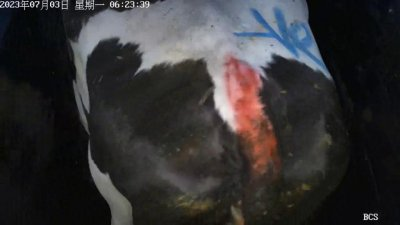

| Field | Value |
|---|---|
| **Dataset** | ScienceDB Cattle BCS |
| **Filename** | `GS_1_1.jpg` |
| **BCS Label** | **4.25** |
| **Split Partition** | `TRAIN` |
| **Farm Source** | `GS_Gansu` |
| **Burst Group ID** | `GS_burst_0001` (Original Passage: `GS_1`) |
| **Biological Cow ID** | *N/A (Publisher did not release cow IDs)* |
| **Inspection Focus** | Inspect prominent fat pads and obscured bone structure around tailhead. |

**Manual Inspection Checklist:**
- [ ] Cattle pelvic / rear anatomy is visible
- [ ] Image is usable for visual condition scoring
- [ ] Stated BCS label (4.25) appears plausible (hook/pin fat coverage)
- [ ] No obvious non-cattle image, corruption, or unusable framing
- **Verdict:** `[ ] PASS   [ ] QUESTIONABLE   [ ] FAIL`
- *Auditor Notes:* _______________________________________

---
### Check [SC-06]: YM Feedlot Environment (BCS 3.50, Train)
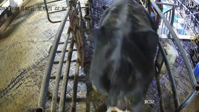

| Field | Value |
|---|---|
| **Dataset** | ScienceDB Cattle BCS |
| **Filename** | `YM_1_1.jpg` |
| **BCS Label** | **3.5** |
| **Split Partition** | `TRAIN` |
| **Farm Source** | `YM_Farm2` |
| **Burst Group ID** | `YM_burst_0001` (Original Passage: `YM_1`) |
| **Biological Cow ID** | *N/A (Publisher did not release cow IDs)* |
| **Inspection Focus** | Check different farm lighting, flooring, and lane width. |

**Manual Inspection Checklist:**
- [ ] Cattle pelvic / rear anatomy is visible
- [ ] Image is usable for visual condition scoring
- [ ] Stated BCS label (3.5) appears plausible (hook/pin fat coverage)
- [ ] No obvious non-cattle image, corruption, or unusable framing
- **Verdict:** `[ ] PASS   [ ] QUESTIONABLE   [ ] FAIL`
- *Auditor Notes:* _______________________________________

---
### Check [SC-07]: YM Farm Validation Sample (BCS 4.00, Val)
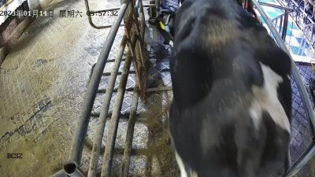

| Field | Value |
|---|---|
| **Dataset** | ScienceDB Cattle BCS |
| **Filename** | `YM_1009_1.jpg` |
| **BCS Label** | **4.0** |
| **Split Partition** | `VAL` |
| **Farm Source** | `YM_Farm2` |
| **Burst Group ID** | `YM_burst_0013` (Original Passage: `YM_1009`) |
| **Biological Cow ID** | *N/A (Publisher did not release cow IDs)* |
| **Inspection Focus** | Verify farm appearance consistency in validation partition. |

**Manual Inspection Checklist:**
- [ ] Cattle pelvic / rear anatomy is visible
- [ ] Image is usable for visual condition scoring
- [ ] Stated BCS label (4.0) appears plausible (hook/pin fat coverage)
- [ ] No obvious non-cattle image, corruption, or unusable framing
- **Verdict:** `[ ] PASS   [ ] QUESTIONABLE   [ ] FAIL`
- *Auditor Notes:* _______________________________________

---
### Check [SC-08]: STEREO Farm Camera Setup (BCS 3.75, Train)
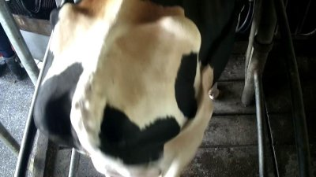

| Field | Value |
|---|---|
| **Dataset** | ScienceDB Cattle BCS |
| **Filename** | `L-i429.jpg` |
| **BCS Label** | **3.75** |
| **Split Partition** | `TRAIN` |
| **Farm Source** | `STEREO_Farm3` |
| **Burst Group ID** | `STEREO_burst_0005` (Original Passage: `STEREO_blk_005`) |
| **Biological Cow ID** | *N/A (Publisher did not release cow IDs)* |
| **Inspection Focus** | Inspect stereoscopic overhead camera geometry and perspective. |

**Manual Inspection Checklist:**
- [ ] Cattle pelvic / rear anatomy is visible
- [ ] Image is usable for visual condition scoring
- [ ] Stated BCS label (3.75) appears plausible (hook/pin fat coverage)
- [ ] No obvious non-cattle image, corruption, or unusable framing
- **Verdict:** `[ ] PASS   [ ] QUESTIONABLE   [ ] FAIL`
- *Auditor Notes:* _______________________________________

---
### Check [SC-09]: STEREO Farm Test Partition (BCS 3.75, Test)
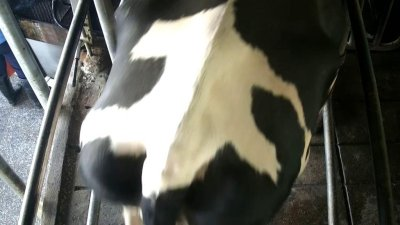

| Field | Value |
|---|---|
| **Dataset** | ScienceDB Cattle BCS |
| **Filename** | `L-i364.jpg` |
| **BCS Label** | **3.75** |
| **Split Partition** | `TEST` |
| **Farm Source** | `STEREO_Farm3` |
| **Burst Group ID** | `STEREO_burst_0003` (Original Passage: `STEREO_blk_003`) |
| **Biological Cow ID** | *N/A (Publisher did not release cow IDs)* |
| **Inspection Focus** | Inspect independent held-out test sample from STEREO camera. |

**Manual Inspection Checklist:**
- [ ] Cattle pelvic / rear anatomy is visible
- [ ] Image is usable for visual condition scoring
- [ ] Stated BCS label (3.75) appears plausible (hook/pin fat coverage)
- [ ] No obvious non-cattle image, corruption, or unusable framing
- **Verdict:** `[ ] PASS   [ ] QUESTIONABLE   [ ] FAIL`
- *Auditor Notes:* _______________________________________

---
### Check [SC-10]: Independent Test Sample (BCS 3.50, GS Farm)
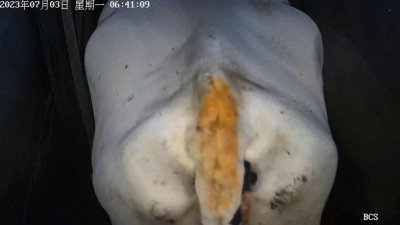

| Field | Value |
|---|---|
| **Dataset** | ScienceDB Cattle BCS |
| **Filename** | `GS_100_1.jpg` |
| **BCS Label** | **3.5** |
| **Split Partition** | `TEST` |
| **Farm Source** | `GS_Gansu` |
| **Burst Group ID** | `GS_burst_0003` (Original Passage: `GS_100`) |
| **Biological Cow ID** | *N/A (Publisher did not release cow IDs)* |
| **Inspection Focus** | Confirm test sample usability and framing. |

**Manual Inspection Checklist:**
- [ ] Cattle pelvic / rear anatomy is visible
- [ ] Image is usable for visual condition scoring
- [ ] Stated BCS label (3.5) appears plausible (hook/pin fat coverage)
- [ ] No obvious non-cattle image, corruption, or unusable framing
- **Verdict:** `[ ] PASS   [ ] QUESTIONABLE   [ ] FAIL`
- *Auditor Notes:* _______________________________________

---
### Check [SC-11]: Independent Test Sample (BCS 4.00, GS Farm)
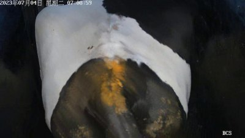

| Field | Value |
|---|---|
| **Dataset** | ScienceDB Cattle BCS |
| **Filename** | `GS_1048_1.jpg` |
| **BCS Label** | **4.0** |
| **Split Partition** | `TEST` |
| **Farm Source** | `GS_Gansu` |
| **Burst Group ID** | `GS_burst_0056` (Original Passage: `GS_1048`) |
| **Biological Cow ID** | *N/A (Publisher did not release cow IDs)* |
| **Inspection Focus** | Confirm high-BCS test sample usability. |

**Manual Inspection Checklist:**
- [ ] Cattle pelvic / rear anatomy is visible
- [ ] Image is usable for visual condition scoring
- [ ] Stated BCS label (4.0) appears plausible (hook/pin fat coverage)
- [ ] No obvious non-cattle image, corruption, or unusable framing
- **Verdict:** `[ ] PASS   [ ] QUESTIONABLE   [ ] FAIL`
- *Auditor Notes:* _______________________________________

---
### Check [SC-12]: Harsh Shadow / Uneven Lighting (GS Farm, Train)
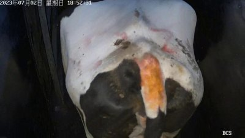

| Field | Value |
|---|---|
| **Dataset** | ScienceDB Cattle BCS |
| **Filename** | `GS_1500_1.jpg` |
| **BCS Label** | **3.75** |
| **Split Partition** | `TRAIN` |
| **Farm Source** | `GS_Gansu` |
| **Burst Group ID** | `GS_burst_0559` (Original Passage: `GS_1500`) |
| **Biological Cow ID** | *N/A (Publisher did not release cow IDs)* |
| **Inspection Focus** | Evaluate if shadows obscure key pelvic landmarks. |

**Manual Inspection Checklist:**
- [ ] Cattle pelvic / rear anatomy is visible
- [ ] Image is usable for visual condition scoring
- [ ] Stated BCS label (3.75) appears plausible (hook/pin fat coverage)
- [ ] No obvious non-cattle image, corruption, or unusable framing
- **Verdict:** `[ ] PASS   [ ] QUESTIONABLE   [ ] FAIL`
- *Auditor Notes:* _______________________________________

---
### Check [SC-13]: Off-Angle / Walking Perspective (GS Farm, Train)
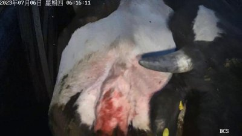

| Field | Value |
|---|---|
| **Dataset** | ScienceDB Cattle BCS |
| **Filename** | `GS_850_1.jpg` |
| **BCS Label** | **4.0** |
| **Split Partition** | `TRAIN` |
| **Farm Source** | `GS_Gansu` |
| **Burst Group ID** | `GS_burst_3174` (Original Passage: `GS_850`) |
| **Biological Cow ID** | *N/A (Publisher did not release cow IDs)* |
| **Inspection Focus** | Inspect cow walking away at a slight oblique angle. |

**Manual Inspection Checklist:**
- [ ] Cattle pelvic / rear anatomy is visible
- [ ] Image is usable for visual condition scoring
- [ ] Stated BCS label (4.0) appears plausible (hook/pin fat coverage)
- [ ] No obvious non-cattle image, corruption, or unusable framing
- **Verdict:** `[ ] PASS   [ ] QUESTIONABLE   [ ] FAIL`
- *Auditor Notes:* _______________________________________

---
### Check [SC-14]: Repaired Burst Link A: GS_1818_1 (Val)
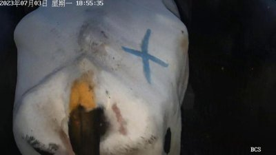

| Field | Value |
|---|---|
| **Dataset** | ScienceDB Cattle BCS |
| **Filename** | `GS_1818_1.jpg` |
| **BCS Label** | **3.5** |
| **Split Partition** | `VAL` |
| **Farm Source** | `GS_Gansu` |
| **Burst Group ID** | `GS_burst_0911` (Original Passage: `GS_1818`) |
| **Biological Cow ID** | *N/A (Publisher did not release cow IDs)* |
| **Inspection Focus** | Inspect Frame 1 of overlapping video burst discovered during audit. |

**Manual Inspection Checklist:**
- [ ] Cattle pelvic / rear anatomy is visible
- [ ] Image is usable for visual condition scoring
- [ ] Stated BCS label (3.5) appears plausible (hook/pin fat coverage)
- [ ] No obvious non-cattle image, corruption, or unusable framing
- **Verdict:** `[ ] PASS   [ ] QUESTIONABLE   [ ] FAIL`
- *Auditor Notes:* _______________________________________

---
### Check [SC-15]: Repaired Burst Link B: GS_1823_1 (Val)
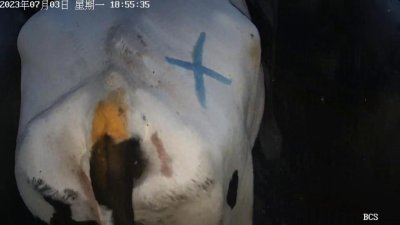

| Field | Value |
|---|---|
| **Dataset** | ScienceDB Cattle BCS |
| **Filename** | `GS_1823_1.jpg` |
| **BCS Label** | **3.5** |
| **Split Partition** | `VAL` |
| **Farm Source** | `GS_Gansu` |
| **Burst Group ID** | `GS_burst_0911` (Original Passage: `GS_1823`) |
| **Biological Cow ID** | *N/A (Publisher did not release cow IDs)* |
| **Inspection Focus** | Verify that GS_1823 is the same video passage shifted by 1 frame (now unified in Val). |

**Manual Inspection Checklist:**
- [ ] Cattle pelvic / rear anatomy is visible
- [ ] Image is usable for visual condition scoring
- [ ] Stated BCS label (3.5) appears plausible (hook/pin fat coverage)
- [ ] No obvious non-cattle image, corruption, or unusable framing
- **Verdict:** `[ ] PASS   [ ] QUESTIONABLE   [ ] FAIL`
- *Auditor Notes:* _______________________________________

---
### Check [SC-16]: Tailhead Zoom / Close-Framing (GS Farm, Train)
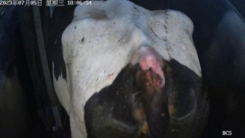

| Field | Value |
|---|---|
| **Dataset** | ScienceDB Cattle BCS |
| **Filename** | `GS_400_1.jpg` |
| **BCS Label** | **3.5** |
| **Split Partition** | `TRAIN` |
| **Farm Source** | `GS_Gansu` |
| **Burst Group ID** | `GS_burst_2675` (Original Passage: `GS_400`) |
| **Biological Cow ID** | *N/A (Publisher did not release cow IDs)* |
| **Inspection Focus** | Inspect tight framing around hook and pin bones. |

**Manual Inspection Checklist:**
- [ ] Cattle pelvic / rear anatomy is visible
- [ ] Image is usable for visual condition scoring
- [ ] Stated BCS label (3.5) appears plausible (hook/pin fat coverage)
- [ ] No obvious non-cattle image, corruption, or unusable framing
- **Verdict:** `[ ] PASS   [ ] QUESTIONABLE   [ ] FAIL`
- *Auditor Notes:* _______________________________________

---
# Part 2: MmCows — Primary Behavior Recognition
*Objective: Verify bounding-box crop quality, pose/action plausibility across all 7 classes, multi-camera synchronized viewpoints, and biological cow ID tracking (16 Holstein cows).*

### Check [MC-01]: Class 1: Walking (Cow 1, Cam 1, Train)
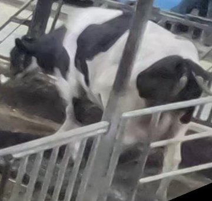

| Field | Value |
|---|---|
| **Dataset** | MmCows Behavior (NeurIPS 2024 Spotlight) |
| **Filename** | `1690272086_03-01-26_1_1.jpg` |
| **Behavior Class** | **Class 1: Walking** |
| **Canonical Split** | `TRAIN` |
| **Biological Cow ID** | **Cow 1** (Verified biological individual) |
| **Camera ID** | Camera 1 |
| **Timestamp** | `2023-07-25T08:01:26Z` (Event ID: `ev_1690272086_c1`) |
| **Inspection Focus** | Inspect active forward leg stride in aisle. |

**Manual Inspection Checklist:**
- [ ] Cow body and limbs are clearly visible in crop
- [ ] Crop bounding box accurately frames the animal
- [ ] Observed posture roughly agrees with stated behavior (`Walking`)
- [ ] If synchronized view, confirms the same time/event from a different camera
- **Verdict:** `[ ] PASS   [ ] QUESTIONABLE   [ ] FAIL`
- *Auditor Notes:* _______________________________________

---
### Check [MC-02]: Class 2: Standing (Cow 3, Cam 1, Train)


| Field | Value |
|---|---|
| **Dataset** | MmCows Behavior (NeurIPS 2024 Spotlight) |
| **Filename** | `1690271846_02-57-26_9_1.jpg` |
| **Behavior Class** | **Class 2: Standing** |
| **Canonical Split** | `TRAIN` |
| **Biological Cow ID** | **Cow 9** (Verified biological individual) |
| **Camera ID** | Camera 1 |
| **Timestamp** | `2023-07-25T07:57:26Z` (Event ID: `ev_1690271846_c9`) |
| **Inspection Focus** | Inspect stationary upright posture with four hooves planted. |

**Manual Inspection Checklist:**
- [ ] Cow body and limbs are clearly visible in crop
- [ ] Crop bounding box accurately frames the animal
- [ ] Observed posture roughly agrees with stated behavior (`Standing`)
- [ ] If synchronized view, confirms the same time/event from a different camera
- **Verdict:** `[ ] PASS   [ ] QUESTIONABLE   [ ] FAIL`
- *Auditor Notes:* _______________________________________

---
### Check [MC-03]: Class 2: Standing (Cow 8, Cam 2, Val)


| Field | Value |
|---|---|
| **Dataset** | MmCows Behavior (NeurIPS 2024 Spotlight) |
| **Filename** | `1690272071_03-01-11_13_2.jpg` |
| **Behavior Class** | **Class 2: Standing** |
| **Canonical Split** | `VAL` |
| **Biological Cow ID** | **Cow 13** (Verified biological individual) |
| **Camera ID** | Camera 2 |
| **Timestamp** | `2023-07-25T08:01:11Z` (Event ID: `ev_1690272071_c13`) |
| **Inspection Focus** | Verify standing posture for held-out validation cow. |

**Manual Inspection Checklist:**
- [ ] Cow body and limbs are clearly visible in crop
- [ ] Crop bounding box accurately frames the animal
- [ ] Observed posture roughly agrees with stated behavior (`Standing`)
- [ ] If synchronized view, confirms the same time/event from a different camera
- **Verdict:** `[ ] PASS   [ ] QUESTIONABLE   [ ] FAIL`
- *Auditor Notes:* _______________________________________

---
### Check [MC-04]: Class 2: Standing (Cow 16, Cam 4, Test)
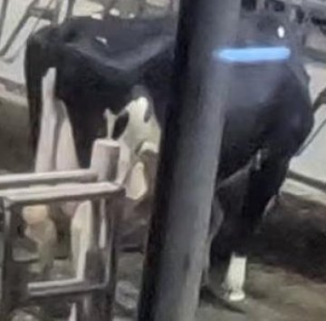

| Field | Value |
|---|---|
| **Dataset** | MmCows Behavior (NeurIPS 2024 Spotlight) |
| **Filename** | `1690271981_02-59-41_16_1.jpg` |
| **Behavior Class** | **Class 2: Standing** |
| **Canonical Split** | `TEST` |
| **Biological Cow ID** | **Cow 16** (Verified biological individual) |
| **Camera ID** | Camera 1 |
| **Timestamp** | `2023-07-25T07:59:41Z` (Event ID: `ev_1690271981_c16`) |
| **Inspection Focus** | Verify standing posture for held-out test cow. |

**Manual Inspection Checklist:**
- [ ] Cow body and limbs are clearly visible in crop
- [ ] Crop bounding box accurately frames the animal
- [ ] Observed posture roughly agrees with stated behavior (`Standing`)
- [ ] If synchronized view, confirms the same time/event from a different camera
- **Verdict:** `[ ] PASS   [ ] QUESTIONABLE   [ ] FAIL`
- *Auditor Notes:* _______________________________________

---
### Check [MC-05]: Class 3: Feeding Head Up (Cow 4, Cam 2, Train)


| Field | Value |
|---|---|
| **Dataset** | MmCows Behavior (NeurIPS 2024 Spotlight) |
| **Filename** | `1690271876_02-57-56_1_1.jpg` |
| **Behavior Class** | **Class 3: Feeding_head_up** |
| **Canonical Split** | `TRAIN` |
| **Biological Cow ID** | **Cow 1** (Verified biological individual) |
| **Camera ID** | Camera 1 |
| **Timestamp** | `2023-07-25T07:57:56Z` (Event ID: `ev_1690271876_c1`) |
| **Inspection Focus** | Inspect cow at feed bunk with head raised above trough level. |

**Manual Inspection Checklist:**
- [ ] Cow body and limbs are clearly visible in crop
- [ ] Crop bounding box accurately frames the animal
- [ ] Observed posture roughly agrees with stated behavior (`Feeding_head_up`)
- [ ] If synchronized view, confirms the same time/event from a different camera
- **Verdict:** `[ ] PASS   [ ] QUESTIONABLE   [ ] FAIL`
- *Auditor Notes:* _______________________________________

---
### Check [MC-06]: Class 4: Feeding Head Down (Cow 5, Cam 2, Train)


| Field | Value |
|---|---|
| **Dataset** | MmCows Behavior (NeurIPS 2024 Spotlight) |
| **Filename** | `1690271846_02-57-26_1_1.jpg` |
| **Behavior Class** | **Class 4: Feeding_head_down** |
| **Canonical Split** | `TRAIN` |
| **Biological Cow ID** | **Cow 1** (Verified biological individual) |
| **Camera ID** | Camera 1 |
| **Timestamp** | `2023-07-25T07:57:26Z` (Event ID: `ev_1690271846_c1`) |
| **Inspection Focus** | Inspect cow at feed bunk with muzzle lowered into feed. |

**Manual Inspection Checklist:**
- [ ] Cow body and limbs are clearly visible in crop
- [ ] Crop bounding box accurately frames the animal
- [ ] Observed posture roughly agrees with stated behavior (`Feeding_head_down`)
- [ ] If synchronized view, confirms the same time/event from a different camera
- **Verdict:** `[ ] PASS   [ ] QUESTIONABLE   [ ] FAIL`
- *Auditor Notes:* _______________________________________

---
### Check [MC-07]: Class 4: Feeding Head Down (Cow 12, Cam 3, Test)
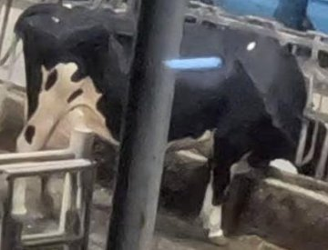

| Field | Value |
|---|---|
| **Dataset** | MmCows Behavior (NeurIPS 2024 Spotlight) |
| **Filename** | `1690271846_02-57-26_16_1.jpg` |
| **Behavior Class** | **Class 4: Feeding_head_down** |
| **Canonical Split** | `TEST` |
| **Biological Cow ID** | **Cow 16** (Verified biological individual) |
| **Camera ID** | Camera 1 |
| **Timestamp** | `2023-07-25T07:57:26Z` (Event ID: `ev_1690271846_c16`) |
| **Inspection Focus** | Inspect feeding action on independent held-out test cow. |

**Manual Inspection Checklist:**
- [ ] Cow body and limbs are clearly visible in crop
- [ ] Crop bounding box accurately frames the animal
- [ ] Observed posture roughly agrees with stated behavior (`Feeding_head_down`)
- [ ] If synchronized view, confirms the same time/event from a different camera
- **Verdict:** `[ ] PASS   [ ] QUESTIONABLE   [ ] FAIL`
- *Auditor Notes:* _______________________________________

---
### Check [MC-08]: Class 5: Licking (Cow 6, Cam 1, Train)


| Field | Value |
|---|---|
| **Dataset** | MmCows Behavior (NeurIPS 2024 Spotlight) |
| **Filename** | `1690272911_03-15-11_12_1.jpg` |
| **Behavior Class** | **Class 5: Licking** |
| **Canonical Split** | `TRAIN` |
| **Biological Cow ID** | **Cow 12** (Verified biological individual) |
| **Camera ID** | Camera 1 |
| **Timestamp** | `2023-07-25T08:15:11Z` (Event ID: `ev_1690272911_c12`) |
| **Inspection Focus** | Inspect rare self-grooming / licking action (coat or stall). |

**Manual Inspection Checklist:**
- [ ] Cow body and limbs are clearly visible in crop
- [ ] Crop bounding box accurately frames the animal
- [ ] Observed posture roughly agrees with stated behavior (`Licking`)
- [ ] If synchronized view, confirms the same time/event from a different camera
- **Verdict:** `[ ] PASS   [ ] QUESTIONABLE   [ ] FAIL`
- *Auditor Notes:* _______________________________________

---
### Check [MC-09]: Class 5: Licking (Cow 10, Cam 3, Train)
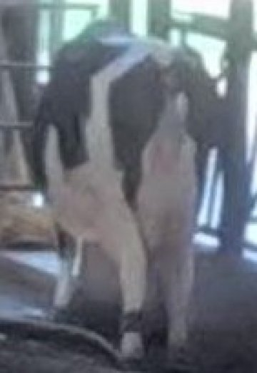

| Field | Value |
|---|---|
| **Dataset** | MmCows Behavior (NeurIPS 2024 Spotlight) |
| **Filename** | `1690330406_19-13-26_10_1.jpg` |
| **Behavior Class** | **Class 5: Licking** |
| **Canonical Split** | `TRAIN` |
| **Biological Cow ID** | **Cow 10** (Verified biological individual) |
| **Camera ID** | Camera 1 |
| **Timestamp** | `2023-07-26T00:13:26Z` (Event ID: `ev_1690330406_c10`) |
| **Inspection Focus** | Second sample of rare licking class across different camera. |

**Manual Inspection Checklist:**
- [ ] Cow body and limbs are clearly visible in crop
- [ ] Crop bounding box accurately frames the animal
- [ ] Observed posture roughly agrees with stated behavior (`Licking`)
- [ ] If synchronized view, confirms the same time/event from a different camera
- **Verdict:** `[ ] PASS   [ ] QUESTIONABLE   [ ] FAIL`
- *Auditor Notes:* _______________________________________

---
### Check [MC-10]: Class 6: Drinking (Cow 7, Cam 1, Train)
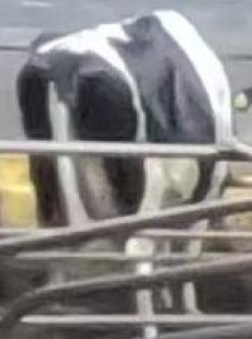

| Field | Value |
|---|---|
| **Dataset** | MmCows Behavior (NeurIPS 2024 Spotlight) |
| **Filename** | `1690272131_03-02-11_9_1.jpg` |
| **Behavior Class** | **Class 6: Drinking** |
| **Canonical Split** | `TRAIN` |
| **Biological Cow ID** | **Cow 9** (Verified biological individual) |
| **Camera ID** | Camera 1 |
| **Timestamp** | `2023-07-25T08:02:11Z` (Event ID: `ev_1690272131_c9`) |
| **Inspection Focus** | Inspect muzzle lowered into water trough. |

**Manual Inspection Checklist:**
- [ ] Cow body and limbs are clearly visible in crop
- [ ] Crop bounding box accurately frames the animal
- [ ] Observed posture roughly agrees with stated behavior (`Drinking`)
- [ ] If synchronized view, confirms the same time/event from a different camera
- **Verdict:** `[ ] PASS   [ ] QUESTIONABLE   [ ] FAIL`
- *Auditor Notes:* _______________________________________

---
### Check [MC-11]: Class 6: Drinking (Cow 2, Cam 2, Test)
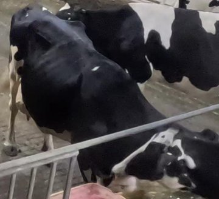

| Field | Value |
|---|---|
| **Dataset** | MmCows Behavior (NeurIPS 2024 Spotlight) |
| **Filename** | `1690274456_03-40-56_16_1.jpg` |
| **Behavior Class** | **Class 6: Drinking** |
| **Canonical Split** | `TEST` |
| **Biological Cow ID** | **Cow 16** (Verified biological individual) |
| **Camera ID** | Camera 1 |
| **Timestamp** | `2023-07-25T08:40:56Z` (Event ID: `ev_1690274456_c16`) |
| **Inspection Focus** | Verify drinking behavior on held-out test cow. |

**Manual Inspection Checklist:**
- [ ] Cow body and limbs are clearly visible in crop
- [ ] Crop bounding box accurately frames the animal
- [ ] Observed posture roughly agrees with stated behavior (`Drinking`)
- [ ] If synchronized view, confirms the same time/event from a different camera
- **Verdict:** `[ ] PASS   [ ] QUESTIONABLE   [ ] FAIL`
- *Auditor Notes:* _______________________________________

---
### Check [MC-12]: Class 7: Lying (Cow 9, Cam 3, Train)


| Field | Value |
|---|---|
| **Dataset** | MmCows Behavior (NeurIPS 2024 Spotlight) |
| **Filename** | `1690271846_02-57-26_3_3.jpg` |
| **Behavior Class** | **Class 7: Lying** |
| **Canonical Split** | `TRAIN` |
| **Biological Cow ID** | **Cow 3** (Verified biological individual) |
| **Camera ID** | Camera 3 |
| **Timestamp** | `2023-07-25T07:57:26Z` (Event ID: `ev_1690271846_c3`) |
| **Inspection Focus** | Inspect recumbent posture resting in cubicle stall. |

**Manual Inspection Checklist:**
- [ ] Cow body and limbs are clearly visible in crop
- [ ] Crop bounding box accurately frames the animal
- [ ] Observed posture roughly agrees with stated behavior (`Lying`)
- [ ] If synchronized view, confirms the same time/event from a different camera
- **Verdict:** `[ ] PASS   [ ] QUESTIONABLE   [ ] FAIL`
- *Auditor Notes:* _______________________________________

---
### Check [MC-13]: Class 7: Lying (Cow 13, Cam 4, Val)


| Field | Value |
|---|---|
| **Dataset** | MmCows Behavior (NeurIPS 2024 Spotlight) |
| **Filename** | `1690271846_02-57-26_7_3.jpg` |
| **Behavior Class** | **Class 7: Lying** |
| **Canonical Split** | `VAL` |
| **Biological Cow ID** | **Cow 7** (Verified biological individual) |
| **Camera ID** | Camera 3 |
| **Timestamp** | `2023-07-25T07:57:26Z` (Event ID: `ev_1690271846_c7`) |
| **Inspection Focus** | Verify lying posture on held-out validation cow. |

**Manual Inspection Checklist:**
- [ ] Cow body and limbs are clearly visible in crop
- [ ] Crop bounding box accurately frames the animal
- [ ] Observed posture roughly agrees with stated behavior (`Lying`)
- [ ] If synchronized view, confirms the same time/event from a different camera
- **Verdict:** `[ ] PASS   [ ] QUESTIONABLE   [ ] FAIL`
- *Auditor Notes:* _______________________________________

---
### Check [MC-14]: Synchronized View A (Cam 1, Cow 1, Feeding)


| Field | Value |
|---|---|
| **Dataset** | MmCows Behavior (NeurIPS 2024 Spotlight) |
| **Filename** | `1690271846_02-57-26_1_1.jpg` |
| **Behavior Class** | **Class 4: Feeding_head_down** |
| **Canonical Split** | `TRAIN` |
| **Biological Cow ID** | **Cow 1** (Verified biological individual) |
| **Camera ID** | Camera 1 |
| **Timestamp** | `2023-07-25T07:57:26Z` (Event ID: `ev_1690271846_c1`) |
| **Inspection Focus** | Simultaneous multi-camera capture at 02:57:26 (View A, Cam 1). |

**Manual Inspection Checklist:**
- [ ] Cow body and limbs are clearly visible in crop
- [ ] Crop bounding box accurately frames the animal
- [ ] Observed posture roughly agrees with stated behavior (`Feeding_head_down`)
- [ ] If synchronized view, confirms the same time/event from a different camera
- **Verdict:** `[ ] PASS   [ ] QUESTIONABLE   [ ] FAIL`
- *Auditor Notes:* _______________________________________

---
### Check [MC-15]: Synchronized View B (Cam 2, Cow 1, Feeding)
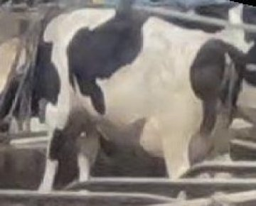

| Field | Value |
|---|---|
| **Dataset** | MmCows Behavior (NeurIPS 2024 Spotlight) |
| **Filename** | `1690271846_02-57-26_1_2.jpg` |
| **Behavior Class** | **Class 4: Feeding_head_down** |
| **Canonical Split** | `TRAIN` |
| **Biological Cow ID** | **Cow 1** (Verified biological individual) |
| **Camera ID** | Camera 2 |
| **Timestamp** | `2023-07-25T07:57:26Z` (Event ID: `ev_1690271846_c1`) |
| **Inspection Focus** | Simultaneous multi-camera capture at 02:57:26 (View B, Cam 2, exact same moment). |

**Manual Inspection Checklist:**
- [ ] Cow body and limbs are clearly visible in crop
- [ ] Crop bounding box accurately frames the animal
- [ ] Observed posture roughly agrees with stated behavior (`Feeding_head_down`)
- [ ] If synchronized view, confirms the same time/event from a different camera
- **Verdict:** `[ ] PASS   [ ] QUESTIONABLE   [ ] FAIL`
- *Auditor Notes:* _______________________________________

---
### Check [MC-16]: Partial Occlusion / Stall Bars (Cow 11, Cam 4)
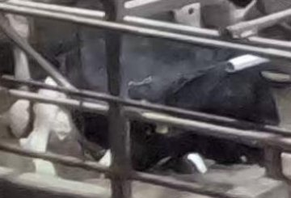

| Field | Value |
|---|---|
| **Dataset** | MmCows Behavior (NeurIPS 2024 Spotlight) |
| **Filename** | `1690272101_03-01-41_11_4.jpg` |
| **Behavior Class** | **Class 7: Lying** |
| **Canonical Split** | `TRAIN` |
| **Biological Cow ID** | **Cow 11** (Verified biological individual) |
| **Camera ID** | Camera 4 |
| **Timestamp** | `2023-07-25T08:01:41Z` (Event ID: `ev_1690272101_c11`) |
| **Inspection Focus** | Evaluate crop quality with cubicle partition bars in foreground. |

**Manual Inspection Checklist:**
- [ ] Cow body and limbs are clearly visible in crop
- [ ] Crop bounding box accurately frames the animal
- [ ] Observed posture roughly agrees with stated behavior (`Lying`)
- [ ] If synchronized view, confirms the same time/event from a different camera
- **Verdict:** `[ ] PASS   [ ] QUESTIONABLE   [ ] FAIL`
- *Auditor Notes:* _______________________________________

---
# Part 3: SideViewCows2026 — Primary Cow Identification / Re-ID
*Objective: Verify side-view profile visibility, cross-setting appearance consistency across parlor, barn, and snapshots, and ground-truth segmentation mask accuracy. (Composite: [ Left: RGB | Middle: Binary Mask | Right: Green Overlay + Contour ]).*

### Check [SV-01]: Cow 128 in Parlor (Fixed Entrance Camera)
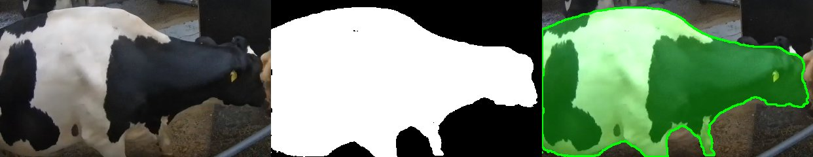

| Field | Value |
|---|---|
| **Dataset** | SideViewCows2026 (Zenodo 21605650) |
| **Filename** | `128_0001.jpg` (Mask: `128_0001.png`) |
| **Biological Individual ID** | **Cow 128** (Verified biological cow) |
| **Camera Setting** | `PARLOR` (Type: `multi`) |
| **Recording Session** | `parlor_cow_0128_sess_001` (Frame No: `1`) |
| **Temporal Offset** | `42,654.0 s` (~0.5 days) |
| **Inspection Focus** | Baseline controlled side-view framing and lighting in parlor gallery. |

**Manual Inspection Checklist:**
- [ ] Cow side profile and coat pattern are identifiable
- [ ] Camera setting matches expected domain (`parlor`)
- [ ] Binary mask accurately traces the cow silhouette
- [ ] Green overlay tightly adheres to body contour without clipping legs/head or bleeding into background
- **Verdict:** `[ ] PASS   [ ] QUESTIONABLE   [ ] FAIL`
- *Auditor Notes:* _______________________________________

---
### Check [SV-02]: Cow 128 in Barn (Handheld Video in Barn)
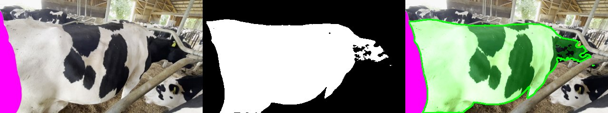

| Field | Value |
|---|---|
| **Dataset** | SideViewCows2026 (Zenodo 21605650) |
| **Filename** | `128_0001.jpg` (Mask: `128_0001.png`) |
| **Biological Individual ID** | **Cow 128** (Verified biological cow) |
| **Camera Setting** | `BARN` (Type: `multi`) |
| **Recording Session** | `barn_cow_0128_sess_001` (Frame No: `1`) |
| **Temporal Offset** | `30,709,730.0 s` (~355.4 days) |
| **Inspection Focus** | Same cow under handheld motion blur and barn lighting shift. |

**Manual Inspection Checklist:**
- [ ] Cow side profile and coat pattern are identifiable
- [ ] Camera setting matches expected domain (`barn`)
- [ ] Binary mask accurately traces the cow silhouette
- [ ] Green overlay tightly adheres to body contour without clipping legs/head or bleeding into background
- **Verdict:** `[ ] PASS   [ ] QUESTIONABLE   [ ] FAIL`
- *Auditor Notes:* _______________________________________

---
### Check [SV-03]: Cow 128 in Snapshots (Unconstrained Photo)
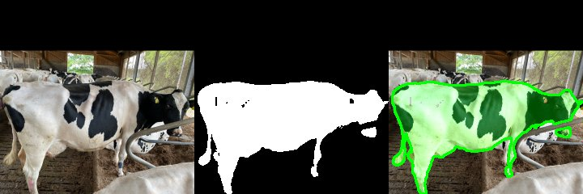

| Field | Value |
|---|---|
| **Dataset** | SideViewCows2026 (Zenodo 21605650) |
| **Filename** | `128_0001.jpg` (Mask: `128_0001.png`) |
| **Biological Individual ID** | **Cow 128** (Verified biological cow) |
| **Camera Setting** | `SNAPSHOTS` (Type: `multi`) |
| **Recording Session** | `snap_cow_0128_sess_001` (Frame No: `1`) |
| **Temporal Offset** | `30,701,803.0 s` (~355.3 days) |
| **Inspection Focus** | Same cow in unconstrained photo setting with different posture. |

**Manual Inspection Checklist:**
- [ ] Cow side profile and coat pattern are identifiable
- [ ] Camera setting matches expected domain (`snapshots`)
- [ ] Binary mask accurately traces the cow silhouette
- [ ] Green overlay tightly adheres to body contour without clipping legs/head or bleeding into background
- **Verdict:** `[ ] PASS   [ ] QUESTIONABLE   [ ] FAIL`
- *Auditor Notes:* _______________________________________

---
### Check [SV-04]: Cow 171 in Parlor (Fixed Entrance Camera)
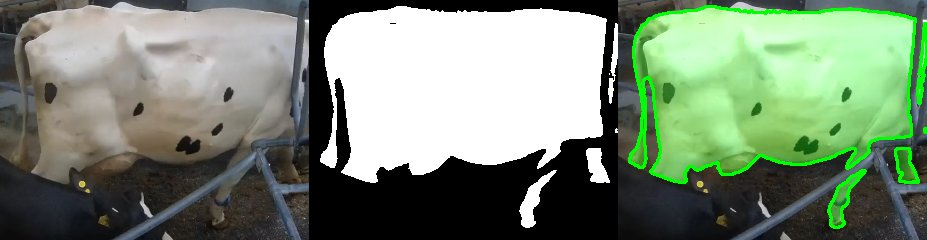

| Field | Value |
|---|---|
| **Dataset** | SideViewCows2026 (Zenodo 21605650) |
| **Filename** | `171_0001.jpg` (Mask: `171_0001.png`) |
| **Biological Individual ID** | **Cow 171** (Verified biological cow) |
| **Camera Setting** | `PARLOR` (Type: `multi`) |
| **Recording Session** | `parlor_cow_0171_sess_001` (Frame No: `1`) |
| **Temporal Offset** | `4,360.0 s` (~0.1 days) |
| **Inspection Focus** | Distinct coat pattern reference in parlor gallery. |

**Manual Inspection Checklist:**
- [ ] Cow side profile and coat pattern are identifiable
- [ ] Camera setting matches expected domain (`parlor`)
- [ ] Binary mask accurately traces the cow silhouette
- [ ] Green overlay tightly adheres to body contour without clipping legs/head or bleeding into background
- **Verdict:** `[ ] PASS   [ ] QUESTIONABLE   [ ] FAIL`
- *Auditor Notes:* _______________________________________

---
### Check [SV-05]: Cow 171 in Barn (Handheld Video in Barn)
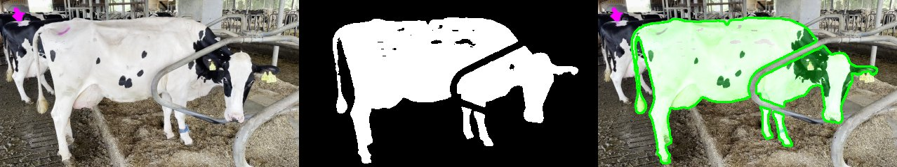

| Field | Value |
|---|---|
| **Dataset** | SideViewCows2026 (Zenodo 21605650) |
| **Filename** | `171_0001.jpg` (Mask: `171_0001.png`) |
| **Biological Individual ID** | **Cow 171** (Verified biological cow) |
| **Camera Setting** | `BARN` (Type: `multi`) |
| **Recording Session** | `barn_cow_0171_sess_001` (Frame No: `1`) |
| **Temporal Offset** | `34,922,187.0 s` (~404.2 days) |
| **Inspection Focus** | Verify coat pattern matching across parlor and barn. |

**Manual Inspection Checklist:**
- [ ] Cow side profile and coat pattern are identifiable
- [ ] Camera setting matches expected domain (`barn`)
- [ ] Binary mask accurately traces the cow silhouette
- [ ] Green overlay tightly adheres to body contour without clipping legs/head or bleeding into background
- **Verdict:** `[ ] PASS   [ ] QUESTIONABLE   [ ] FAIL`
- *Auditor Notes:* _______________________________________

---
### Check [SV-06]: Open-Set Train Identity (Cow 144, Parlor)


| Field | Value |
|---|---|
| **Dataset** | SideViewCows2026 (Zenodo 21605650) |
| **Filename** | `144_0001.jpg` (Mask: `144_0001.png`) |
| **Biological Individual ID** | **Cow 144** (Verified biological cow) |
| **Camera Setting** | `PARLOR` (Type: `parlor_only`) |
| **Recording Session** | `parlor_cow_0144_sess_001` (Frame No: `1`) |
| **Temporal Offset** | `1,857,097.0 s` (~21.5 days) |
| **Inspection Focus** | Evaluate representation training sample (open-set train). |

**Manual Inspection Checklist:**
- [ ] Cow side profile and coat pattern are identifiable
- [ ] Camera setting matches expected domain (`parlor`)
- [ ] Binary mask accurately traces the cow silhouette
- [ ] Green overlay tightly adheres to body contour without clipping legs/head or bleeding into background
- **Verdict:** `[ ] PASS   [ ] QUESTIONABLE   [ ] FAIL`
- *Auditor Notes:* _______________________________________

---
### Check [SV-07]: Open-Set Val Identity (Cow 168, Parlor Gallery)
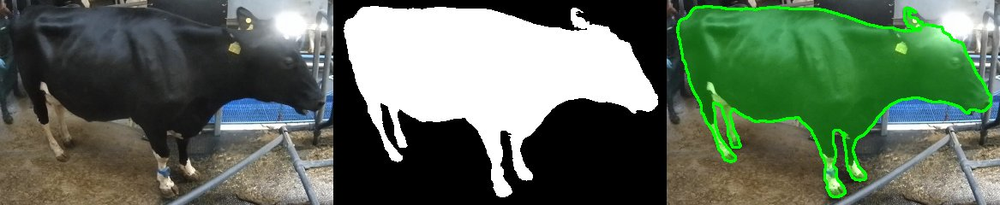

| Field | Value |
|---|---|
| **Dataset** | SideViewCows2026 (Zenodo 21605650) |
| **Filename** | `168_0001.jpg` (Mask: `168_0001.png`) |
| **Biological Individual ID** | **Cow 168** (Verified biological cow) |
| **Camera Setting** | `PARLOR` (Type: `multi`) |
| **Recording Session** | `parlor_cow_0168_sess_001` (Frame No: `1`) |
| **Temporal Offset** | `437,002.0 s` (~5.1 days) |
| **Inspection Focus** | Verify unseen validation identity in parlor reference setting. |

**Manual Inspection Checklist:**
- [ ] Cow side profile and coat pattern are identifiable
- [ ] Camera setting matches expected domain (`parlor`)
- [ ] Binary mask accurately traces the cow silhouette
- [ ] Green overlay tightly adheres to body contour without clipping legs/head or bleeding into background
- **Verdict:** `[ ] PASS   [ ] QUESTIONABLE   [ ] FAIL`
- *Auditor Notes:* _______________________________________

---
### Check [SV-08]: Open-Set Val Identity (Cow 168, Barn Query)
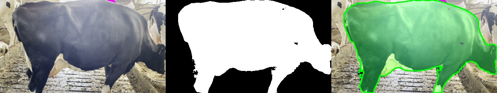

| Field | Value |
|---|---|
| **Dataset** | SideViewCows2026 (Zenodo 21605650) |
| **Filename** | `168_0001.jpg` (Mask: `168_0001.png`) |
| **Biological Individual ID** | **Cow 168** (Verified biological cow) |
| **Camera Setting** | `BARN` (Type: `multi`) |
| **Recording Session** | `barn_cow_0168_sess_001` (Frame No: `1`) |
| **Temporal Offset** | `34,922,773.0 s` (~404.2 days) |
| **Inspection Focus** | Verify cross-domain query for unseen validation identity. |

**Manual Inspection Checklist:**
- [ ] Cow side profile and coat pattern are identifiable
- [ ] Camera setting matches expected domain (`barn`)
- [ ] Binary mask accurately traces the cow silhouette
- [ ] Green overlay tightly adheres to body contour without clipping legs/head or bleeding into background
- **Verdict:** `[ ] PASS   [ ] QUESTIONABLE   [ ] FAIL`
- *Auditor Notes:* _______________________________________

---
### Check [SV-09]: Open-Set Held-Out Test Identity (Cow 166, Parlor)
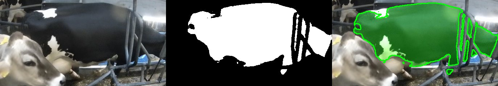

| Field | Value |
|---|---|
| **Dataset** | SideViewCows2026 (Zenodo 21605650) |
| **Filename** | `166_0001.jpg` (Mask: `166_0001.png`) |
| **Biological Individual ID** | **Cow 166** (Verified biological cow) |
| **Camera Setting** | `PARLOR` (Type: `multi`) |
| **Recording Session** | `parlor_cow_0166_sess_001` (Frame No: `1`) |
| **Temporal Offset** | `435,214.0 s` (~5.0 days) |
| **Inspection Focus** | Benchmark reference gallery for held-out test identity. |

**Manual Inspection Checklist:**
- [ ] Cow side profile and coat pattern are identifiable
- [ ] Camera setting matches expected domain (`parlor`)
- [ ] Binary mask accurately traces the cow silhouette
- [ ] Green overlay tightly adheres to body contour without clipping legs/head or bleeding into background
- **Verdict:** `[ ] PASS   [ ] QUESTIONABLE   [ ] FAIL`
- *Auditor Notes:* _______________________________________

---
### Check [SV-10]: Open-Set Held-Out Test Identity (Cow 166, Barn Query)
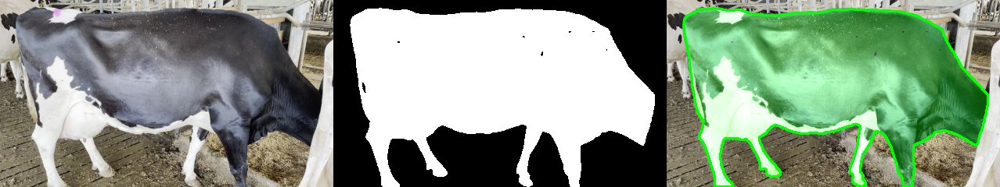

| Field | Value |
|---|---|
| **Dataset** | SideViewCows2026 (Zenodo 21605650) |
| **Filename** | `166_0001.jpg` (Mask: `166_0001.png`) |
| **Biological Individual ID** | **Cow 166** (Verified biological cow) |
| **Camera Setting** | `BARN` (Type: `multi`) |
| **Recording Session** | `barn_cow_0166_sess_001` (Frame No: `1`) |
| **Temporal Offset** | `34,922,216.0 s` (~404.2 days) |
| **Inspection Focus** | Benchmark query retrieval for held-out test identity. |

**Manual Inspection Checklist:**
- [ ] Cow side profile and coat pattern are identifiable
- [ ] Camera setting matches expected domain (`barn`)
- [ ] Binary mask accurately traces the cow silhouette
- [ ] Green overlay tightly adheres to body contour without clipping legs/head or bleeding into background
- **Verdict:** `[ ] PASS   [ ] QUESTIONABLE   [ ] FAIL`
- *Auditor Notes:* _______________________________________

---
### Check [SV-11]: Open-Set Held-Out Test Identity (Cow 166, Snapshots)
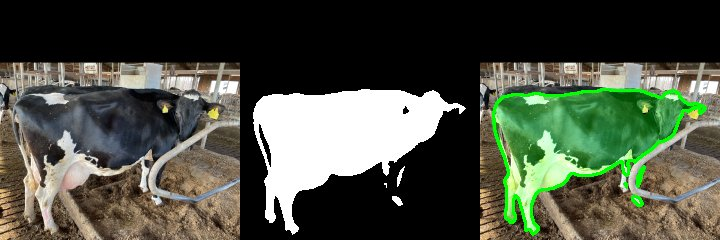

| Field | Value |
|---|---|
| **Dataset** | SideViewCows2026 (Zenodo 21605650) |
| **Filename** | `166_0001.jpg` (Mask: `166_0001.png`) |
| **Biological Individual ID** | **Cow 166** (Verified biological cow) |
| **Camera Setting** | `SNAPSHOTS` (Type: `multi`) |
| **Recording Session** | `snap_cow_0166_sess_001` (Frame No: `1`) |
| **Temporal Offset** | `51,181,215.0 s` (~592.4 days) |
| **Inspection Focus** | Extreme domain shift query for held-out test identity. |

**Manual Inspection Checklist:**
- [ ] Cow side profile and coat pattern are identifiable
- [ ] Camera setting matches expected domain (`snapshots`)
- [ ] Binary mask accurately traces the cow silhouette
- [ ] Green overlay tightly adheres to body contour without clipping legs/head or bleeding into background
- **Verdict:** `[ ] PASS   [ ] QUESTIONABLE   [ ] FAIL`
- *Auditor Notes:* _______________________________________

---
### Check [SV-12]: Lying Down Posture in Cubicle (Snapshots)
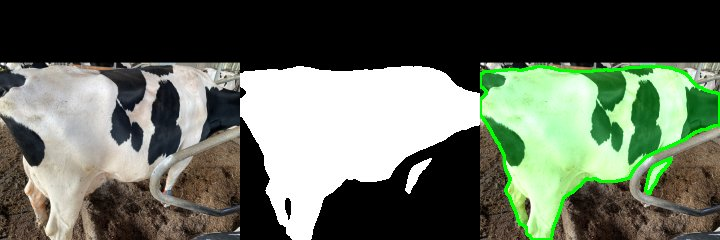

| Field | Value |
|---|---|
| **Dataset** | SideViewCows2026 (Zenodo 21605650) |
| **Filename** | `128_0011.jpg` (Mask: `128_0011.png`) |
| **Biological Individual ID** | **Cow 128** (Verified biological cow) |
| **Camera Setting** | `SNAPSHOTS` (Type: `multi`) |
| **Recording Session** | `snap_cow_0128_sess_004` (Frame No: `11`) |
| **Temporal Offset** | `30,704,436.0 s` (~355.4 days) |
| **Inspection Focus** | Inspect mask quality when cow is lying down on stall bedding. |

**Manual Inspection Checklist:**
- [ ] Cow side profile and coat pattern are identifiable
- [ ] Camera setting matches expected domain (`snapshots`)
- [ ] Binary mask accurately traces the cow silhouette
- [ ] Green overlay tightly adheres to body contour without clipping legs/head or bleeding into background
- **Verdict:** `[ ] PASS   [ ] QUESTIONABLE   [ ] FAIL`
- *Auditor Notes:* _______________________________________

---
### Check [SV-13]: Parlor-Only Identity (Cow 200, In-Domain)
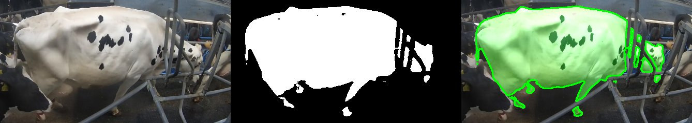

| Field | Value |
|---|---|
| **Dataset** | SideViewCows2026 (Zenodo 21605650) |
| **Filename** | `144_0001.jpg` (Mask: `144_0001.png`) |
| **Biological Individual ID** | **Cow 144** (Verified biological cow) |
| **Camera Setting** | `PARLOR` (Type: `parlor_only`) |
| **Recording Session** | `parlor_cow_0144_sess_001` (Frame No: `1`) |
| **Temporal Offset** | `1,857,097.0 s` (~21.5 days) |
| **Inspection Focus** | Inspect representation training identity without barn recordings. |

**Manual Inspection Checklist:**
- [ ] Cow side profile and coat pattern are identifiable
- [ ] Camera setting matches expected domain (`parlor`)
- [ ] Binary mask accurately traces the cow silhouette
- [ ] Green overlay tightly adheres to body contour without clipping legs/head or bleeding into background
- **Verdict:** `[ ] PASS   [ ] QUESTIONABLE   [ ] FAIL`
- *Auditor Notes:* _______________________________________

---
### Check [SV-14]: Closed-Set Early Parlor Session (Train)


| Field | Value |
|---|---|
| **Dataset** | SideViewCows2026 (Zenodo 21605650) |
| **Filename** | `128_0001.jpg` (Mask: `128_0001.png`) |
| **Biological Individual ID** | **Cow 128** (Verified biological cow) |
| **Camera Setting** | `BARN` (Type: `multi`) |
| **Recording Session** | `barn_cow_0128_sess_001` (Frame No: `1`) |
| **Temporal Offset** | `30,709,730.0 s` (~355.4 days) |
| **Inspection Focus** | Inspect early chronological parlor session for closed-set. |

**Manual Inspection Checklist:**
- [ ] Cow side profile and coat pattern are identifiable
- [ ] Camera setting matches expected domain (`barn`)
- [ ] Binary mask accurately traces the cow silhouette
- [ ] Green overlay tightly adheres to body contour without clipping legs/head or bleeding into background
- **Verdict:** `[ ] PASS   [ ] QUESTIONABLE   [ ] FAIL`
- *Auditor Notes:* _______________________________________

---
### Check [SV-15]: Closed-Set Late Parlor Session (Test Parlor)
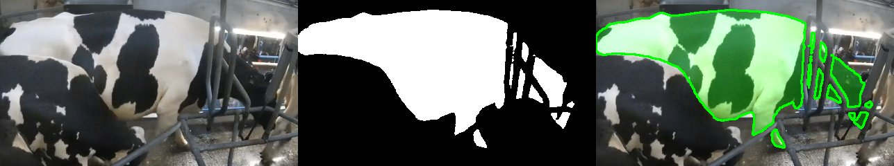

| Field | Value |
|---|---|
| **Dataset** | SideViewCows2026 (Zenodo 21605650) |
| **Filename** | `128_0355.jpg` (Mask: `128_0355.png`) |
| **Biological Individual ID** | **Cow 128** (Verified biological cow) |
| **Camera Setting** | `PARLOR` (Type: `multi`) |
| **Recording Session** | `parlor_cow_0128_sess_020` (Frame No: `355`) |
| **Temporal Offset** | `1,383,997.0 s` (~16.0 days) |
| **Inspection Focus** | Inspect late parlor session (>50 days later) of same cow. |

**Manual Inspection Checklist:**
- [ ] Cow side profile and coat pattern are identifiable
- [ ] Camera setting matches expected domain (`parlor`)
- [ ] Binary mask accurately traces the cow silhouette
- [ ] Green overlay tightly adheres to body contour without clipping legs/head or bleeding into background
- **Verdict:** `[ ] PASS   [ ] QUESTIONABLE   [ ] FAIL`
- *Auditor Notes:* _______________________________________

---
### Check [SV-16]: Complex Background / Low Contrast (Barn)
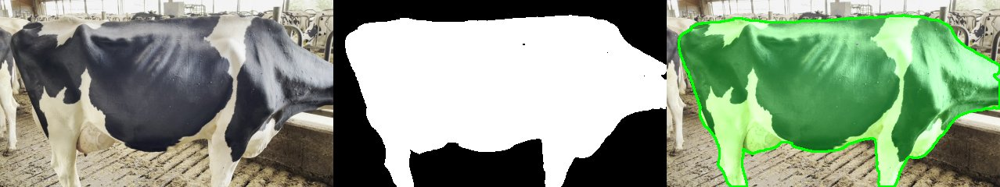

| Field | Value |
|---|---|
| **Dataset** | SideViewCows2026 (Zenodo 21605650) |
| **Filename** | `124_0201.jpg` (Mask: `124_0201.png`) |
| **Biological Individual ID** | **Cow 124** (Verified biological cow) |
| **Camera Setting** | `BARN` (Type: `parlor_barn`) |
| **Recording Session** | `barn_cow_0124_sess_001` (Frame No: `201`) |
| **Temporal Offset** | `30,708,569.0 s` (~355.4 days) |
| **Inspection Focus** | Inspect mask boundary accuracy around legs, hooves, and udder. |

**Manual Inspection Checklist:**
- [ ] Cow side profile and coat pattern are identifiable
- [ ] Camera setting matches expected domain (`barn`)
- [ ] Binary mask accurately traces the cow silhouette
- [ ] Green overlay tightly adheres to body contour without clipping legs/head or bleeding into background
- **Verdict:** `[ ] PASS   [ ] QUESTIONABLE   [ ] FAIL`
- *Auditor Notes:* _______________________________________

---
# Final Manual Verification Summary

Please fill out the summary table below after inspecting all 48 visual checks:

| Dataset | Total Checks | PASS | QUESTIONABLE | FAIL | Auditor Comments |
|---|---|---|---|---|---|
| **ScienceDB (BCS)** | 16 | [ ] | [ ] | [ ] | |
| **MmCows (Behavior)** | 16 | [ ] | [ ] | [ ] | |
| **SideViewCows2026 (Re-ID)** | 16 | [ ] | [ ] | [ ] | |
| **Total** | **48** | | | | |

---

## Overall Manual Decision

Review your findings above and select one conclusion before authorizing Step 2:

- [ ] **ACCEPT — DATASET FOUNDATION SOUND**  
  *No fatal image corruptions, crop failures, mask misalignments, or obvious label inversions detected. Ready for Step 2 Cattle-Perception Feasibility Audit.*

- [ ] **ACCEPT WITH MINOR NOTES**  
  *Certain frames exhibit expected livestock real-world ambiguity (e.g. occlusion by stall bars, slight shadow, subtle licking action), but data structure is verified sound and split protocols remain valid.*

- [ ] **INVESTIGATE BEFORE STEP 2**  
  *Severe structural defect identified (e.g. inverted mask, completely wrong species/image, corrupted file). Must resolve before Step 2.*

**Auditor Signature**: Hasin Ishrak  
**Date**: 2026-09-20  
