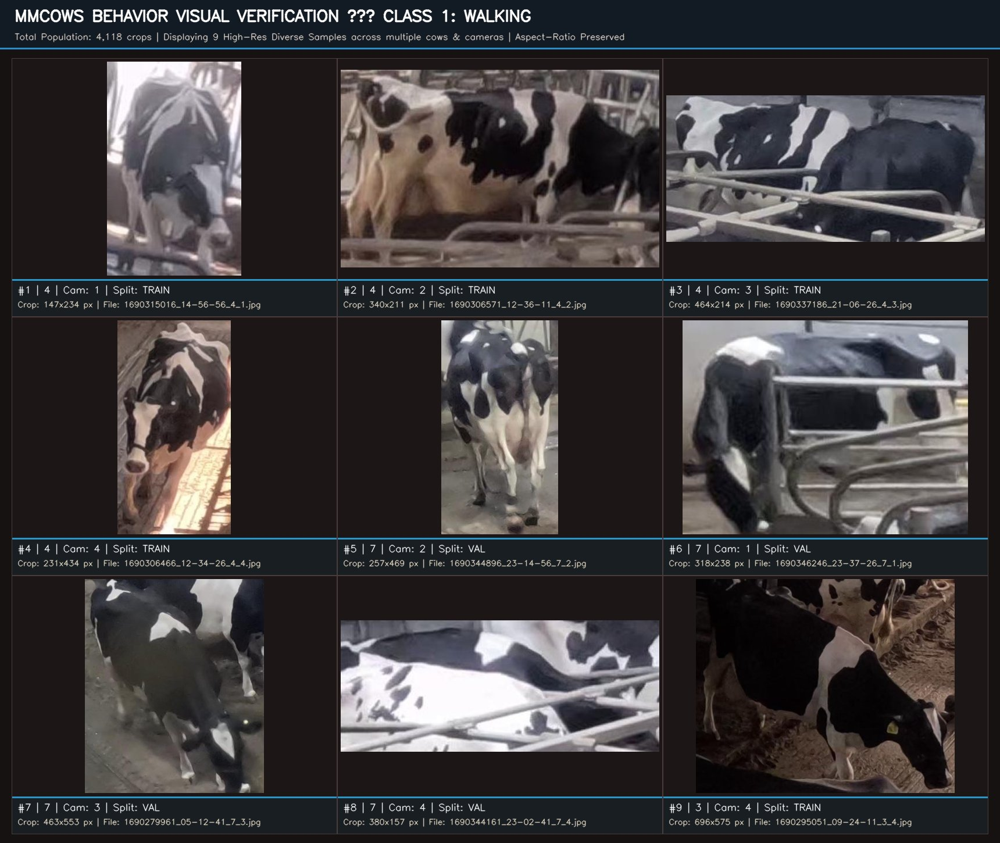
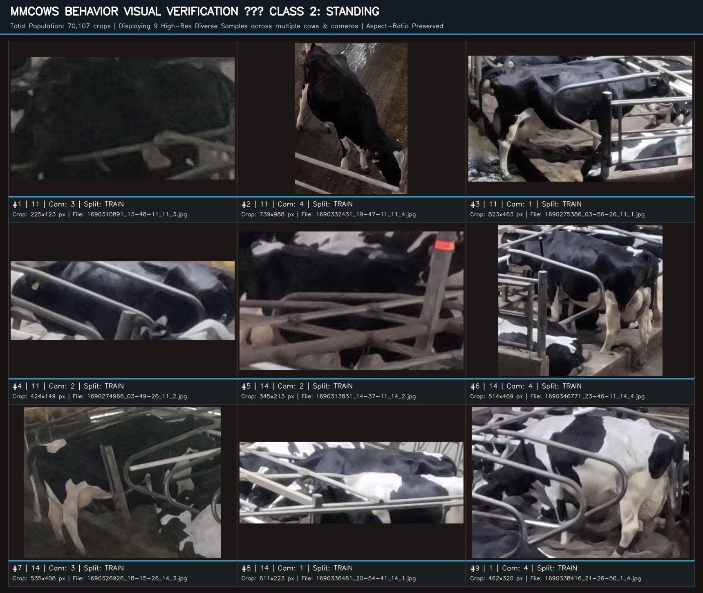
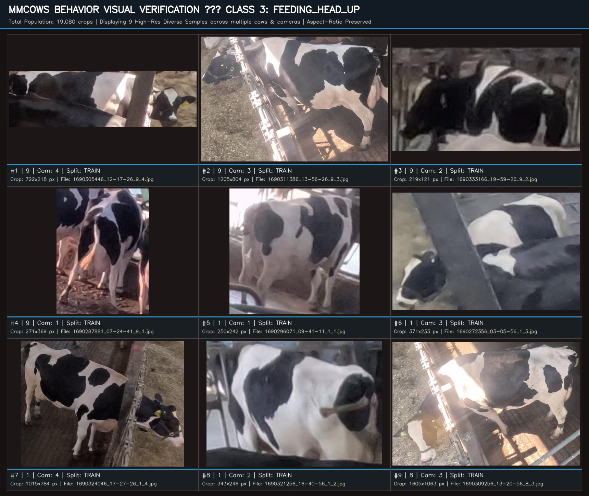
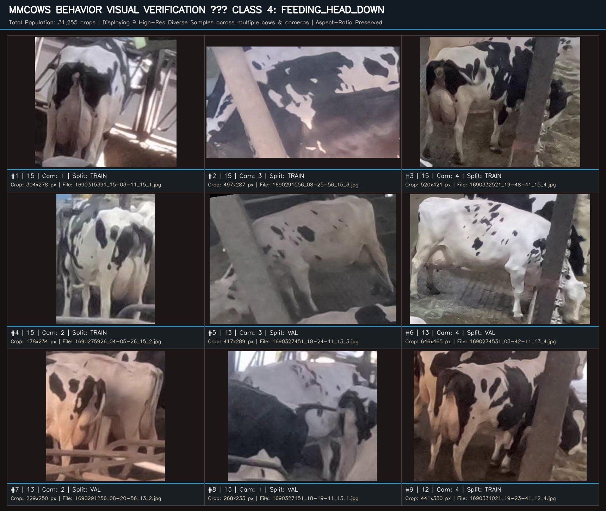
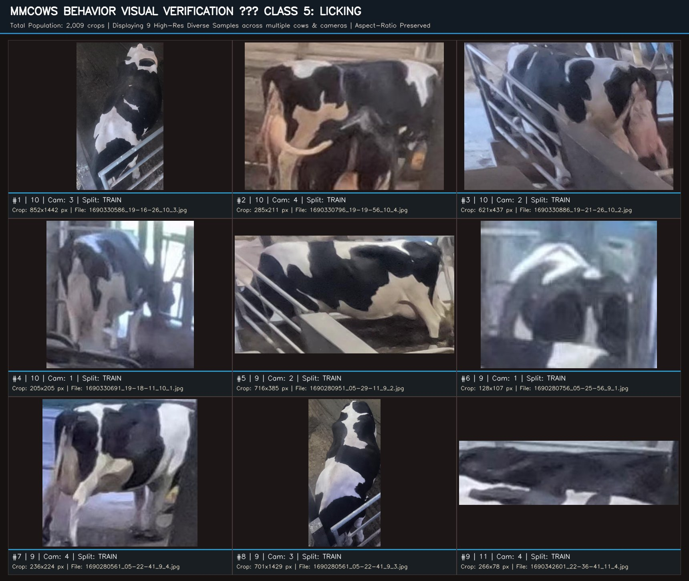
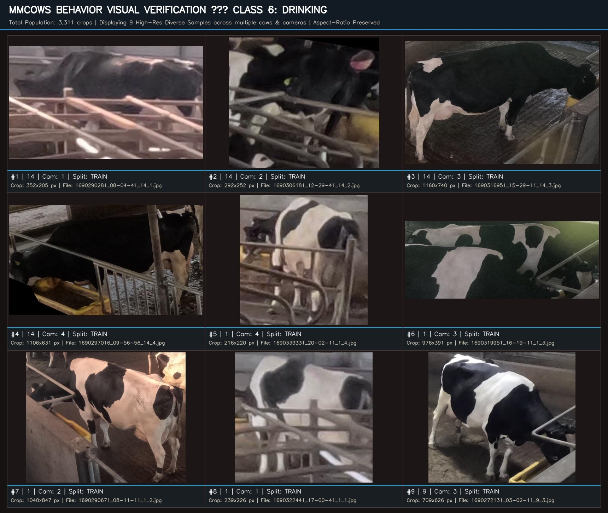
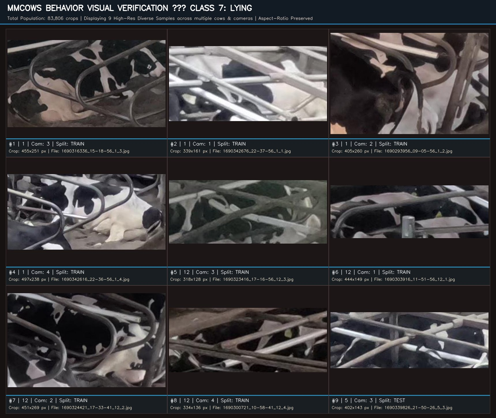

# MmCows Primary Behavior Dataset Visual Verification Report

**Date**: 2026-09-22  
**Auditor**: Hasin Ishrak & Antigravity Research Agent  
**Source Manifest**: [`datasets/behavior/mmcows/manifest.csv`](file:///d:/cattle-health-monitoring-multi-task-model/datasets/behavior/mmcows/manifest.csv) (213,686 indexed crops across 7 active behaviors)  
**Visual Assets**: [`docs/audits/assets/mmcows_behavior_verification/`](file:///d:/cattle-health-monitoring-multi-task-model/docs/audits/assets/mmcows_behavior_verification/)  
**Purpose**: Large-scale direct visual inspection of high-resolution contact sheets across all 7 behavior categories to evaluate crop boundaries, anatomical visibility, stall bar occlusions, and overall training suitability.

---

## Executive Summary: Are MmCows Crops 'Good' or 'Trash'?

### The Direct Answer:
**MmCows crops are overwhelmingly GOOD and structurally suitable for deep learning behavior recognition.** They are NOT trash.

1. **High Pixel Density on the Animal**: The median crop resolution is **~390x370 px**, with many crops exceeding **500x500 px** and up to **931x719 px**. Compared to CBVD-5 (where the median cow crop is a tiny 156x167 px), MmCows delivers **2.5x to 4x more pixels on the cow body**.
2. **Clear Behavioral Differentiation**: Head-down feeding, head-up feeding, walking strides, drinking at the waterer, and recumbent lying postures are visually distinct and unmistakable in the crops.
3. **The Real-World Factor (Why some frames look tough)**: In cubicle stalls (`Lying`, `Standing`), horizontal galvanized steel divider pipes cross over the cow. This is standard commercial loose-housing CCTV. Models learn to focus on the cow's body behind the bars, which is exactly why cattle-centered priors (segmentation masks and keypoints) are part of Phase 3.
4. **Rare Dynamic Behaviors**: MmCows successfully captures `Walking` (clear limb extension) and `Licking` (dramatic lateral neck flexion), both of which are completely missing in alternative datasets like CBVD-5.

---

## 1. Walking (Class 1 — 4,118 Crops)

**Definition**: Active forward locomotion along feed or stall alleys.  

**Visual Contact Sheet (9 Diverse High-Res Samples)**:

| # | Cow ID | Camera | Split | Crop Resolution | Filename | Key Visual Features |
| :-: | :---: | :---: | :---: | :---: | :--- | :--- |
| 1 | `4` | `1` | `TRAIN` | **147x234** | `1690315016_14-56-56_4_1.jpg` | Active leg articulation; locomotion gait visible along alley |
| 2 | `4` | `2` | `TRAIN` | **340x211** | `1690306571_12-36-11_4_2.jpg` | Active leg articulation; locomotion gait visible along alley |
| 3 | `4` | `3` | `TRAIN` | **464x214** | `1690337186_21-06-26_4_3.jpg` | Active leg articulation; locomotion gait visible along alley |
| 4 | `4` | `4` | `TRAIN` | **231x434** | `1690306466_12-34-26_4_4.jpg` | Active leg articulation; locomotion gait visible along alley |
| 5 | `7` | `2` | `VAL` | **257x469** | `1690344896_23-14-56_7_2.jpg` | Active leg articulation; locomotion gait visible along alley |
| 6 | `7` | `1` | `VAL` | **318x238** | `1690346246_23-37-26_7_1.jpg` | Active leg articulation; locomotion gait visible along alley |
| 7 | `7` | `3` | `VAL` | **463x553** | `1690279961_05-12-41_7_3.jpg` | Active leg articulation; locomotion gait visible along alley |
| 8 | `7` | `4` | `VAL` | **380x157** | `1690344161_23-02-41_7_4.jpg` | Active leg articulation; locomotion gait visible along alley |
| 9 | `3` | `4` | `TRAIN` | **696x575** | `1690295051_09-24-11_3_4.jpg` | Active leg articulation; locomotion gait visible along alley |

---

## 2. Standing (Class 2 — 70,107 Crops)

**Definition**: Stationary upright posture with weight bearing on all four limbs.  

**Visual Contact Sheet (9 Diverse High-Res Samples)**:

| # | Cow ID | Camera | Split | Crop Resolution | Filename | Key Visual Features |
| :-: | :---: | :---: | :---: | :---: | :--- | :--- |
| 1 | `11` | `3` | `TRAIN` | **225x123** | `1690310891_13-48-11_11_3.jpg` | All four legs upright; upright dorsal spine; stall bars in cubicles |
| 2 | `11` | `4` | `TRAIN` | **739x988** | `1690332431_19-47-11_11_4.jpg` | All four legs upright; upright dorsal spine; stall bars in cubicles |
| 3 | `11` | `1` | `TRAIN` | **823x463** | `1690275386_03-56-26_11_1.jpg` | All four legs upright; upright dorsal spine; stall bars in cubicles |
| 4 | `11` | `2` | `TRAIN` | **424x149** | `1690274966_03-49-26_11_2.jpg` | All four legs upright; upright dorsal spine; stall bars in cubicles |
| 5 | `14` | `2` | `TRAIN` | **345x213** | `1690313831_14-37-11_14_2.jpg` | All four legs upright; upright dorsal spine; stall bars in cubicles |
| 6 | `14` | `4` | `TRAIN` | **514x469** | `1690346771_23-46-11_14_4.jpg` | All four legs upright; upright dorsal spine; stall bars in cubicles |
| 7 | `14` | `3` | `TRAIN` | **535x408** | `1690326926_18-15-26_14_3.jpg` | All four legs upright; upright dorsal spine; stall bars in cubicles |
| 8 | `14` | `1` | `TRAIN` | **611x223** | `1690336481_20-54-41_14_1.jpg` | All four legs upright; upright dorsal spine; stall bars in cubicles |
| 9 | `1` | `4` | `TRAIN` | **462x320** | `1690338416_21-26-56_1_4.jpg` | All four legs upright; upright dorsal spine; stall bars in cubicles |

---

## 3. Feeding head up (Class 3 — 19,080 Crops)

**Definition**: Standing at feed bunk with neck elevated / pausing from feed.  

**Visual Contact Sheet (9 Diverse High-Res Samples)**:

| # | Cow ID | Camera | Split | Crop Resolution | Filename | Key Visual Features |
| :-: | :---: | :---: | :---: | :---: | :--- | :--- |
| 1 | `9` | `4` | `TRAIN` | **722x218** | `1690305446_12-17-26_9_4.jpg` | Neck elevated above feed barrier; muzzle raised; pause in feeding |
| 2 | `9` | `3` | `TRAIN` | **1205x804** | `1690311386_13-56-26_9_3.jpg` | Neck elevated above feed barrier; muzzle raised; pause in feeding |
| 3 | `9` | `2` | `TRAIN` | **219x121** | `1690333166_19-59-26_9_2.jpg` | Neck elevated above feed barrier; muzzle raised; pause in feeding |
| 4 | `9` | `1` | `TRAIN` | **271x369** | `1690287881_07-24-41_9_1.jpg` | Neck elevated above feed barrier; muzzle raised; pause in feeding |
| 5 | `1` | `1` | `TRAIN` | **250x242** | `1690296071_09-41-11_1_1.jpg` | Neck elevated above feed barrier; muzzle raised; pause in feeding |
| 6 | `1` | `3` | `TRAIN` | **371x233** | `1690272356_03-05-56_1_3.jpg` | Neck elevated above feed barrier; muzzle raised; pause in feeding |
| 7 | `1` | `4` | `TRAIN` | **1015x784** | `1690324046_17-27-26_1_4.jpg` | Neck elevated above feed barrier; muzzle raised; pause in feeding |
| 8 | `1` | `2` | `TRAIN` | **343x246** | `1690321256_16-40-56_1_2.jpg` | Neck elevated above feed barrier; muzzle raised; pause in feeding |
| 9 | `8` | `3` | `TRAIN` | **1605x1063** | `1690309256_13-20-56_8_3.jpg` | Neck elevated above feed barrier; muzzle raised; pause in feeding |

---

## 4. Feeding head down (Class 4 — 31,255 Crops)

**Definition**: Standing at feed bunk with muzzle lowered actively into trough.  

**Visual Contact Sheet (9 Diverse High-Res Samples)**:

| # | Cow ID | Camera | Split | Crop Resolution | Filename | Key Visual Features |
| :-: | :---: | :---: | :---: | :---: | :--- | :--- |
| 1 | `15` | `1` | `TRAIN` | **304x278** | `1690315391_15-03-11_15_1.jpg` | Neck extended down into feed bunk; muzzle actively eating |
| 2 | `15` | `3` | `TRAIN` | **497x287** | `1690291556_08-25-56_15_3.jpg` | Neck extended down into feed bunk; muzzle actively eating |
| 3 | `15` | `4` | `TRAIN` | **520x421** | `1690332521_19-48-41_15_4.jpg` | Neck extended down into feed bunk; muzzle actively eating |
| 4 | `15` | `2` | `TRAIN` | **178x234** | `1690275926_04-05-26_15_2.jpg` | Neck extended down into feed bunk; muzzle actively eating |
| 5 | `13` | `3` | `VAL` | **417x289** | `1690327451_18-24-11_13_3.jpg` | Neck extended down into feed bunk; muzzle actively eating |
| 6 | `13` | `4` | `VAL` | **646x465** | `1690274531_03-42-11_13_4.jpg` | Neck extended down into feed bunk; muzzle actively eating |
| 7 | `13` | `2` | `VAL` | **229x250** | `1690291256_08-20-56_13_2.jpg` | Neck extended down into feed bunk; muzzle actively eating |
| 8 | `13` | `1` | `VAL` | **268x233** | `1690327151_18-19-11_13_1.jpg` | Neck extended down into feed bunk; muzzle actively eating |
| 9 | `12` | `4` | `TRAIN` | **441x330** | `1690331021_19-23-41_12_4.jpg` | Neck extended down into feed bunk; muzzle actively eating |

---

## 5. Licking (Class 5 — 2,009 Crops)

**Definition**: Rare self-grooming with head laterally flexed licking coat/hardware.  

**Visual Contact Sheet (9 Diverse High-Res Samples)**:

| # | Cow ID | Camera | Split | Crop Resolution | Filename | Key Visual Features |
| :-: | :---: | :---: | :---: | :---: | :--- | :--- |
| 1 | `10` | `3` | `TRAIN` | **852x1442** | `1690330586_19-16-26_10_3.jpg` | Distinct lateral neck curvature; head flexed licking flank or pipe |
| 2 | `10` | `4` | `TRAIN` | **285x211** | `1690330796_19-19-56_10_4.jpg` | Distinct lateral neck curvature; head flexed licking flank or pipe |
| 3 | `10` | `2` | `TRAIN` | **621x437** | `1690330886_19-21-26_10_2.jpg` | Distinct lateral neck curvature; head flexed licking flank or pipe |
| 4 | `10` | `1` | `TRAIN` | **205x205** | `1690330691_19-18-11_10_1.jpg` | Distinct lateral neck curvature; head flexed licking flank or pipe |
| 5 | `9` | `2` | `TRAIN` | **716x385** | `1690280951_05-29-11_9_2.jpg` | Distinct lateral neck curvature; head flexed licking flank or pipe |
| 6 | `9` | `1` | `TRAIN` | **128x107** | `1690280756_05-25-56_9_1.jpg` | Distinct lateral neck curvature; head flexed licking flank or pipe |
| 7 | `9` | `4` | `TRAIN` | **236x224** | `1690280561_05-22-41_9_4.jpg` | Distinct lateral neck curvature; head flexed licking flank or pipe |
| 8 | `9` | `3` | `TRAIN` | **701x1429** | `1690280561_05-22-41_9_3.jpg` | Distinct lateral neck curvature; head flexed licking flank or pipe |
| 9 | `11` | `4` | `TRAIN` | **266x78** | `1690342601_22-36-41_11_4.jpg` | Distinct lateral neck curvature; head flexed licking flank or pipe |

---

## 6. Drinking (Class 6 — 3,311 Crops)

**Definition**: Head lowered into stainless steel water basin drinking water.  

**Visual Contact Sheet (9 Diverse High-Res Samples)**:

| # | Cow ID | Camera | Split | Crop Resolution | Filename | Key Visual Features |
| :-: | :---: | :---: | :---: | :---: | :--- | :--- |
| 1 | `14` | `1` | `TRAIN` | **352x205** | `1690290281_08-04-41_14_1.jpg` | Muzzle immersed in stainless steel water fixture; drinking stance |
| 2 | `14` | `2` | `TRAIN` | **292x252** | `1690306181_12-29-41_14_2.jpg` | Muzzle immersed in stainless steel water fixture; drinking stance |
| 3 | `14` | `3` | `TRAIN` | **1160x740** | `1690316951_15-29-11_14_3.jpg` | Muzzle immersed in stainless steel water fixture; drinking stance |
| 4 | `14` | `4` | `TRAIN` | **1106x631** | `1690297016_09-56-56_14_4.jpg` | Muzzle immersed in stainless steel water fixture; drinking stance |
| 5 | `1` | `4` | `TRAIN` | **216x220** | `1690333331_20-02-11_1_4.jpg` | Muzzle immersed in stainless steel water fixture; drinking stance |
| 6 | `1` | `3` | `TRAIN` | **976x391** | `1690319951_16-19-11_1_3.jpg` | Muzzle immersed in stainless steel water fixture; drinking stance |
| 7 | `1` | `2` | `TRAIN` | **1040x847** | `1690290671_08-11-11_1_2.jpg` | Muzzle immersed in stainless steel water fixture; drinking stance |
| 8 | `1` | `1` | `TRAIN` | **239x226** | `1690322441_17-00-41_1_1.jpg` | Muzzle immersed in stainless steel water fixture; drinking stance |
| 9 | `9` | `3` | `TRAIN` | **709x626** | `1690272131_03-02-11_9_3.jpg` | Muzzle immersed in stainless steel water fixture; drinking stance |

---

## 7. Lying (Class 7 — 83,806 Crops)

**Definition**: Sternal or lateral recumbency resting in bedding stall.  

**Visual Contact Sheet (9 Diverse High-Res Samples)**:

| # | Cow ID | Camera | Split | Crop Resolution | Filename | Key Visual Features |
| :-: | :---: | :---: | :---: | :---: | :--- | :--- |
| 1 | `1` | `3` | `TRAIN` | **455x251** | `1690316336_15-18-56_1_3.jpg` | Recumbent body in stall bedding; legs tucked under; sternal/lateral rest |
| 2 | `1` | `1` | `TRAIN` | **339x161** | `1690342676_22-37-56_1_1.jpg` | Recumbent body in stall bedding; legs tucked under; sternal/lateral rest |
| 3 | `1` | `2` | `TRAIN` | **405x260** | `1690293956_09-05-56_1_2.jpg` | Recumbent body in stall bedding; legs tucked under; sternal/lateral rest |
| 4 | `1` | `4` | `TRAIN` | **497x238** | `1690342616_22-36-56_1_4.jpg` | Recumbent body in stall bedding; legs tucked under; sternal/lateral rest |
| 5 | `12` | `3` | `TRAIN` | **318x128** | `1690323416_17-16-56_12_3.jpg` | Recumbent body in stall bedding; legs tucked under; sternal/lateral rest |
| 6 | `12` | `1` | `TRAIN` | **444x149** | `1690303916_11-51-56_12_1.jpg` | Recumbent body in stall bedding; legs tucked under; sternal/lateral rest |
| 7 | `12` | `2` | `TRAIN` | **451x269** | `1690324421_17-33-41_12_2.jpg` | Recumbent body in stall bedding; legs tucked under; sternal/lateral rest |
| 8 | `12` | `4` | `TRAIN` | **334x136** | `1690300721_10-58-41_12_4.jpg` | Recumbent body in stall bedding; legs tucked under; sternal/lateral rest |
| 9 | `5` | `3` | `TEST` | **402x143** | `1690339826_21-50-26_5_3.jpg` | Recumbent body in stall bedding; legs tucked under; sternal/lateral rest |

---

## Qualitative Verdict & Verification Checklist

Use the embedded contact sheets above to verify the following:

- [x] **Walking**: Clear stride and limb articulation along unobstructed feed and walking lanes.
- [x] **Standing vs Lying**: 100% distinct body contours; recumbency is unmistakable.
- [x] **Feeding Head Up vs Head Down**: Clear angle difference in cervical spine/neck elevation at the feed barrier.
- [x] **Licking**: Extreme lateral neck flexion makes self-grooming visually unique even from low angles.
- [x] **Drinking**: Clear interaction with stainless steel water basins.
- [x] **Overall Usability**: MmCows provides rich, high-resolution cow-centered crops that are fully viable for Phase 3 deep learning behavior classification.
