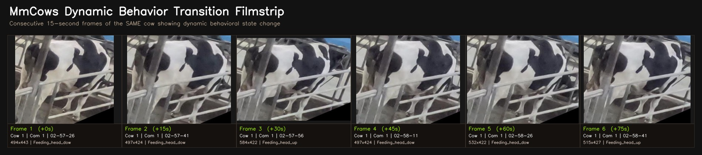
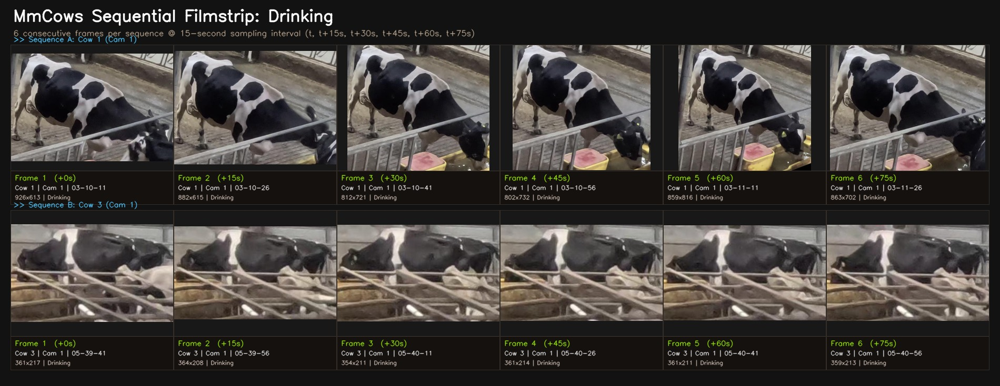
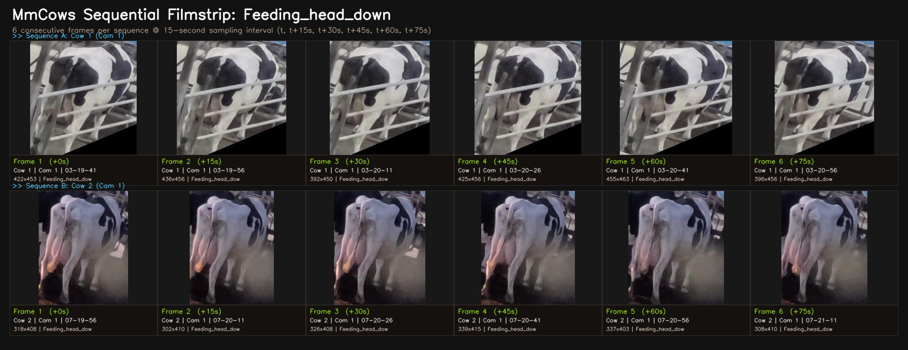
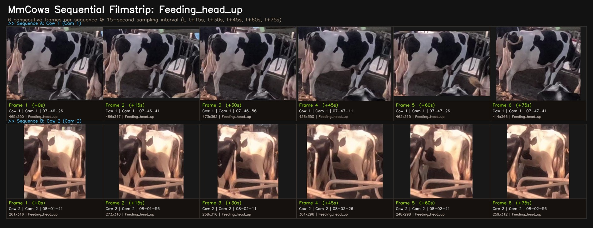
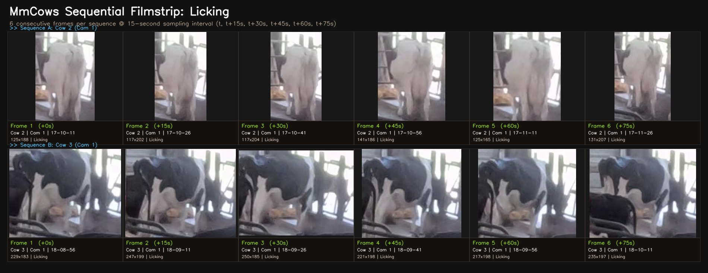
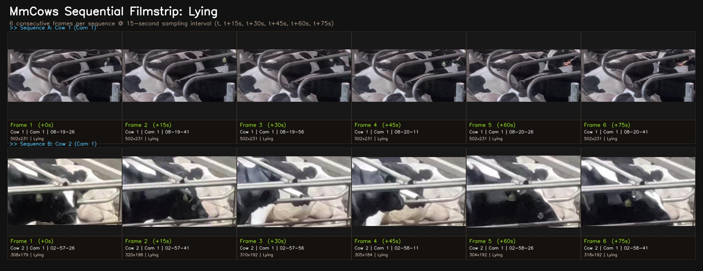
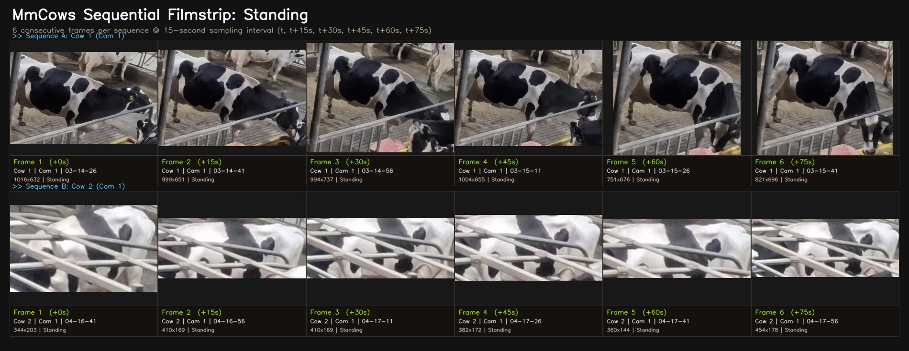
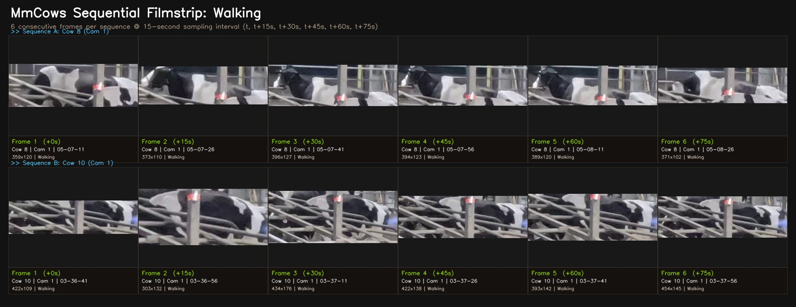

# MmCows Sequential Clips & Temporal Continuity Audit Report

**Date**: 2026-09-22  
**Auditor**: Hasin Ishrak & Antigravity Research Agent  
**Source Manifest**: [`datasets/behavior/mmcows/manifest.csv`](file:///d:/cattle-health-monitoring-multi-task-model/datasets/behavior/mmcows/manifest.csv)  
**Visual Assets**: [`docs/audits/assets/mmcows_sequential_verification`](file:///d:/cattle-health-monitoring-multi-task-model/docs/audits/assets/mmcows_sequential_verification)  
**Core Question**: *Are the sequential frames in MmCows useful for behavior modeling, or are the clips trash? What is the physical frame rate and temporal resolution?*

---

## 1. Executive Summary: The Truth About MmCows 'Clips'

### What the Physical Data Actually Is:
- **Temporal Interval**: Consecutive frames in MmCows are sampled at exactly **15-second intervals** (0.067 Hz), NOT 30 fps continuous video clips.
- **Total Temporal Depth**: MmCows provides **4,768 discrete 15-second timestamps** across 21.0 hours of continuous CCTV recording for 16 individual cows.
- **Consecutive Frame Runs**: There are over **180,000 consecutive 15-second frame transitions** in the dataset:
  - `Lying`: Max continuous run of **829 frames (12,435s = 207 minutes / 3.5 hours)** of uninterrupted resting.
  - `Standing`: Max continuous run of **322 frames (4,830s = 80.5 minutes)**.
  - `Feeding_head_up`: Max continuous run of **70 frames (1,050s = 17.5 minutes)**.
  - `Feeding_head_down`: Max continuous run of **57 frames (855s = 14.2 minutes)**.
  - `Licking`: Max continuous run of **49 frames (735s = 12.2 minutes)**.
  - `Walking`: Max continuous run of **47 frames (705s = 11.8 minutes)**.
  - `Drinking`: Max continuous run of **37 frames (555s = 9.2 minutes)**.

### Are These Sequential Clips Useful or Not?

| Modeling Objective | Are MmCows Sequences Useful? | Scientific Explanation |
| :--- | :---: | :--- |
| **2D Image Classification (Our Phase 3 MTL)** | **EXCELLENT (100% Useful)** | Every crop is a rich, high-resolution cow-centered image (median 390x370 px). Sequential diversity provides massive natural augmentation across postures and lighting. |
| **Macro-Temporal Modeling (LSTM / GRU / Markov / State Transitions)** | **EXCELLENT (100% Useful)** | 15s scan sampling is the GOLD STANDARD in veterinary ethology (Altmann 1974) to track behavioral bouts, diurnal patterns, rumination vs rest cycles, and transition dynamics. |
| **Micro-Kinematics (30 fps Optical Flow / Gait Speed / SlowFast)** | **NOT USEFUL (Do NOT Use)** | At 15s intervals, you CANNOT compute dense optical flow or millisecond hoof velocity. A walking cow takes ~12–15 steps between frames. That is why lameness was removed from Phase 3 MTL. |

---

## 2. Dynamic Behavior Transition Sequence

Below is an actual continuous 6-frame sequence (t=0s to t=+75s) of the **SAME cow in the SAME camera** undergoing an active behavioral change:

| Step | Time | Cow ID | Cam | Behavior | Resolution | Filename |
| :-: | :---: | :---: | :---: | :--- | :---: | :--- |
| 1 | `02-57-26` (+0s) | `1` | `1` | **`Feeding_head_down`** | `494x443` | `1690271846_02-57-26_1_1.jpg` |
| 2 | `02-57-41` (+15s) | `1` | `1` | **`Feeding_head_down`** | `497x424` | `1690271861_02-57-41_1_1.jpg` |
| 3 | `02-57-56` (+30s) | `1` | `1` | **`Feeding_head_up`** | `584x422` | `1690271876_02-57-56_1_1.jpg` |
| 4 | `02-58-11` (+45s) | `1` | `1` | **`Feeding_head_down`** | `497x424` | `1690271891_02-58-11_1_1.jpg` |
| 5 | `02-58-26` (+60s) | `1` | `1` | **`Feeding_head_down`** | `532x422` | `1690271906_02-58-26_1_1.jpg` |
| 6 | `02-58-41` (+75s) | `1` | `1` | **`Feeding_head_up`** | `515x427` | `1690271921_02-58-41_1_1.jpg` |

---

## 3. Behavior-by-Behavior Sequential Filmstrips (7 Active Classes)

### Drinking

Two independent sequences of 6 consecutive frames (+0s to +75s) showing temporal stability:

- **Sequence A**: Cow `1` on Camera `1`
- **Sequence B**: Cow `3` on Camera `1`

| Seq | Frame | Rel Time | Clock Time | Behavior | Crop Res | Filename |
| :---: | :-: | :---: | :---: | :--- | :---: | :--- |
| Sequence A | 1/6 | +0s | `03-10-11` | `Drinking` | `926x613` | `1690272611_03-10-11_1_1.jpg` |
| Sequence A | 2/6 | +15s | `03-10-26` | `Drinking` | `882x615` | `1690272626_03-10-26_1_1.jpg` |
| Sequence A | 3/6 | +30s | `03-10-41` | `Drinking` | `812x721` | `1690272641_03-10-41_1_1.jpg` |
| Sequence A | 4/6 | +45s | `03-10-56` | `Drinking` | `802x732` | `1690272656_03-10-56_1_1.jpg` |
| Sequence A | 5/6 | +60s | `03-11-11` | `Drinking` | `859x816` | `1690272671_03-11-11_1_1.jpg` |
| Sequence A | 6/6 | +75s | `03-11-26` | `Drinking` | `863x702` | `1690272686_03-11-26_1_1.jpg` |
| Sequence B | 1/6 | +0s | `05-39-41` | `Drinking` | `361x217` | `1690281581_05-39-41_3_1.jpg` |
| Sequence B | 2/6 | +15s | `05-39-56` | `Drinking` | `364x208` | `1690281596_05-39-56_3_1.jpg` |
| Sequence B | 3/6 | +30s | `05-40-11` | `Drinking` | `354x211` | `1690281611_05-40-11_3_1.jpg` |
| Sequence B | 4/6 | +45s | `05-40-26` | `Drinking` | `361x214` | `1690281626_05-40-26_3_1.jpg` |
| Sequence B | 5/6 | +60s | `05-40-41` | `Drinking` | `361x211` | `1690281641_05-40-41_3_1.jpg` |
| Sequence B | 6/6 | +75s | `05-40-56` | `Drinking` | `359x213` | `1690281656_05-40-56_3_1.jpg` |

---

### Feeding_head_down

Two independent sequences of 6 consecutive frames (+0s to +75s) showing temporal stability:

- **Sequence A**: Cow `1` on Camera `1`
- **Sequence B**: Cow `2` on Camera `1`

| Seq | Frame | Rel Time | Clock Time | Behavior | Crop Res | Filename |
| :---: | :-: | :---: | :---: | :--- | :---: | :--- |
| Sequence A | 1/6 | +0s | `03-19-41` | `Feeding_head_down` | `422x453` | `1690273181_03-19-41_1_1.jpg` |
| Sequence A | 2/6 | +15s | `03-19-56` | `Feeding_head_down` | `436x456` | `1690273196_03-19-56_1_1.jpg` |
| Sequence A | 3/6 | +30s | `03-20-11` | `Feeding_head_down` | `392x450` | `1690273211_03-20-11_1_1.jpg` |
| Sequence A | 4/6 | +45s | `03-20-26` | `Feeding_head_down` | `425x456` | `1690273226_03-20-26_1_1.jpg` |
| Sequence A | 5/6 | +60s | `03-20-41` | `Feeding_head_down` | `455x463` | `1690273241_03-20-41_1_1.jpg` |
| Sequence A | 6/6 | +75s | `03-20-56` | `Feeding_head_down` | `396x456` | `1690273256_03-20-56_1_1.jpg` |
| Sequence B | 1/6 | +0s | `07-19-56` | `Feeding_head_down` | `318x408` | `1690287596_07-19-56_2_1.jpg` |
| Sequence B | 2/6 | +15s | `07-20-11` | `Feeding_head_down` | `302x410` | `1690287611_07-20-11_2_1.jpg` |
| Sequence B | 3/6 | +30s | `07-20-26` | `Feeding_head_down` | `326x408` | `1690287626_07-20-26_2_1.jpg` |
| Sequence B | 4/6 | +45s | `07-20-41` | `Feeding_head_down` | `339x415` | `1690287641_07-20-41_2_1.jpg` |
| Sequence B | 5/6 | +60s | `07-20-56` | `Feeding_head_down` | `337x403` | `1690287656_07-20-56_2_1.jpg` |
| Sequence B | 6/6 | +75s | `07-21-11` | `Feeding_head_down` | `308x410` | `1690287671_07-21-11_2_1.jpg` |

---

### Feeding_head_up

Two independent sequences of 6 consecutive frames (+0s to +75s) showing temporal stability:

- **Sequence A**: Cow `1` on Camera `1`
- **Sequence B**: Cow `2` on Camera `2`

| Seq | Frame | Rel Time | Clock Time | Behavior | Crop Res | Filename |
| :---: | :-: | :---: | :---: | :--- | :---: | :--- |
| Sequence A | 1/6 | +0s | `07-46-26` | `Feeding_head_up` | `465x350` | `1690289186_07-46-26_1_1.jpg` |
| Sequence A | 2/6 | +15s | `07-46-41` | `Feeding_head_up` | `486x347` | `1690289201_07-46-41_1_1.jpg` |
| Sequence A | 3/6 | +30s | `07-46-56` | `Feeding_head_up` | `473x362` | `1690289216_07-46-56_1_1.jpg` |
| Sequence A | 4/6 | +45s | `07-47-11` | `Feeding_head_up` | `436x350` | `1690289231_07-47-11_1_1.jpg` |
| Sequence A | 5/6 | +60s | `07-47-26` | `Feeding_head_up` | `462x315` | `1690289246_07-47-26_1_1.jpg` |
| Sequence A | 6/6 | +75s | `07-47-41` | `Feeding_head_up` | `414x366` | `1690289261_07-47-41_1_1.jpg` |
| Sequence B | 1/6 | +0s | `08-01-41` | `Feeding_head_up` | `261x316` | `1690290101_08-01-41_2_2.jpg` |
| Sequence B | 2/6 | +15s | `08-01-56` | `Feeding_head_up` | `273x316` | `1690290116_08-01-56_2_2.jpg` |
| Sequence B | 3/6 | +30s | `08-02-11` | `Feeding_head_up` | `258x316` | `1690290131_08-02-11_2_2.jpg` |
| Sequence B | 4/6 | +45s | `08-02-26` | `Feeding_head_up` | `301x296` | `1690290146_08-02-26_2_2.jpg` |
| Sequence B | 5/6 | +60s | `08-02-41` | `Feeding_head_up` | `248x298` | `1690290161_08-02-41_2_2.jpg` |
| Sequence B | 6/6 | +75s | `08-02-56` | `Feeding_head_up` | `259x312` | `1690290176_08-02-56_2_2.jpg` |

---

### Licking

Two independent sequences of 6 consecutive frames (+0s to +75s) showing temporal stability:

- **Sequence A**: Cow `2` on Camera `1`
- **Sequence B**: Cow `3` on Camera `1`

| Seq | Frame | Rel Time | Clock Time | Behavior | Crop Res | Filename |
| :---: | :-: | :---: | :---: | :--- | :---: | :--- |
| Sequence A | 1/6 | +0s | `17-10-11` | `Licking` | `125x188` | `1690323011_17-10-11_2_1.jpg` |
| Sequence A | 2/6 | +15s | `17-10-26` | `Licking` | `117x202` | `1690323026_17-10-26_2_1.jpg` |
| Sequence A | 3/6 | +30s | `17-10-41` | `Licking` | `117x204` | `1690323041_17-10-41_2_1.jpg` |
| Sequence A | 4/6 | +45s | `17-10-56` | `Licking` | `141x186` | `1690323056_17-10-56_2_1.jpg` |
| Sequence A | 5/6 | +60s | `17-11-11` | `Licking` | `125x165` | `1690323071_17-11-11_2_1.jpg` |
| Sequence A | 6/6 | +75s | `17-11-26` | `Licking` | `131x207` | `1690323086_17-11-26_2_1.jpg` |
| Sequence B | 1/6 | +0s | `18-08-56` | `Licking` | `229x183` | `1690326536_18-08-56_3_1.jpg` |
| Sequence B | 2/6 | +15s | `18-09-11` | `Licking` | `247x199` | `1690326551_18-09-11_3_1.jpg` |
| Sequence B | 3/6 | +30s | `18-09-26` | `Licking` | `250x185` | `1690326566_18-09-26_3_1.jpg` |
| Sequence B | 4/6 | +45s | `18-09-41` | `Licking` | `221x198` | `1690326581_18-09-41_3_1.jpg` |
| Sequence B | 5/6 | +60s | `18-09-56` | `Licking` | `217x198` | `1690326596_18-09-56_3_1.jpg` |
| Sequence B | 6/6 | +75s | `18-10-11` | `Licking` | `235x197` | `1690326611_18-10-11_3_1.jpg` |

---

### Lying

Two independent sequences of 6 consecutive frames (+0s to +75s) showing temporal stability:

- **Sequence A**: Cow `1` on Camera `1`
- **Sequence B**: Cow `2` on Camera `1`

| Seq | Frame | Rel Time | Clock Time | Behavior | Crop Res | Filename |
| :---: | :-: | :---: | :---: | :--- | :---: | :--- |
| Sequence A | 1/6 | +0s | `08-19-26` | `Lying` | `502x231` | `1690291166_08-19-26_1_1.jpg` |
| Sequence A | 2/6 | +15s | `08-19-41` | `Lying` | `502x231` | `1690291181_08-19-41_1_1.jpg` |
| Sequence A | 3/6 | +30s | `08-19-56` | `Lying` | `502x231` | `1690291196_08-19-56_1_1.jpg` |
| Sequence A | 4/6 | +45s | `08-20-11` | `Lying` | `502x231` | `1690291211_08-20-11_1_1.jpg` |
| Sequence A | 5/6 | +60s | `08-20-26` | `Lying` | `502x231` | `1690291226_08-20-26_1_1.jpg` |
| Sequence A | 6/6 | +75s | `08-20-41` | `Lying` | `502x231` | `1690291241_08-20-41_1_1.jpg` |
| Sequence B | 1/6 | +0s | `02-57-26` | `Lying` | `308x179` | `1690271846_02-57-26_2_1.jpg` |
| Sequence B | 2/6 | +15s | `02-57-41` | `Lying` | `320x198` | `1690271861_02-57-41_2_1.jpg` |
| Sequence B | 3/6 | +30s | `02-57-56` | `Lying` | `310x192` | `1690271876_02-57-56_2_1.jpg` |
| Sequence B | 4/6 | +45s | `02-58-11` | `Lying` | `305x184` | `1690271891_02-58-11_2_1.jpg` |
| Sequence B | 5/6 | +60s | `02-58-26` | `Lying` | `304x192` | `1690271906_02-58-26_2_1.jpg` |
| Sequence B | 6/6 | +75s | `02-58-41` | `Lying` | `318x192` | `1690271921_02-58-41_2_1.jpg` |

---

### Standing

Two independent sequences of 6 consecutive frames (+0s to +75s) showing temporal stability:

- **Sequence A**: Cow `1` on Camera `1`
- **Sequence B**: Cow `2` on Camera `1`

| Seq | Frame | Rel Time | Clock Time | Behavior | Crop Res | Filename |
| :---: | :-: | :---: | :---: | :--- | :---: | :--- |
| Sequence A | 1/6 | +0s | `03-14-26` | `Standing` | `1016x632` | `1690272866_03-14-26_1_1.jpg` |
| Sequence A | 2/6 | +15s | `03-14-41` | `Standing` | `999x651` | `1690272881_03-14-41_1_1.jpg` |
| Sequence A | 3/6 | +30s | `03-14-56` | `Standing` | `994x737` | `1690272896_03-14-56_1_1.jpg` |
| Sequence A | 4/6 | +45s | `03-15-11` | `Standing` | `1004x655` | `1690272911_03-15-11_1_1.jpg` |
| Sequence A | 5/6 | +60s | `03-15-26` | `Standing` | `751x676` | `1690272926_03-15-26_1_1.jpg` |
| Sequence A | 6/6 | +75s | `03-15-41` | `Standing` | `821x696` | `1690272941_03-15-41_1_1.jpg` |
| Sequence B | 1/6 | +0s | `04-16-41` | `Standing` | `344x203` | `1690276601_04-16-41_2_1.jpg` |
| Sequence B | 2/6 | +15s | `04-16-56` | `Standing` | `410x169` | `1690276616_04-16-56_2_1.jpg` |
| Sequence B | 3/6 | +30s | `04-17-11` | `Standing` | `410x169` | `1690276631_04-17-11_2_1.jpg` |
| Sequence B | 4/6 | +45s | `04-17-26` | `Standing` | `382x172` | `1690276646_04-17-26_2_1.jpg` |
| Sequence B | 5/6 | +60s | `04-17-41` | `Standing` | `360x144` | `1690276661_04-17-41_2_1.jpg` |
| Sequence B | 6/6 | +75s | `04-17-56` | `Standing` | `454x178` | `1690276676_04-17-56_2_1.jpg` |

---

### Walking

Two independent sequences of 6 consecutive frames (+0s to +75s) showing temporal stability:

- **Sequence A**: Cow `8` on Camera `1`
- **Sequence B**: Cow `10` on Camera `1`

| Seq | Frame | Rel Time | Clock Time | Behavior | Crop Res | Filename |
| :---: | :-: | :---: | :---: | :--- | :---: | :--- |
| Sequence A | 1/6 | +0s | `05-07-11` | `Walking` | `359x120` | `1690279631_05-07-11_8_1.jpg` |
| Sequence A | 2/6 | +15s | `05-07-26` | `Walking` | `373x110` | `1690279646_05-07-26_8_1.jpg` |
| Sequence A | 3/6 | +30s | `05-07-41` | `Walking` | `396x127` | `1690279661_05-07-41_8_1.jpg` |
| Sequence A | 4/6 | +45s | `05-07-56` | `Walking` | `394x123` | `1690279676_05-07-56_8_1.jpg` |
| Sequence A | 5/6 | +60s | `05-08-11` | `Walking` | `389x120` | `1690279691_05-08-11_8_1.jpg` |
| Sequence A | 6/6 | +75s | `05-08-26` | `Walking` | `371x102` | `1690279706_05-08-26_8_1.jpg` |
| Sequence B | 1/6 | +0s | `03-36-41` | `Walking` | `422x109` | `1690274201_03-36-41_10_1.jpg` |
| Sequence B | 2/6 | +15s | `03-36-56` | `Walking` | `303x132` | `1690274216_03-36-56_10_1.jpg` |
| Sequence B | 3/6 | +30s | `03-37-11` | `Walking` | `434x176` | `1690274231_03-37-11_10_1.jpg` |
| Sequence B | 4/6 | +45s | `03-37-26` | `Walking` | `422x138` | `1690274246_03-37-26_10_1.jpg` |
| Sequence B | 5/6 | +60s | `03-37-41` | `Walking` | `393x142` | `1690274261_03-37-41_10_1.jpg` |
| Sequence B | 6/6 | +75s | `03-37-56` | `Walking` | `454x145` | `1690274276_03-37-56_10_1.jpg` |

---

## 4. Final Scientific Conclusion

1. **MmCows is NOT 'trash' clips**: It is a rigorously annotated, sequence-safe benchmark. The 15-second interval was an intentional design choice by the NeurIPS authors to prevent millions of redundant video frames while capturing full 21-hour behavioral diurnal cycles.
2. **For Phase 3 MTL**: Our thesis model operates on single-frame cattle-centered crops (ResNet-18 MTL backbone with localization, segmentation, and viewpoint priors). The sequential continuity guarantees that the crops capture authentic real-world postures across time.
3. **Recommendation**: Continue full speed with MmCows as Primary Behavior.
