# Phase 3 Pose Visual Review

Human visual-review sheet for inspecting the anatomical plausibility of predicted cattle keypoints from official DeepLabCut **SuperAnimal-Quadruped** across the three primary Phase 3 datasets:
* **ScienceDB** (Rear-view BCS)
* **MmCows** (CCTV behavior postures)
* **SideViewCows2026** (Parlor & barn Re-ID side views)

Two backbones evaluated on identical target-cow crops:
* **HRNet-W32** (`superanimal_quadruped_hrnet_w32.pt`)
* **ResNet-50** (`superanimal_quadruped_resnet_50.pt`)

> [!NOTE]
> This document is a human visual-review scorecard. No checkboxes are pre-filled, and no manual ratings are fabricated.

---

## ScienceDB

Rear-view chute images from ScienceDB Cattle BCS dataset (dorsal/pelvic view of cows facing away).

### Sample Quick-Comparison Index

| Sample ID | HRNet-W32 Link | ResNet-50 Link |
|---|---|---|
| `sample_0001` | [HRNet-W32](#sample_0001--hrnet-w32) | [ResNet-50](#sample_0001--resnet-50) |
| `sample_0002` | [HRNet-W32](#sample_0002--hrnet-w32) | [ResNet-50](#sample_0002--resnet-50) |
| `sample_0003` | [HRNet-W32](#sample_0003--hrnet-w32) | [ResNet-50](#sample_0003--resnet-50) |
| `sample_0004` | [HRNet-W32](#sample_0004--hrnet-w32) | [ResNet-50](#sample_0004--resnet-50) |
| `sample_0005` | [HRNet-W32](#sample_0005--hrnet-w32) | [ResNet-50](#sample_0005--resnet-50) |
| `sample_0006` | [HRNet-W32](#sample_0006--hrnet-w32) | [ResNet-50](#sample_0006--resnet-50) |
| `sample_0007` | [HRNet-W32](#sample_0007--hrnet-w32) | [ResNet-50](#sample_0007--resnet-50) |
| `sample_0008` | [HRNet-W32](#sample_0008--hrnet-w32) | [ResNet-50](#sample_0008--resnet-50) |
| `sample_0009` | [HRNet-W32](#sample_0009--hrnet-w32) | [ResNet-50](#sample_0009--resnet-50) |
| `sample_0010` | [HRNet-W32](#sample_0010--hrnet-w32) | [ResNet-50](#sample_0010--resnet-50) |

---

### HRNet-W32

#### `sample_0001` — HRNet-W32

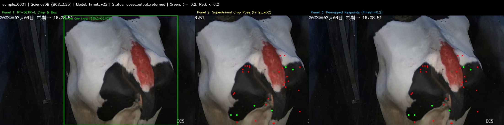

Review:
* [ ] Anatomically plausible
* [ ] Partially plausible
* [ ] Clearly wrong
* [ ] Wrong cow
* [ ] Insufficient visible anatomy
* [ ] Detector / pose failure

Notes:

---

#### `sample_0002` — HRNet-W32

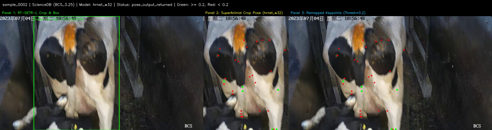

Review:
* [ ] Anatomically plausible
* [ ] Partially plausible
* [ ] Clearly wrong
* [ ] Wrong cow
* [ ] Insufficient visible anatomy
* [ ] Detector / pose failure

Notes:

---

#### `sample_0003` — HRNet-W32

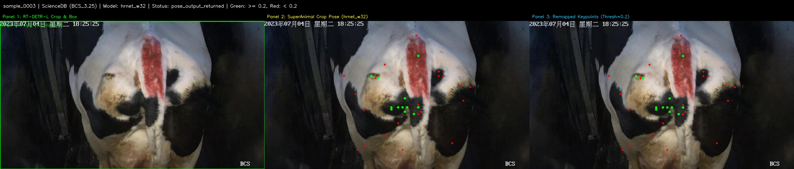

Review:
* [ ] Anatomically plausible
* [ ] Partially plausible
* [ ] Clearly wrong
* [ ] Wrong cow
* [ ] Insufficient visible anatomy
* [ ] Detector / pose failure

Notes:

---

#### `sample_0004` — HRNet-W32

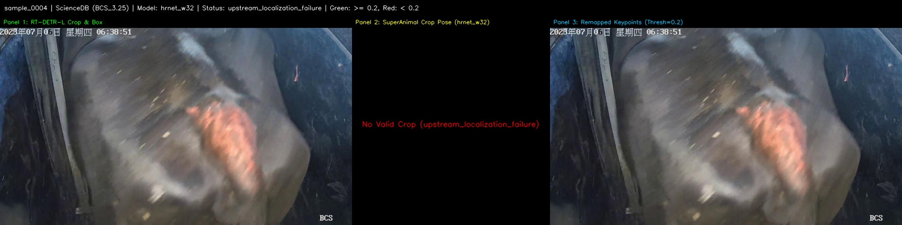

Review:
* [ ] Anatomically plausible
* [ ] Partially plausible
* [ ] Clearly wrong
* [ ] Wrong cow
* [ ] Insufficient visible anatomy
* [ ] Detector / pose failure

Notes:

---

#### `sample_0005` — HRNet-W32

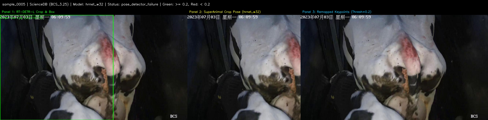

Review:
* [ ] Anatomically plausible
* [ ] Partially plausible
* [ ] Clearly wrong
* [ ] Wrong cow
* [ ] Insufficient visible anatomy
* [ ] Detector / pose failure

Notes:

---

#### `sample_0006` — HRNet-W32

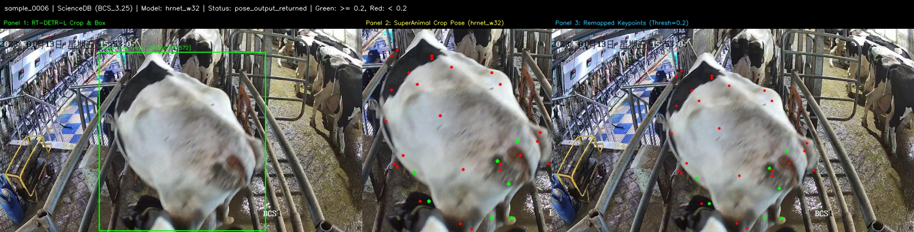

Review:
* [ ] Anatomically plausible
* [ ] Partially plausible
* [ ] Clearly wrong
* [ ] Wrong cow
* [ ] Insufficient visible anatomy
* [ ] Detector / pose failure

Notes:

---

#### `sample_0007` — HRNet-W32

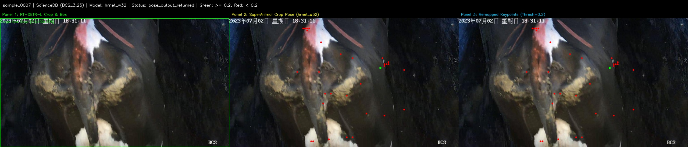

Review:
* [ ] Anatomically plausible
* [ ] Partially plausible
* [ ] Clearly wrong
* [ ] Wrong cow
* [ ] Insufficient visible anatomy
* [ ] Detector / pose failure

Notes:

---

#### `sample_0008` — HRNet-W32

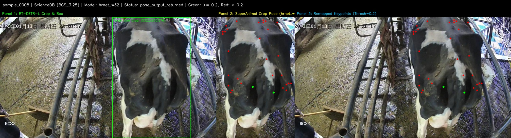

Review:
* [ ] Anatomically plausible
* [ ] Partially plausible
* [ ] Clearly wrong
* [ ] Wrong cow
* [ ] Insufficient visible anatomy
* [ ] Detector / pose failure

Notes:

---

#### `sample_0009` — HRNet-W32

Review:
* [ ] Anatomically plausible
* [ ] Partially plausible
* [ ] Clearly wrong
* [ ] Wrong cow
* [ ] Insufficient visible anatomy
* [ ] Detector / pose failure

Notes:

---

#### `sample_0010` — HRNet-W32

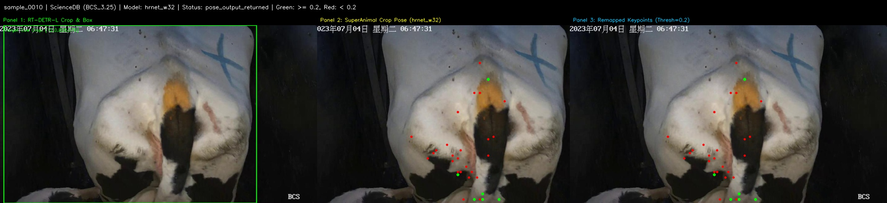

Review:
* [ ] Anatomically plausible
* [ ] Partially plausible
* [ ] Clearly wrong
* [ ] Wrong cow
* [ ] Insufficient visible anatomy
* [ ] Detector / pose failure

Notes:

---

### ResNet-50

#### `sample_0001` — ResNet-50

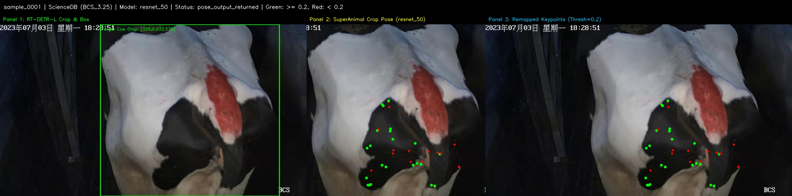

Review:
* [ ] Anatomically plausible
* [ ] Partially plausible
* [ ] Clearly wrong
* [ ] Wrong cow
* [ ] Insufficient visible anatomy
* [ ] Detector / pose failure

Notes:

---

#### `sample_0002` — ResNet-50

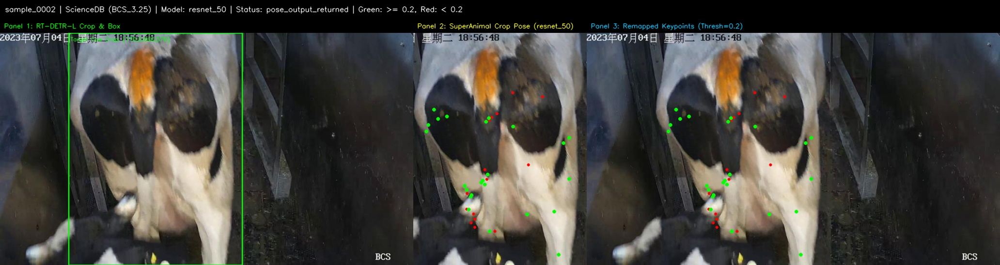

Review:
* [ ] Anatomically plausible
* [ ] Partially plausible
* [ ] Clearly wrong
* [ ] Wrong cow
* [ ] Insufficient visible anatomy
* [ ] Detector / pose failure

Notes:

---

#### `sample_0003` — ResNet-50

Review:
* [ ] Anatomically plausible
* [ ] Partially plausible
* [ ] Clearly wrong
* [ ] Wrong cow
* [ ] Insufficient visible anatomy
* [ ] Detector / pose failure

Notes:

---

#### `sample_0004` — ResNet-50

Review:
* [ ] Anatomically plausible
* [ ] Partially plausible
* [ ] Clearly wrong
* [ ] Wrong cow
* [ ] Insufficient visible anatomy
* [ ] Detector / pose failure

Notes:

---

#### `sample_0005` — ResNet-50

Review:
* [ ] Anatomically plausible
* [ ] Partially plausible
* [ ] Clearly wrong
* [ ] Wrong cow
* [ ] Insufficient visible anatomy
* [ ] Detector / pose failure

Notes:

---

#### `sample_0006` — ResNet-50

Review:
* [ ] Anatomically plausible
* [ ] Partially plausible
* [ ] Clearly wrong
* [ ] Wrong cow
* [ ] Insufficient visible anatomy
* [ ] Detector / pose failure

Notes:

---

#### `sample_0007` — ResNet-50

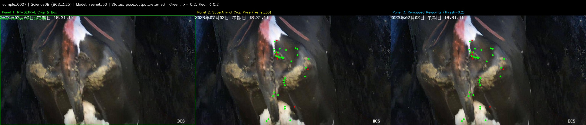

Review:
* [ ] Anatomically plausible
* [ ] Partially plausible
* [ ] Clearly wrong
* [ ] Wrong cow
* [ ] Insufficient visible anatomy
* [ ] Detector / pose failure

Notes:

---

#### `sample_0008` — ResNet-50

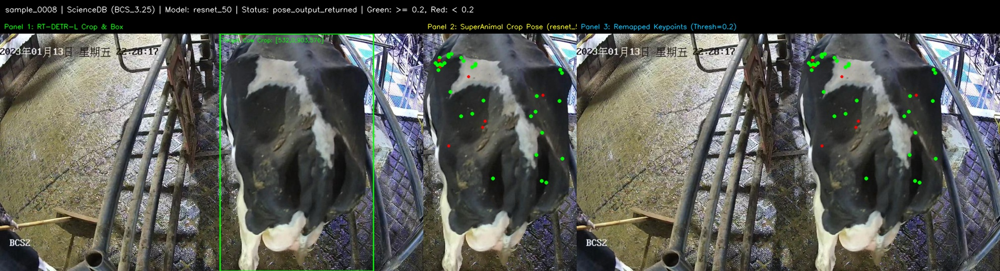

Review:
* [ ] Anatomically plausible
* [ ] Partially plausible
* [ ] Clearly wrong
* [ ] Wrong cow
* [ ] Insufficient visible anatomy
* [ ] Detector / pose failure

Notes:

---

#### `sample_0009` — ResNet-50

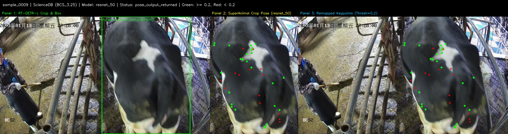

Review:
* [ ] Anatomically plausible
* [ ] Partially plausible
* [ ] Clearly wrong
* [ ] Wrong cow
* [ ] Insufficient visible anatomy
* [ ] Detector / pose failure

Notes:

---

#### `sample_0010` — ResNet-50

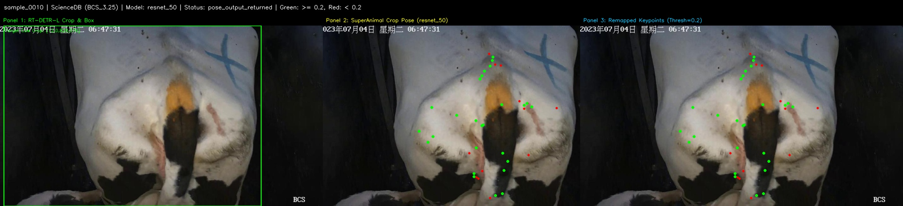

Review:
* [ ] Anatomically plausible
* [ ] Partially plausible
* [ ] Clearly wrong
* [ ] Wrong cow
* [ ] Insufficient visible anatomy
* [ ] Detector / pose failure

Notes:

---

## MmCows

CCTV overhead/angled multi-camera barn images from MmCows dataset (various behaviors: lying, standing, feeding, drinking, walking, licking).

### Sample Quick-Comparison Index

| Sample ID | HRNet-W32 Link | ResNet-50 Link |
|---|---|---|
| `sample_0101` | [HRNet-W32](#sample_0101--hrnet-w32) | [ResNet-50](#sample_0101--resnet-50) |
| `sample_0102` | [HRNet-W32](#sample_0102--hrnet-w32) | [ResNet-50](#sample_0102--resnet-50) |
| `sample_0103` | [HRNet-W32](#sample_0103--hrnet-w32) | [ResNet-50](#sample_0103--resnet-50) |
| `sample_0104` | [HRNet-W32](#sample_0104--hrnet-w32) | [ResNet-50](#sample_0104--resnet-50) |
| `sample_0105` | [HRNet-W32](#sample_0105--hrnet-w32) | [ResNet-50](#sample_0105--resnet-50) |
| `sample_0106` | [HRNet-W32](#sample_0106--hrnet-w32) | [ResNet-50](#sample_0106--resnet-50) |
| `sample_0107` | [HRNet-W32](#sample_0107--hrnet-w32) | [ResNet-50](#sample_0107--resnet-50) |
| `sample_0108` | [HRNet-W32](#sample_0108--hrnet-w32) | [ResNet-50](#sample_0108--resnet-50) |
| `sample_0109` | [HRNet-W32](#sample_0109--hrnet-w32) | [ResNet-50](#sample_0109--resnet-50) |
| `sample_0110` | [HRNet-W32](#sample_0110--hrnet-w32) | [ResNet-50](#sample_0110--resnet-50) |

---

### HRNet-W32

#### `sample_0101` — HRNet-W32

Review:
* [ ] Anatomically plausible
* [ ] Partially plausible
* [ ] Clearly wrong
* [ ] Wrong cow
* [ ] Insufficient visible anatomy
* [ ] Detector / pose failure

Notes:

---

#### `sample_0102` — HRNet-W32

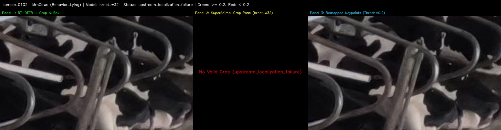

Review:
* [ ] Anatomically plausible
* [ ] Partially plausible
* [ ] Clearly wrong
* [ ] Wrong cow
* [ ] Insufficient visible anatomy
* [ ] Detector / pose failure

Notes:

---

#### `sample_0103` — HRNet-W32

Review:
* [ ] Anatomically plausible
* [ ] Partially plausible
* [ ] Clearly wrong
* [ ] Wrong cow
* [ ] Insufficient visible anatomy
* [ ] Detector / pose failure

Notes:

---

#### `sample_0104` — HRNet-W32

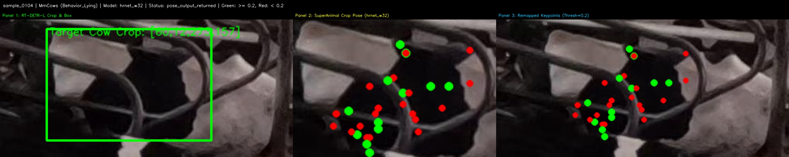

Review:
* [ ] Anatomically plausible
* [ ] Partially plausible
* [ ] Clearly wrong
* [ ] Wrong cow
* [ ] Insufficient visible anatomy
* [ ] Detector / pose failure

Notes:

---

#### `sample_0105` — HRNet-W32

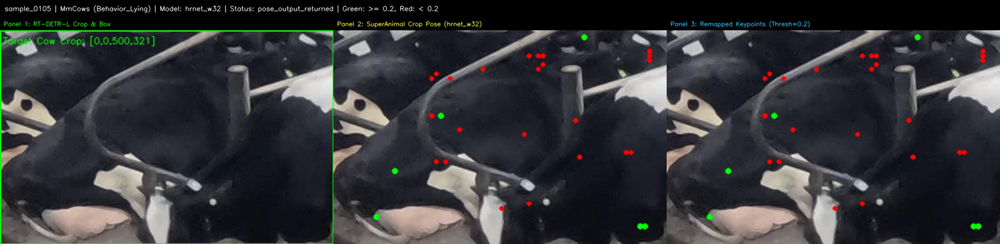

Review:
* [ ] Anatomically plausible
* [ ] Partially plausible
* [ ] Clearly wrong
* [ ] Wrong cow
* [ ] Insufficient visible anatomy
* [ ] Detector / pose failure

Notes:

---

#### `sample_0106` — HRNet-W32

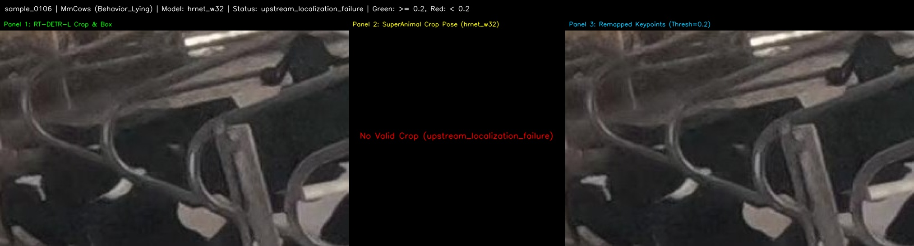

Review:
* [ ] Anatomically plausible
* [ ] Partially plausible
* [ ] Clearly wrong
* [ ] Wrong cow
* [ ] Insufficient visible anatomy
* [ ] Detector / pose failure

Notes:

---

#### `sample_0107` — HRNet-W32

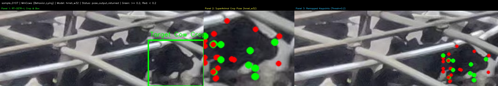

Review:
* [ ] Anatomically plausible
* [ ] Partially plausible
* [ ] Clearly wrong
* [ ] Wrong cow
* [ ] Insufficient visible anatomy
* [ ] Detector / pose failure

Notes:

---

#### `sample_0108` — HRNet-W32

Review:
* [ ] Anatomically plausible
* [ ] Partially plausible
* [ ] Clearly wrong
* [ ] Wrong cow
* [ ] Insufficient visible anatomy
* [ ] Detector / pose failure

Notes:

---

#### `sample_0109` — HRNet-W32

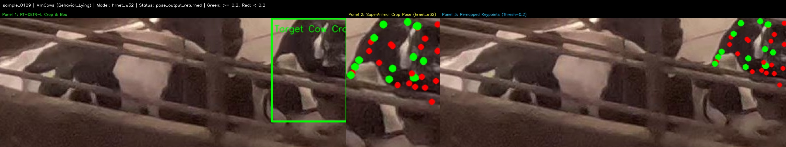

Review:
* [ ] Anatomically plausible
* [ ] Partially plausible
* [ ] Clearly wrong
* [ ] Wrong cow
* [ ] Insufficient visible anatomy
* [ ] Detector / pose failure

Notes:

---

#### `sample_0110` — HRNet-W32

Review:
* [ ] Anatomically plausible
* [ ] Partially plausible
* [ ] Clearly wrong
* [ ] Wrong cow
* [ ] Insufficient visible anatomy
* [ ] Detector / pose failure

Notes:

---

### ResNet-50

#### `sample_0101` — ResNet-50

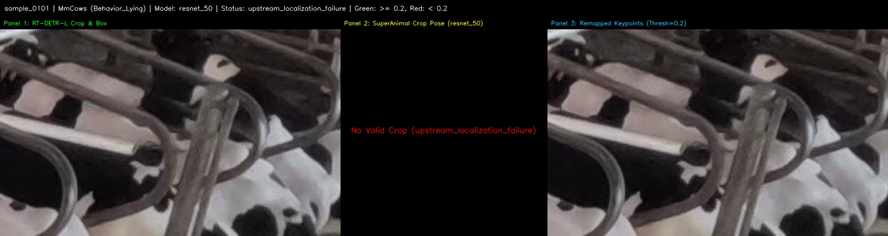

Review:
* [ ] Anatomically plausible
* [ ] Partially plausible
* [ ] Clearly wrong
* [ ] Wrong cow
* [ ] Insufficient visible anatomy
* [ ] Detector / pose failure

Notes:

---

#### `sample_0102` — ResNet-50

Review:
* [ ] Anatomically plausible
* [ ] Partially plausible
* [ ] Clearly wrong
* [ ] Wrong cow
* [ ] Insufficient visible anatomy
* [ ] Detector / pose failure

Notes:

---

#### `sample_0103` — ResNet-50

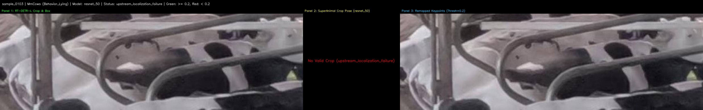

Review:
* [ ] Anatomically plausible
* [ ] Partially plausible
* [ ] Clearly wrong
* [ ] Wrong cow
* [ ] Insufficient visible anatomy
* [ ] Detector / pose failure

Notes:

---

#### `sample_0104` — ResNet-50

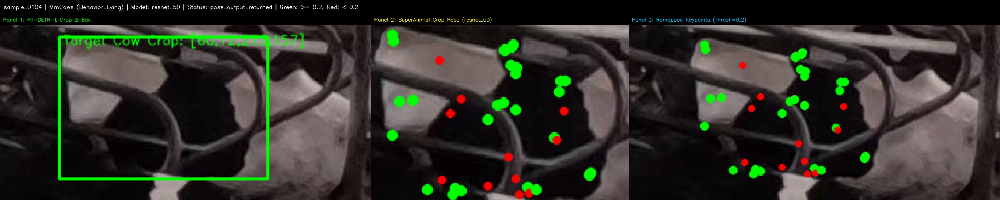

Review:
* [ ] Anatomically plausible
* [ ] Partially plausible
* [ ] Clearly wrong
* [ ] Wrong cow
* [ ] Insufficient visible anatomy
* [ ] Detector / pose failure

Notes:

---

#### `sample_0105` — ResNet-50

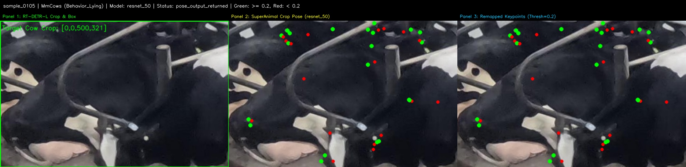

Review:
* [ ] Anatomically plausible
* [ ] Partially plausible
* [ ] Clearly wrong
* [ ] Wrong cow
* [ ] Insufficient visible anatomy
* [ ] Detector / pose failure

Notes:

---

#### `sample_0106` — ResNet-50

Review:
* [ ] Anatomically plausible
* [ ] Partially plausible
* [ ] Clearly wrong
* [ ] Wrong cow
* [ ] Insufficient visible anatomy
* [ ] Detector / pose failure

Notes:

---

#### `sample_0107` — ResNet-50

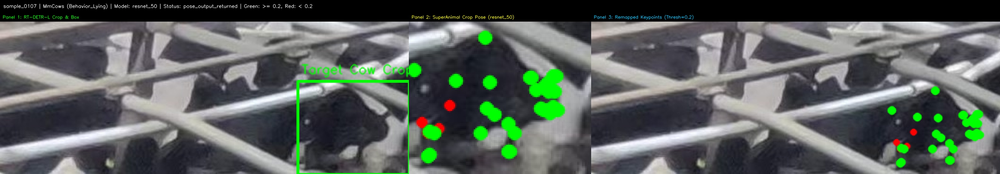

Review:
* [ ] Anatomically plausible
* [ ] Partially plausible
* [ ] Clearly wrong
* [ ] Wrong cow
* [ ] Insufficient visible anatomy
* [ ] Detector / pose failure

Notes:

---

#### `sample_0108` — ResNet-50

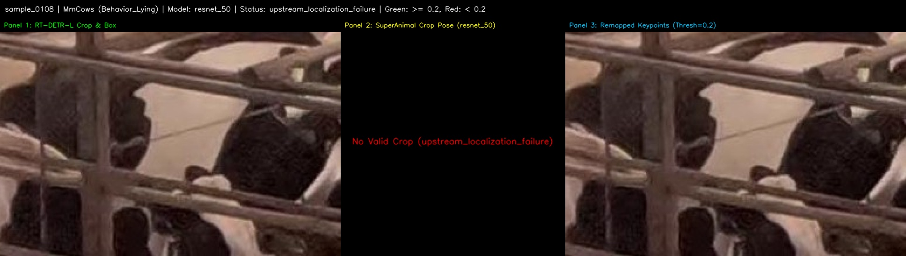

Review:
* [ ] Anatomically plausible
* [ ] Partially plausible
* [ ] Clearly wrong
* [ ] Wrong cow
* [ ] Insufficient visible anatomy
* [ ] Detector / pose failure

Notes:

---

#### `sample_0109` — ResNet-50

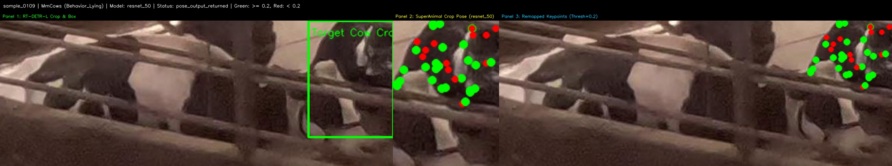

Review:
* [ ] Anatomically plausible
* [ ] Partially plausible
* [ ] Clearly wrong
* [ ] Wrong cow
* [ ] Insufficient visible anatomy
* [ ] Detector / pose failure

Notes:

---

#### `sample_0110` — ResNet-50

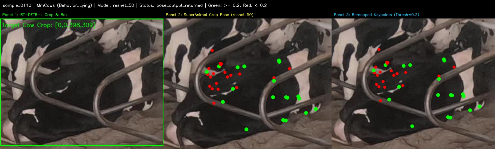

Review:
* [ ] Anatomically plausible
* [ ] Partially plausible
* [ ] Clearly wrong
* [ ] Wrong cow
* [ ] Insufficient visible anatomy
* [ ] Detector / pose failure

Notes:

---

## SideViewCows2026

Side-view milking parlor and barn alley images from SideViewCows2026 dataset (includes verified ground-truth segmentation masks outlined in magenta on Panel 1).

### Sample Quick-Comparison Index

| Sample ID | HRNet-W32 Link | ResNet-50 Link |
|---|---|---|
| `sample_0201` | [HRNet-W32](#sample_0201--hrnet-w32) | [ResNet-50](#sample_0201--resnet-50) |
| `sample_0202` | [HRNet-W32](#sample_0202--hrnet-w32) | [ResNet-50](#sample_0202--resnet-50) |
| `sample_0203` | [HRNet-W32](#sample_0203--hrnet-w32) | [ResNet-50](#sample_0203--resnet-50) |
| `sample_0204` | [HRNet-W32](#sample_0204--hrnet-w32) | [ResNet-50](#sample_0204--resnet-50) |
| `sample_0205` | [HRNet-W32](#sample_0205--hrnet-w32) | [ResNet-50](#sample_0205--resnet-50) |
| `sample_0206` | [HRNet-W32](#sample_0206--hrnet-w32) | [ResNet-50](#sample_0206--resnet-50) |
| `sample_0207` | [HRNet-W32](#sample_0207--hrnet-w32) | [ResNet-50](#sample_0207--resnet-50) |
| `sample_0208` | [HRNet-W32](#sample_0208--hrnet-w32) | [ResNet-50](#sample_0208--resnet-50) |
| `sample_0209` | [HRNet-W32](#sample_0209--hrnet-w32) | [ResNet-50](#sample_0209--resnet-50) |
| `sample_0210` | [HRNet-W32](#sample_0210--hrnet-w32) | [ResNet-50](#sample_0210--resnet-50) |

---

### HRNet-W32

#### `sample_0201` — HRNet-W32

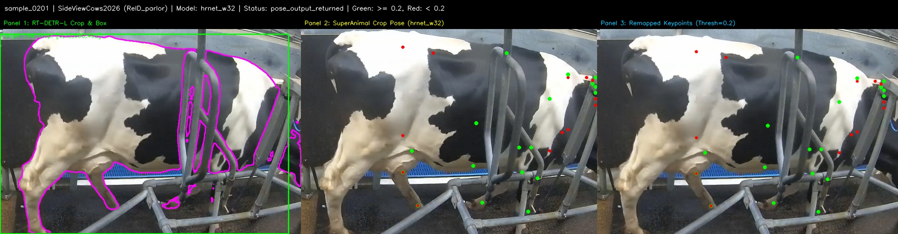

Review:
* [ ] Anatomically plausible
* [ ] Partially plausible
* [ ] Clearly wrong
* [ ] Wrong cow
* [ ] Insufficient visible anatomy
* [ ] Detector / pose failure

Notes:

---

#### `sample_0202` — HRNet-W32

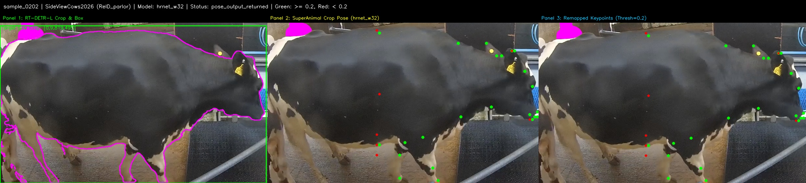

Review:
* [ ] Anatomically plausible
* [ ] Partially plausible
* [ ] Clearly wrong
* [ ] Wrong cow
* [ ] Insufficient visible anatomy
* [ ] Detector / pose failure

Notes:

---

#### `sample_0203` — HRNet-W32

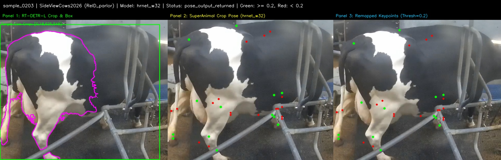

Review:
* [ ] Anatomically plausible
* [ ] Partially plausible
* [ ] Clearly wrong
* [ ] Wrong cow
* [ ] Insufficient visible anatomy
* [ ] Detector / pose failure

Notes:

---

#### `sample_0204` — HRNet-W32

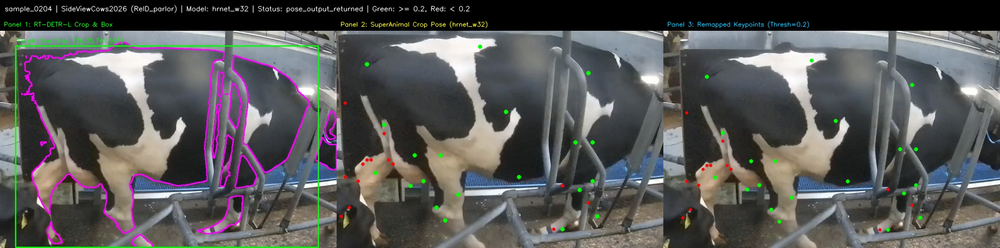

Review:
* [ ] Anatomically plausible
* [ ] Partially plausible
* [ ] Clearly wrong
* [ ] Wrong cow
* [ ] Insufficient visible anatomy
* [ ] Detector / pose failure

Notes:

---

#### `sample_0205` — HRNet-W32

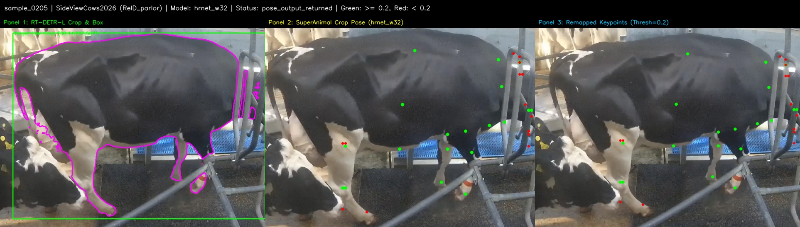

Review:
* [ ] Anatomically plausible
* [ ] Partially plausible
* [ ] Clearly wrong
* [ ] Wrong cow
* [ ] Insufficient visible anatomy
* [ ] Detector / pose failure

Notes:

---

#### `sample_0206` — HRNet-W32

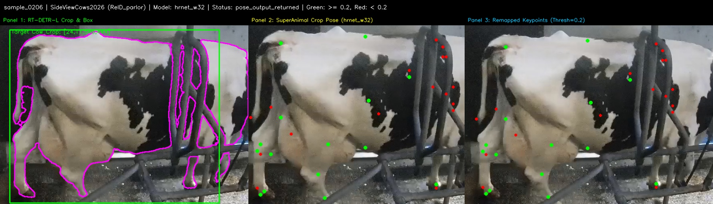

Review:
* [ ] Anatomically plausible
* [ ] Partially plausible
* [ ] Clearly wrong
* [ ] Wrong cow
* [ ] Insufficient visible anatomy
* [ ] Detector / pose failure

Notes:

---

#### `sample_0207` — HRNet-W32

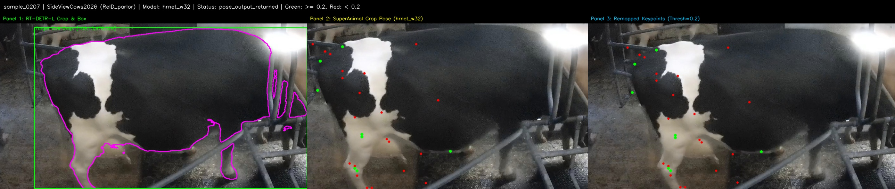

Review:
* [ ] Anatomically plausible
* [ ] Partially plausible
* [ ] Clearly wrong
* [ ] Wrong cow
* [ ] Insufficient visible anatomy
* [ ] Detector / pose failure

Notes:

---

#### `sample_0208` — HRNet-W32

Review:
* [ ] Anatomically plausible
* [ ] Partially plausible
* [ ] Clearly wrong
* [ ] Wrong cow
* [ ] Insufficient visible anatomy
* [ ] Detector / pose failure

Notes:

---

#### `sample_0209` — HRNet-W32

Review:
* [ ] Anatomically plausible
* [ ] Partially plausible
* [ ] Clearly wrong
* [ ] Wrong cow
* [ ] Insufficient visible anatomy
* [ ] Detector / pose failure

Notes:

---

#### `sample_0210` — HRNet-W32

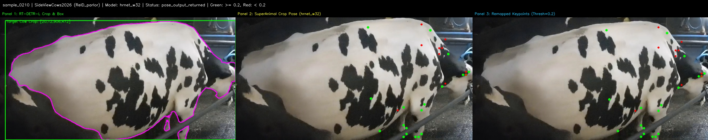

Review:
* [ ] Anatomically plausible
* [ ] Partially plausible
* [ ] Clearly wrong
* [ ] Wrong cow
* [ ] Insufficient visible anatomy
* [ ] Detector / pose failure

Notes:

---

### ResNet-50

#### `sample_0201` — ResNet-50

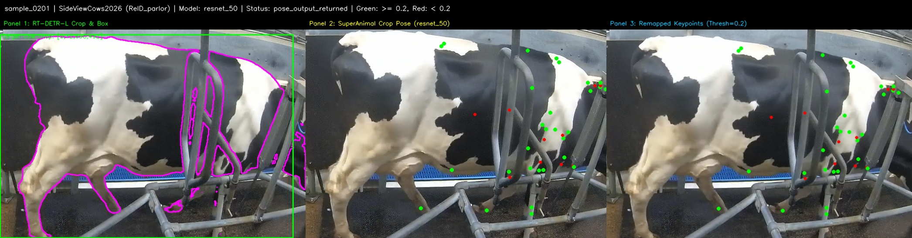

Review:
* [ ] Anatomically plausible
* [ ] Partially plausible
* [ ] Clearly wrong
* [ ] Wrong cow
* [ ] Insufficient visible anatomy
* [ ] Detector / pose failure

Notes:

---

#### `sample_0202` — ResNet-50

Review:
* [ ] Anatomically plausible
* [ ] Partially plausible
* [ ] Clearly wrong
* [ ] Wrong cow
* [ ] Insufficient visible anatomy
* [ ] Detector / pose failure

Notes:

---

#### `sample_0203` — ResNet-50

Review:
* [ ] Anatomically plausible
* [ ] Partially plausible
* [ ] Clearly wrong
* [ ] Wrong cow
* [ ] Insufficient visible anatomy
* [ ] Detector / pose failure

Notes:

---

#### `sample_0204` — ResNet-50

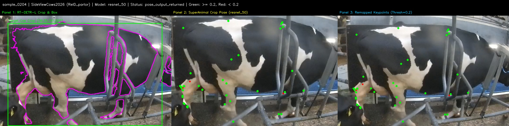

Review:
* [ ] Anatomically plausible
* [ ] Partially plausible
* [ ] Clearly wrong
* [ ] Wrong cow
* [ ] Insufficient visible anatomy
* [ ] Detector / pose failure

Notes:

---

#### `sample_0205` — ResNet-50

Review:
* [ ] Anatomically plausible
* [ ] Partially plausible
* [ ] Clearly wrong
* [ ] Wrong cow
* [ ] Insufficient visible anatomy
* [ ] Detector / pose failure

Notes:

---

#### `sample_0206` — ResNet-50

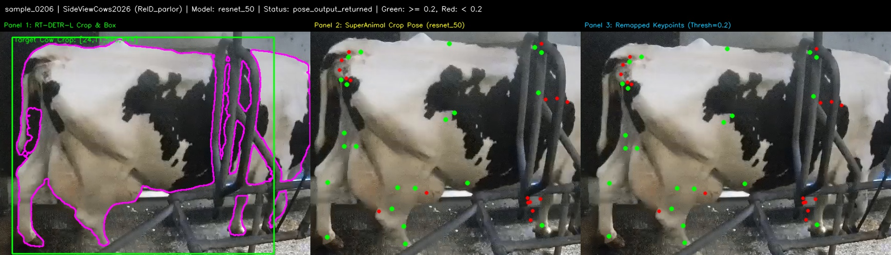

Review:
* [ ] Anatomically plausible
* [ ] Partially plausible
* [ ] Clearly wrong
* [ ] Wrong cow
* [ ] Insufficient visible anatomy
* [ ] Detector / pose failure

Notes:

---

#### `sample_0207` — ResNet-50

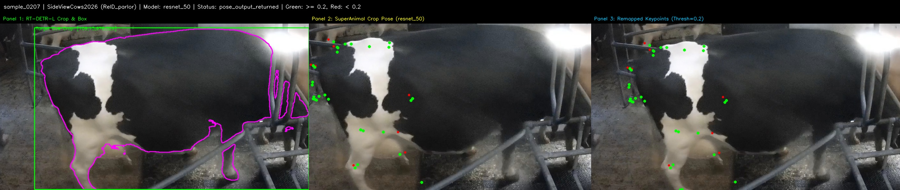

Review:
* [ ] Anatomically plausible
* [ ] Partially plausible
* [ ] Clearly wrong
* [ ] Wrong cow
* [ ] Insufficient visible anatomy
* [ ] Detector / pose failure

Notes:

---

#### `sample_0208` — ResNet-50

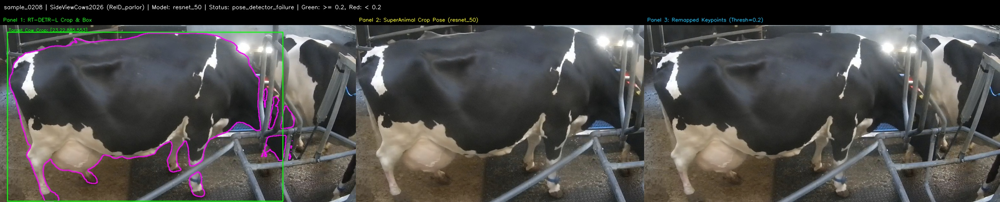

Review:
* [ ] Anatomically plausible
* [ ] Partially plausible
* [ ] Clearly wrong
* [ ] Wrong cow
* [ ] Insufficient visible anatomy
* [ ] Detector / pose failure

Notes:

---

#### `sample_0209` — ResNet-50

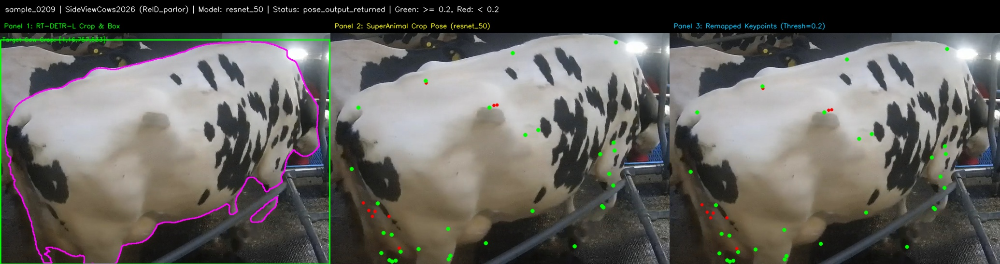

Review:
* [ ] Anatomically plausible
* [ ] Partially plausible
* [ ] Clearly wrong
* [ ] Wrong cow
* [ ] Insufficient visible anatomy
* [ ] Detector / pose failure

Notes:

---

#### `sample_0210` — ResNet-50

Review:
* [ ] Anatomically plausible
* [ ] Partially plausible
* [ ] Clearly wrong
* [ ] Wrong cow
* [ ] Insufficient visible anatomy
* [ ] Detector / pose failure

Notes:

---
