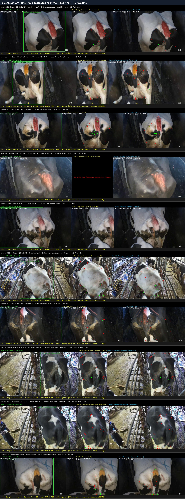
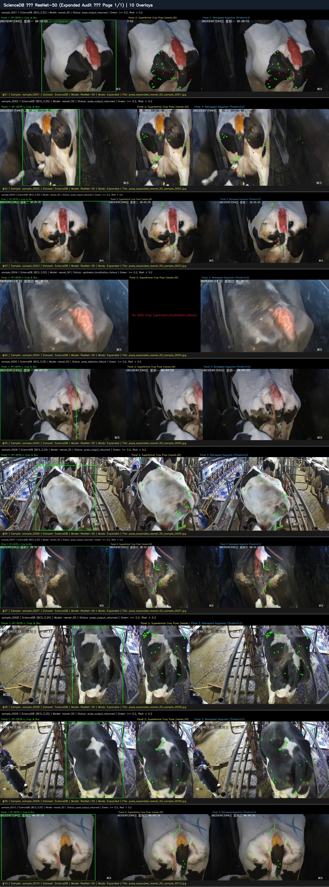
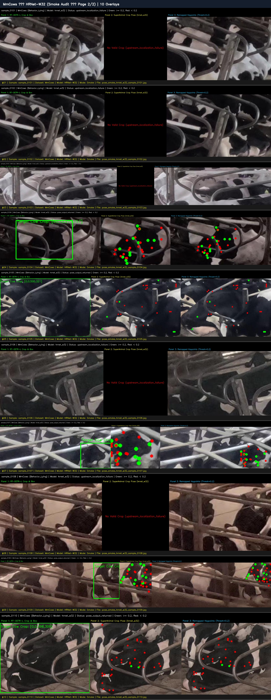
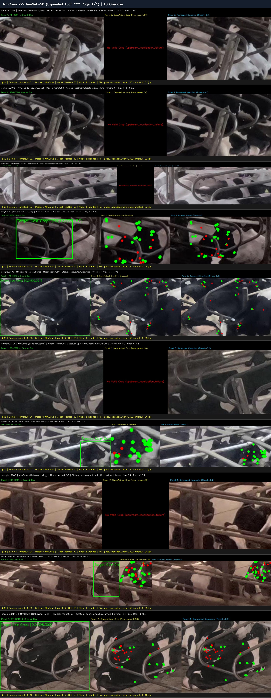
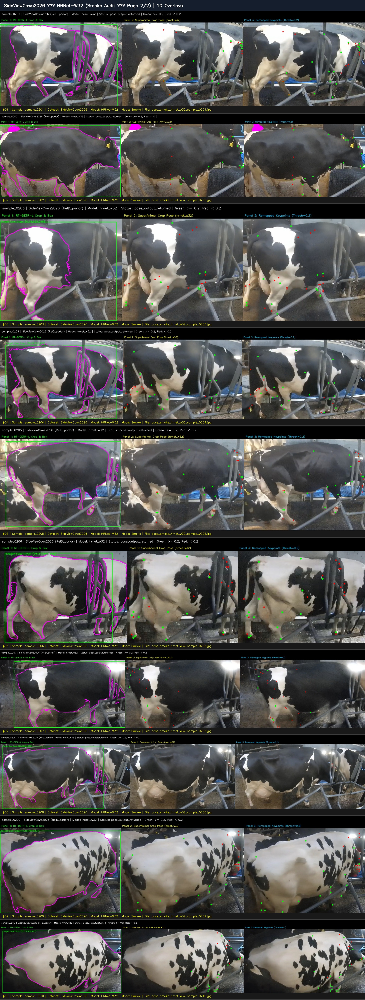
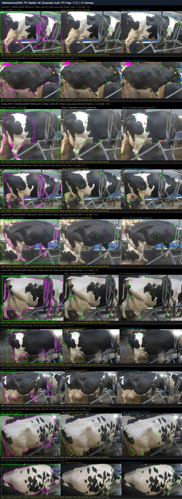

# Phase 3 Pose Visual Review — Contact Sheet Index

Comprehensive visual contact sheets for inspecting anatomical keypoint predictions from official DeepLabCut **SuperAnimal-Quadruped** across the three primary Phase 3 datasets:
* **ScienceDB** (Rear-view BCS)
* **MmCows** (CCTV behavior postures)
* **SideViewCows2026** (Parlor & barn Re-ID side views)

All 90 source pose overlays from Step 2.3 are represented across 9 high-resolution contact sheets (10 overlays per sheet).

---

## ScienceDB

Rear-view chute images from ScienceDB Cattle BCS dataset.

### ScienceDB — HRNet-W32

#### Page 1: Expanded Audit (`sample_0001` to `sample_0010`)

#### Page 2: Smoke Audit (`sample_0001` to `sample_0010`)

---

### ScienceDB — ResNet-50

#### Page 1: Expanded Audit (`sample_0001` to `sample_0010`)

---

## MmCows

CCTV overhead/angled multi-camera barn images from MmCows dataset across standing, walking, lying, feeding, drinking, and licking postures.

### MmCows — HRNet-W32

#### Page 1: Expanded Audit (`sample_0101` to `sample_0110`)

#### Page 2: Smoke Audit (`sample_0101` to `sample_0110`)

---

### MmCows — ResNet-50

#### Page 1: Expanded Audit (`sample_0101` to `sample_0110`)

---

## SideViewCows2026

Side-view milking parlor and barn alley images from SideViewCows2026 dataset (includes verified ground-truth segmentation masks outlined in magenta).

### SideViewCows2026 — HRNet-W32

#### Page 1: Expanded Audit (`sample_0201` to `sample_0210`)

#### Page 2: Smoke Audit (`sample_0201` to `sample_0210`)

---

### SideViewCows2026 — ResNet-50

#### Page 1: Expanded Audit (`sample_0201` to `sample_0210`)

