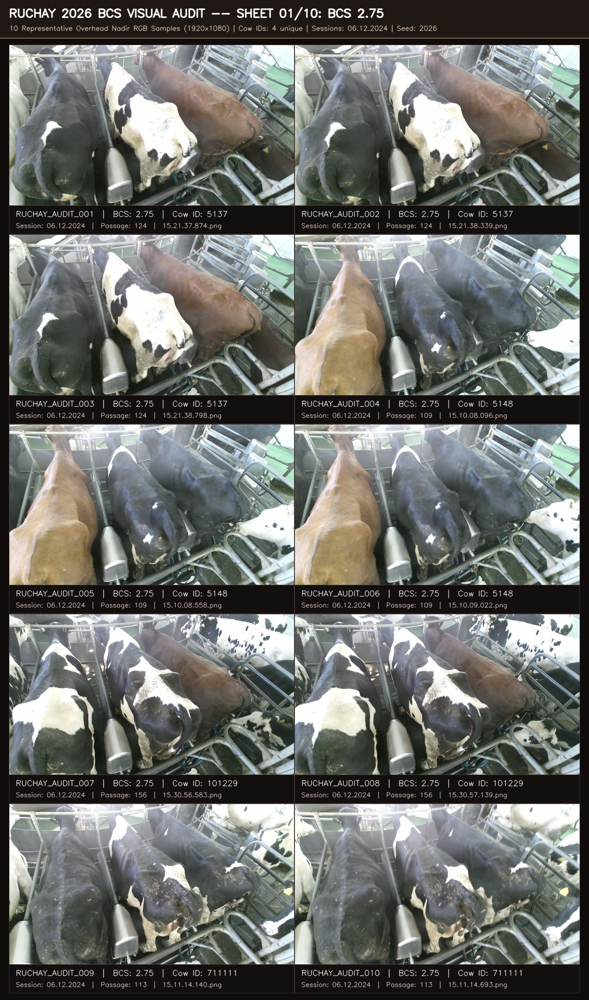
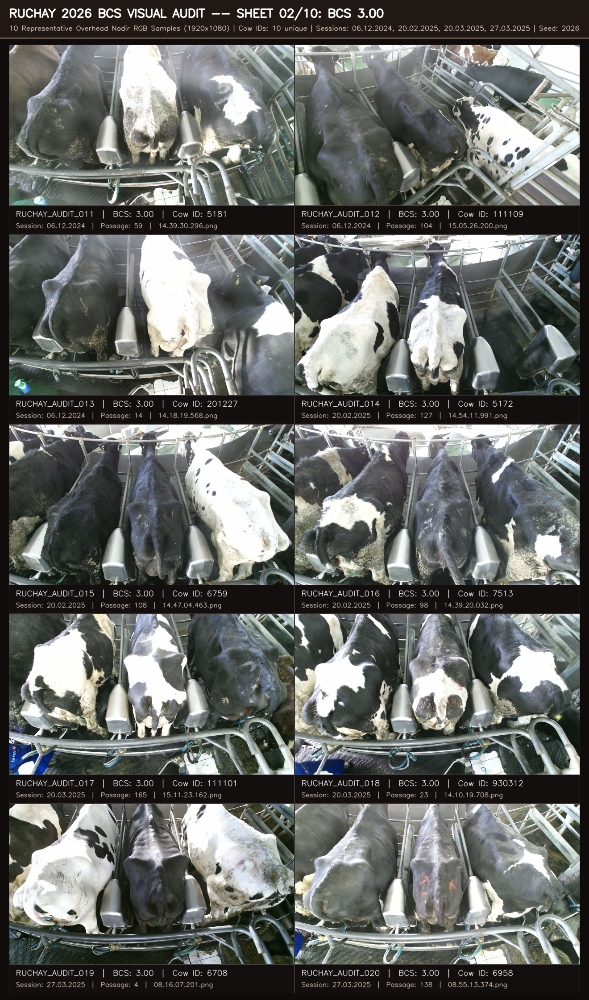
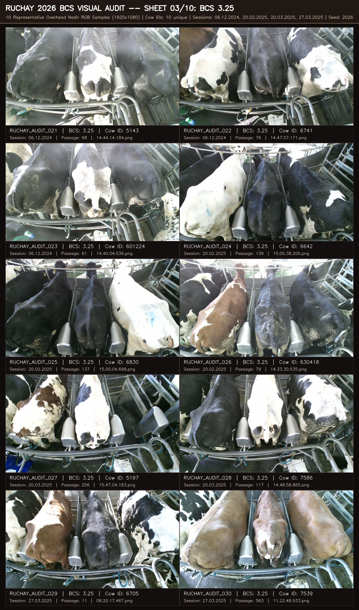
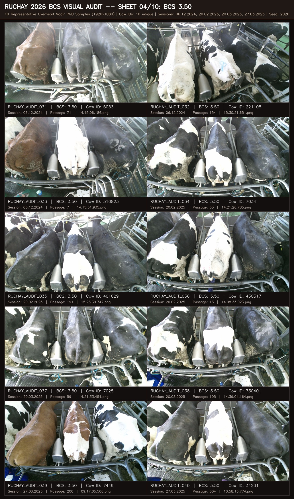
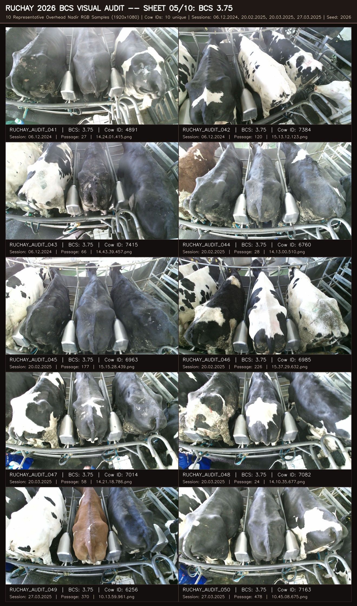
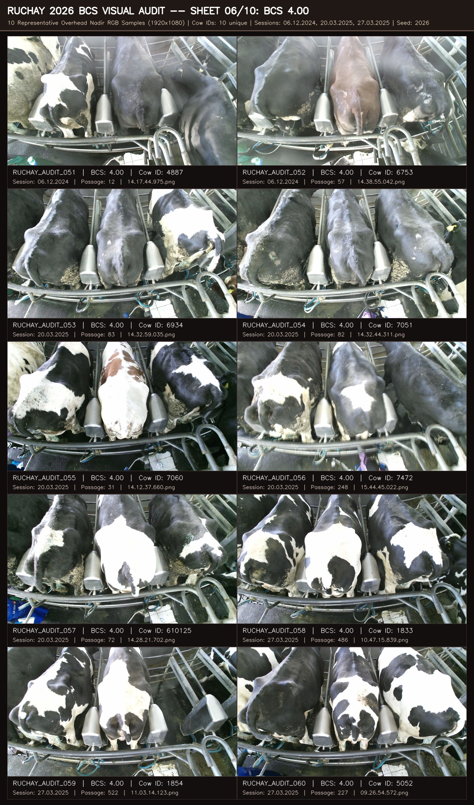
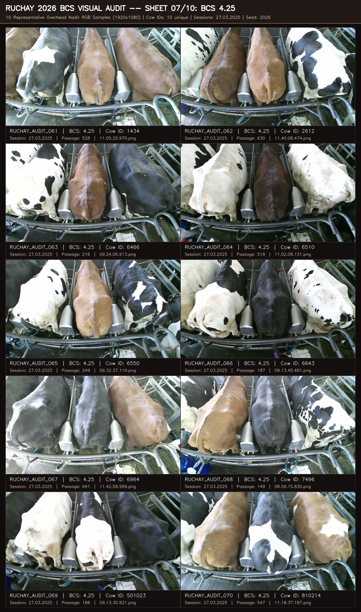
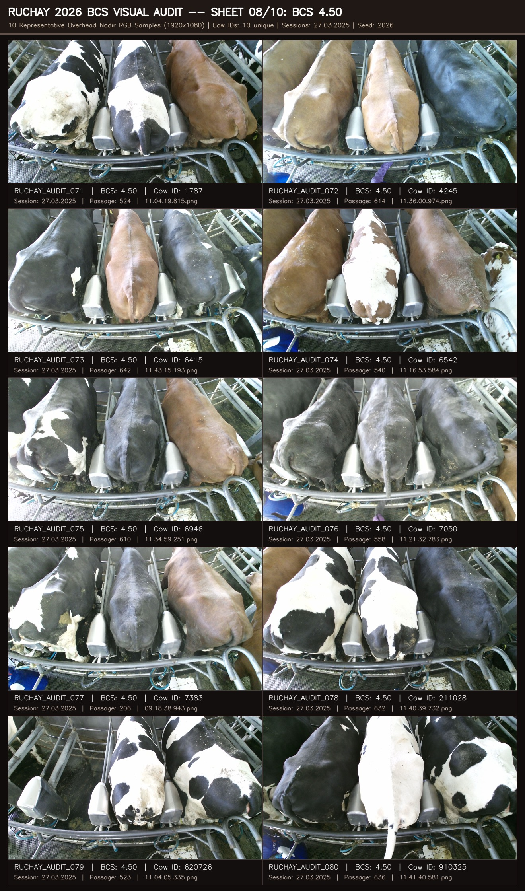
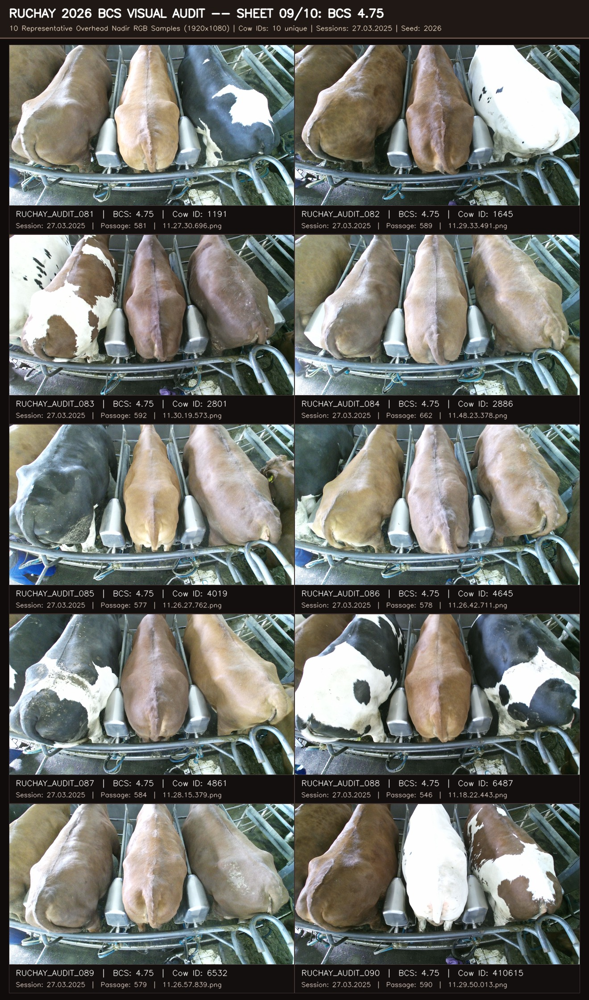
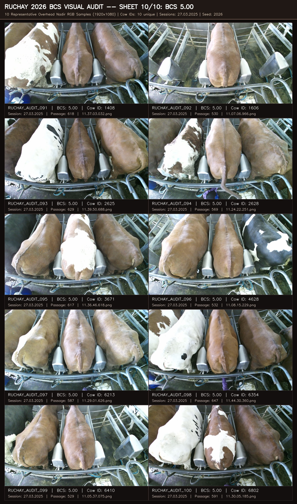

# Ruchay et al. (2026) RGB-D BCS Visual Quality Audit Index

**Date**: 2026-09-22  
**Author**: Hasin Ishrak & Antigravity Research Agent  
**Context**: Phase 3 Candidate External BCS Validation Benchmark Perception Audit  
**Selection Seed**: `2026` (Deterministic, 100% reproducible)  
**Total Samples**: 100 RGB images across 10 BCS classes (exactly 10 per class)  
**Total Unique Cows**: 94 unique biological cows (94% diversity)  

---

## 1. Executive Summary & Audit Purpose

Ruchay et al. (2026) (*RGB-D dataset of dairy cows for body condition scoring*, Zenodo record `20290988`) is designated as the **Primary External BCS Validation Benchmark** in the canonical roadmap.
Before executing cross-domain BCS evaluation, a manual human visual audit is required to assess:
1. **Overhead Nadir Camera Framing**: Cows pass through a chute beneath a Microsoft Kinect sensor mounted at 3.05m height;
2. **Anatomical Visibility**: Whether dorsal spine, hooks (tuber coxae), pins (tuber ischii), thurl, and tailhead ligament are clearly visible for Ferguson 5-point BCS evaluation;
3. **Multi-Cow & Obstruction Risks**: Whether loose-housing crowding, gates, or chute walls introduce occlusion or multi-cow ambiguity;
4. **Image Clarity & Lighting**: Sensor noise, shadows, motion blur, and contrast under barn illumination.

> [!IMPORTANT]
> **Audit Constraint**: This document and visual evidence pack are strictly observational. No dataset roles are altered, no roadmap changes are enacted, and no performance comparisons are fabricated. The pack enables direct manual inspection by Hasin and ChatGPT vision.

---

## 2. Sample Distribution & Dataset Demographics

### Class & Session Cross-Tabulation

| BCS Class | 06.12.2024 | 20.02.2025 | 20.03.2025 | 27.03.2025 | Total Samples | Unique Cows |
| :--- | :---: | :---: | :---: | :---: | :---: | :---: |
| **2.75** | 10 | 0 | 0 | 0 | **10** | **4** |
| **3.00** | 3 | 3 | 2 | 2 | **10** | **10** |
| **3.25** | 3 | 3 | 2 | 2 | **10** | **10** |
| **3.50** | 3 | 3 | 2 | 2 | **10** | **10** |
| **3.75** | 3 | 3 | 2 | 2 | **10** | **10** |
| **4.00** | 2 | 0 | 5 | 3 | **10** | **10** |
| **4.25** | 0 | 0 | 0 | 10 | **10** | **10** |
| **4.50** | 0 | 0 | 0 | 10 | **10** | **10** |
| **4.75** | 0 | 0 | 0 | 10 | **10** | **10** |
| **5.00** | 0 | 0 | 0 | 10 | **10** | **10** |
| **TOTAL** | **24** | **12** | **13** | **51** | **100** | **94** |

### Key Sampling Observations:

- **BCS 2.75**: Present exclusively in session `06.12.2024` across only 4 cows in the entire 25,700-sample dataset. All 4 biological cows are represented (quotas: 3, 3, 2, 2) using non-adjacent frames (passage relative indices [5, 10, 15] or [7, 13]).
- **BCS 4.25, 4.50, 4.75, 5.00**: Present exclusively in session `27.03.2025`. Each class features 10 completely distinct biological cows (1 frame per cow).
- **BCS 3.00, 3.25, 3.50, 3.75, 4.00**: Distributed across all available recording dates with 10 distinct biological cows each.
- **Total Diversity**: 94 distinct cows out of 100 samples (the theoretical maximum possible given BCS 2.75 constraints).

---

## 3. High-Resolution Contact Sheets Gallery

### Contact Sheet 01: BCS 2.75

### Contact Sheet 02: BCS 3.00

### Contact Sheet 03: BCS 3.25

### Contact Sheet 04: BCS 3.50

### Contact Sheet 05: BCS 3.75

### Contact Sheet 06: BCS 4.00

### Contact Sheet 07: BCS 4.25

### Contact Sheet 08: BCS 4.50

### Contact Sheet 09: BCS 4.75

### Contact Sheet 10: BCS 5.00

---

## 4. Full 100-Sample Audit Provenance Manifest

| Sample ID | BCS | Cow ID | Session | Passage | Source Filename | Resolution | Local Relative Path |
| :--- | :---: | :---: | :---: | :---: | :--- | :---: | :--- |
| `ruchay_audit_001` | **2.75** | `5137` | 06.12.2024 | 124 | `15.21.37.874.png` | 1920x1080 | [`datasets/bcs/external/ruchay2026/samples/06.12.2024/124/rgb/15.21.37.874.png`](file:///d:/cattle-health-monitoring-multi-task-model/datasets/bcs/external/ruchay2026/samples/06.12.2024/124/rgb/15.21.37.874.png ) |
| `ruchay_audit_002` | **2.75** | `5137` | 06.12.2024 | 124 | `15.21.38.339.png` | 1920x1080 | [`datasets/bcs/external/ruchay2026/samples/06.12.2024/124/rgb/15.21.38.339.png`](file:///d:/cattle-health-monitoring-multi-task-model/datasets/bcs/external/ruchay2026/samples/06.12.2024/124/rgb/15.21.38.339.png ) |
| `ruchay_audit_003` | **2.75** | `5137` | 06.12.2024 | 124 | `15.21.38.798.png` | 1920x1080 | [`datasets/bcs/external/ruchay2026/samples/06.12.2024/124/rgb/15.21.38.798.png`](file:///d:/cattle-health-monitoring-multi-task-model/datasets/bcs/external/ruchay2026/samples/06.12.2024/124/rgb/15.21.38.798.png ) |
| `ruchay_audit_004` | **2.75** | `5148` | 06.12.2024 | 109 | `15.10.08.096.png` | 1920x1080 | [`datasets/bcs/external/ruchay2026/samples/06.12.2024/109/rgb/15.10.08.096.png`](file:///d:/cattle-health-monitoring-multi-task-model/datasets/bcs/external/ruchay2026/samples/06.12.2024/109/rgb/15.10.08.096.png ) |
| `ruchay_audit_005` | **2.75** | `5148` | 06.12.2024 | 109 | `15.10.08.558.png` | 1920x1080 | [`datasets/bcs/external/ruchay2026/samples/06.12.2024/109/rgb/15.10.08.558.png`](file:///d:/cattle-health-monitoring-multi-task-model/datasets/bcs/external/ruchay2026/samples/06.12.2024/109/rgb/15.10.08.558.png ) |
| `ruchay_audit_006` | **2.75** | `5148` | 06.12.2024 | 109 | `15.10.09.022.png` | 1920x1080 | [`datasets/bcs/external/ruchay2026/samples/06.12.2024/109/rgb/15.10.09.022.png`](file:///d:/cattle-health-monitoring-multi-task-model/datasets/bcs/external/ruchay2026/samples/06.12.2024/109/rgb/15.10.09.022.png ) |
| `ruchay_audit_007` | **2.75** | `101229` | 06.12.2024 | 156 | `15.30.56.583.png` | 1920x1080 | [`datasets/bcs/external/ruchay2026/samples/06.12.2024/156/rgb/15.30.56.583.png`](file:///d:/cattle-health-monitoring-multi-task-model/datasets/bcs/external/ruchay2026/samples/06.12.2024/156/rgb/15.30.56.583.png ) |
| `ruchay_audit_008` | **2.75** | `101229` | 06.12.2024 | 156 | `15.30.57.139.png` | 1920x1080 | [`datasets/bcs/external/ruchay2026/samples/06.12.2024/156/rgb/15.30.57.139.png`](file:///d:/cattle-health-monitoring-multi-task-model/datasets/bcs/external/ruchay2026/samples/06.12.2024/156/rgb/15.30.57.139.png ) |
| `ruchay_audit_009` | **2.75** | `711111` | 06.12.2024 | 113 | `15.11.14.140.png` | 1920x1080 | [`datasets/bcs/external/ruchay2026/samples/06.12.2024/113/rgb/15.11.14.140.png`](file:///d:/cattle-health-monitoring-multi-task-model/datasets/bcs/external/ruchay2026/samples/06.12.2024/113/rgb/15.11.14.140.png ) |
| `ruchay_audit_010` | **2.75** | `711111` | 06.12.2024 | 113 | `15.11.14.693.png` | 1920x1080 | [`datasets/bcs/external/ruchay2026/samples/06.12.2024/113/rgb/15.11.14.693.png`](file:///d:/cattle-health-monitoring-multi-task-model/datasets/bcs/external/ruchay2026/samples/06.12.2024/113/rgb/15.11.14.693.png ) |
| `ruchay_audit_011` | **3.00** | `5181` | 06.12.2024 | 59 | `14.39.30.296.png` | 1920x1080 | [`datasets/bcs/external/ruchay2026/samples/06.12.2024/59/rgb/14.39.30.296.png`](file:///d:/cattle-health-monitoring-multi-task-model/datasets/bcs/external/ruchay2026/samples/06.12.2024/59/rgb/14.39.30.296.png ) |
| `ruchay_audit_012` | **3.00** | `111109` | 06.12.2024 | 104 | `15.05.26.200.png` | 1920x1080 | [`datasets/bcs/external/ruchay2026/samples/06.12.2024/104/rgb/15.05.26.200.png`](file:///d:/cattle-health-monitoring-multi-task-model/datasets/bcs/external/ruchay2026/samples/06.12.2024/104/rgb/15.05.26.200.png ) |
| `ruchay_audit_013` | **3.00** | `201227` | 06.12.2024 | 14 | `14.18.19.568.png` | 1920x1080 | [`datasets/bcs/external/ruchay2026/samples/06.12.2024/14/rgb/14.18.19.568.png`](file:///d:/cattle-health-monitoring-multi-task-model/datasets/bcs/external/ruchay2026/samples/06.12.2024/14/rgb/14.18.19.568.png ) |
| `ruchay_audit_014` | **3.00** | `5172` | 20.02.2025 | 127 | `14.54.11.991.png` | 1920x1080 | [`datasets/bcs/external/ruchay2026/samples/20.02.2025/127/rgb/14.54.11.991.png`](file:///d:/cattle-health-monitoring-multi-task-model/datasets/bcs/external/ruchay2026/samples/20.02.2025/127/rgb/14.54.11.991.png ) |
| `ruchay_audit_015` | **3.00** | `6759` | 20.02.2025 | 108 | `14.47.04.463.png` | 1920x1080 | [`datasets/bcs/external/ruchay2026/samples/20.02.2025/108/rgb/14.47.04.463.png`](file:///d:/cattle-health-monitoring-multi-task-model/datasets/bcs/external/ruchay2026/samples/20.02.2025/108/rgb/14.47.04.463.png ) |
| `ruchay_audit_016` | **3.00** | `7513` | 20.02.2025 | 98 | `14.39.20.032.png` | 1920x1080 | [`datasets/bcs/external/ruchay2026/samples/20.02.2025/98/rgb/14.39.20.032.png`](file:///d:/cattle-health-monitoring-multi-task-model/datasets/bcs/external/ruchay2026/samples/20.02.2025/98/rgb/14.39.20.032.png ) |
| `ruchay_audit_017` | **3.00** | `111101` | 20.03.2025 | 165 | `15.11.23.162.png` | 1920x1080 | [`datasets/bcs/external/ruchay2026/samples/20.03.2025/165/rgb/15.11.23.162.png`](file:///d:/cattle-health-monitoring-multi-task-model/datasets/bcs/external/ruchay2026/samples/20.03.2025/165/rgb/15.11.23.162.png ) |
| `ruchay_audit_018` | **3.00** | `930312` | 20.03.2025 | 23 | `14.10.19.708.png` | 1920x1080 | [`datasets/bcs/external/ruchay2026/samples/20.03.2025/23/rgb/14.10.19.708.png`](file:///d:/cattle-health-monitoring-multi-task-model/datasets/bcs/external/ruchay2026/samples/20.03.2025/23/rgb/14.10.19.708.png ) |
| `ruchay_audit_019` | **3.00** | `6708` | 27.03.2025 | 4 | `08.16.07.201.png` | 1920x1080 | [`datasets/bcs/external/ruchay2026/samples/27.03.2025/4/rgb/08.16.07.201.png`](file:///d:/cattle-health-monitoring-multi-task-model/datasets/bcs/external/ruchay2026/samples/27.03.2025/4/rgb/08.16.07.201.png ) |
| `ruchay_audit_020` | **3.00** | `6958` | 27.03.2025 | 138 | `08.55.13.374.png` | 1920x1080 | [`datasets/bcs/external/ruchay2026/samples/27.03.2025/138/rgb/08.55.13.374.png`](file:///d:/cattle-health-monitoring-multi-task-model/datasets/bcs/external/ruchay2026/samples/27.03.2025/138/rgb/08.55.13.374.png ) |
| `ruchay_audit_021` | **3.25** | `5143` | 06.12.2024 | 68 | `14.44.14.184.png` | 1920x1080 | [`datasets/bcs/external/ruchay2026/samples/06.12.2024/68/rgb/14.44.14.184.png`](file:///d:/cattle-health-monitoring-multi-task-model/datasets/bcs/external/ruchay2026/samples/06.12.2024/68/rgb/14.44.14.184.png ) |
| `ruchay_audit_022` | **3.25** | `6741` | 06.12.2024 | 76 | `14.47.57.171.png` | 1920x1080 | [`datasets/bcs/external/ruchay2026/samples/06.12.2024/76/rgb/14.47.57.171.png`](file:///d:/cattle-health-monitoring-multi-task-model/datasets/bcs/external/ruchay2026/samples/06.12.2024/76/rgb/14.47.57.171.png ) |
| `ruchay_audit_023` | **3.25** | `601224` | 06.12.2024 | 61 | `14.40.04.036.png` | 1920x1080 | [`datasets/bcs/external/ruchay2026/samples/06.12.2024/61/rgb/14.40.04.036.png`](file:///d:/cattle-health-monitoring-multi-task-model/datasets/bcs/external/ruchay2026/samples/06.12.2024/61/rgb/14.40.04.036.png ) |
| `ruchay_audit_024` | **3.25** | `6642` | 20.02.2025 | 139 | `15.00.38.200.png` | 1920x1080 | [`datasets/bcs/external/ruchay2026/samples/20.02.2025/139/rgb/15.00.38.200.png`](file:///d:/cattle-health-monitoring-multi-task-model/datasets/bcs/external/ruchay2026/samples/20.02.2025/139/rgb/15.00.38.200.png ) |
| `ruchay_audit_025` | **3.25** | `6830` | 20.02.2025 | 137 | `15.00.04.698.png` | 1920x1080 | [`datasets/bcs/external/ruchay2026/samples/20.02.2025/137/rgb/15.00.04.698.png`](file:///d:/cattle-health-monitoring-multi-task-model/datasets/bcs/external/ruchay2026/samples/20.02.2025/137/rgb/15.00.04.698.png ) |
| `ruchay_audit_026` | **3.25** | `630418` | 20.02.2025 | 79 | `14.33.30.535.png` | 1920x1080 | [`datasets/bcs/external/ruchay2026/samples/20.02.2025/79/rgb/14.33.30.535.png`](file:///d:/cattle-health-monitoring-multi-task-model/datasets/bcs/external/ruchay2026/samples/20.02.2025/79/rgb/14.33.30.535.png ) |
| `ruchay_audit_027` | **3.25** | `5197` | 20.03.2025 | 256 | `15.47.04.183.png` | 1920x1080 | [`datasets/bcs/external/ruchay2026/samples/20.03.2025/256/rgb/15.47.04.183.png`](file:///d:/cattle-health-monitoring-multi-task-model/datasets/bcs/external/ruchay2026/samples/20.03.2025/256/rgb/15.47.04.183.png ) |
| `ruchay_audit_028` | **3.25** | `7586` | 20.03.2025 | 117 | `14.48.58.865.png` | 1920x1080 | [`datasets/bcs/external/ruchay2026/samples/20.03.2025/117/rgb/14.48.58.865.png`](file:///d:/cattle-health-monitoring-multi-task-model/datasets/bcs/external/ruchay2026/samples/20.03.2025/117/rgb/14.48.58.865.png ) |
| `ruchay_audit_029` | **3.25** | `6705` | 27.03.2025 | 11 | `08.20.17.467.png` | 1920x1080 | [`datasets/bcs/external/ruchay2026/samples/27.03.2025/11/rgb/08.20.17.467.png`](file:///d:/cattle-health-monitoring-multi-task-model/datasets/bcs/external/ruchay2026/samples/27.03.2025/11/rgb/08.20.17.467.png ) |
| `ruchay_audit_030` | **3.25** | `7539` | 27.03.2025 | 563 | `11.22.48.933.png` | 1920x1080 | [`datasets/bcs/external/ruchay2026/samples/27.03.2025/563/rgb/11.22.48.933.png`](file:///d:/cattle-health-monitoring-multi-task-model/datasets/bcs/external/ruchay2026/samples/27.03.2025/563/rgb/11.22.48.933.png ) |
| `ruchay_audit_031` | **3.50** | `5053` | 06.12.2024 | 71 | `14.45.06.186.png` | 1920x1080 | [`datasets/bcs/external/ruchay2026/samples/06.12.2024/71/rgb/14.45.06.186.png`](file:///d:/cattle-health-monitoring-multi-task-model/datasets/bcs/external/ruchay2026/samples/06.12.2024/71/rgb/14.45.06.186.png ) |
| `ruchay_audit_032` | **3.50** | `221108` | 06.12.2024 | 154 | `15.30.21.651.png` | 1920x1080 | [`datasets/bcs/external/ruchay2026/samples/06.12.2024/154/rgb/15.30.21.651.png`](file:///d:/cattle-health-monitoring-multi-task-model/datasets/bcs/external/ruchay2026/samples/06.12.2024/154/rgb/15.30.21.651.png ) |
| `ruchay_audit_033` | **3.50** | `310823` | 06.12.2024 | 7 | `14.15.51.935.png` | 1920x1080 | [`datasets/bcs/external/ruchay2026/samples/06.12.2024/7/rgb/14.15.51.935.png`](file:///d:/cattle-health-monitoring-multi-task-model/datasets/bcs/external/ruchay2026/samples/06.12.2024/7/rgb/14.15.51.935.png ) |
| `ruchay_audit_034` | **3.50** | `7034` | 20.02.2025 | 53 | `14.21.26.785.png` | 1920x1080 | [`datasets/bcs/external/ruchay2026/samples/20.02.2025/53/rgb/14.21.26.785.png`](file:///d:/cattle-health-monitoring-multi-task-model/datasets/bcs/external/ruchay2026/samples/20.02.2025/53/rgb/14.21.26.785.png ) |
| `ruchay_audit_035` | **3.50** | `401029` | 20.02.2025 | 191 | `15.23.39.747.png` | 1920x1080 | [`datasets/bcs/external/ruchay2026/samples/20.02.2025/191/rgb/15.23.39.747.png`](file:///d:/cattle-health-monitoring-multi-task-model/datasets/bcs/external/ruchay2026/samples/20.02.2025/191/rgb/15.23.39.747.png ) |
| `ruchay_audit_036` | **3.50** | `430317` | 20.02.2025 | 13 | `14.08.33.023.png` | 1920x1080 | [`datasets/bcs/external/ruchay2026/samples/20.02.2025/13/rgb/14.08.33.023.png`](file:///d:/cattle-health-monitoring-multi-task-model/datasets/bcs/external/ruchay2026/samples/20.02.2025/13/rgb/14.08.33.023.png ) |
| `ruchay_audit_037` | **3.50** | `7025` | 20.03.2025 | 59 | `14.21.33.454.png` | 1920x1080 | [`datasets/bcs/external/ruchay2026/samples/20.03.2025/59/rgb/14.21.33.454.png`](file:///d:/cattle-health-monitoring-multi-task-model/datasets/bcs/external/ruchay2026/samples/20.03.2025/59/rgb/14.21.33.454.png ) |
| `ruchay_audit_038` | **3.50** | `730401` | 20.03.2025 | 105 | `14.39.04.164.png` | 1920x1080 | [`datasets/bcs/external/ruchay2026/samples/20.03.2025/105/rgb/14.39.04.164.png`](file:///d:/cattle-health-monitoring-multi-task-model/datasets/bcs/external/ruchay2026/samples/20.03.2025/105/rgb/14.39.04.164.png ) |
| `ruchay_audit_039` | **3.50** | `7449` | 27.03.2025 | 200 | `09.17.05.506.png` | 1920x1080 | [`datasets/bcs/external/ruchay2026/samples/27.03.2025/200/rgb/09.17.05.506.png`](file:///d:/cattle-health-monitoring-multi-task-model/datasets/bcs/external/ruchay2026/samples/27.03.2025/200/rgb/09.17.05.506.png ) |
| `ruchay_audit_040` | **3.50** | `34231` | 27.03.2025 | 504 | `10.58.13.774.png` | 1920x1080 | [`datasets/bcs/external/ruchay2026/samples/27.03.2025/504/rgb/10.58.13.774.png`](file:///d:/cattle-health-monitoring-multi-task-model/datasets/bcs/external/ruchay2026/samples/27.03.2025/504/rgb/10.58.13.774.png ) |
| `ruchay_audit_041` | **3.75** | `4891` | 06.12.2024 | 27 | `14.24.01.415.png` | 1920x1080 | [`datasets/bcs/external/ruchay2026/samples/06.12.2024/27/rgb/14.24.01.415.png`](file:///d:/cattle-health-monitoring-multi-task-model/datasets/bcs/external/ruchay2026/samples/06.12.2024/27/rgb/14.24.01.415.png ) |
| `ruchay_audit_042` | **3.75** | `7384` | 06.12.2024 | 120 | `15.13.12.123.png` | 1920x1080 | [`datasets/bcs/external/ruchay2026/samples/06.12.2024/120/rgb/15.13.12.123.png`](file:///d:/cattle-health-monitoring-multi-task-model/datasets/bcs/external/ruchay2026/samples/06.12.2024/120/rgb/15.13.12.123.png ) |
| `ruchay_audit_043` | **3.75** | `7415` | 06.12.2024 | 66 | `14.43.39.457.png` | 1920x1080 | [`datasets/bcs/external/ruchay2026/samples/06.12.2024/66/rgb/14.43.39.457.png`](file:///d:/cattle-health-monitoring-multi-task-model/datasets/bcs/external/ruchay2026/samples/06.12.2024/66/rgb/14.43.39.457.png ) |
| `ruchay_audit_044` | **3.75** | `6760` | 20.02.2025 | 28 | `14.13.00.510.png` | 1920x1080 | [`datasets/bcs/external/ruchay2026/samples/20.02.2025/28/rgb/14.13.00.510.png`](file:///d:/cattle-health-monitoring-multi-task-model/datasets/bcs/external/ruchay2026/samples/20.02.2025/28/rgb/14.13.00.510.png ) |
| `ruchay_audit_045` | **3.75** | `6963` | 20.02.2025 | 177 | `15.15.28.439.png` | 1920x1080 | [`datasets/bcs/external/ruchay2026/samples/20.02.2025/177/rgb/15.15.28.439.png`](file:///d:/cattle-health-monitoring-multi-task-model/datasets/bcs/external/ruchay2026/samples/20.02.2025/177/rgb/15.15.28.439.png ) |
| `ruchay_audit_046` | **3.75** | `6985` | 20.02.2025 | 226 | `15.37.29.632.png` | 1920x1080 | [`datasets/bcs/external/ruchay2026/samples/20.02.2025/226/rgb/15.37.29.632.png`](file:///d:/cattle-health-monitoring-multi-task-model/datasets/bcs/external/ruchay2026/samples/20.02.2025/226/rgb/15.37.29.632.png ) |
| `ruchay_audit_047` | **3.75** | `7014` | 20.03.2025 | 58 | `14.21.18.786.png` | 1920x1080 | [`datasets/bcs/external/ruchay2026/samples/20.03.2025/58/rgb/14.21.18.786.png`](file:///d:/cattle-health-monitoring-multi-task-model/datasets/bcs/external/ruchay2026/samples/20.03.2025/58/rgb/14.21.18.786.png ) |
| `ruchay_audit_048` | **3.75** | `7082` | 20.03.2025 | 24 | `14.10.35.677.png` | 1920x1080 | [`datasets/bcs/external/ruchay2026/samples/20.03.2025/24/rgb/14.10.35.677.png`](file:///d:/cattle-health-monitoring-multi-task-model/datasets/bcs/external/ruchay2026/samples/20.03.2025/24/rgb/14.10.35.677.png ) |
| `ruchay_audit_049` | **3.75** | `6256` | 27.03.2025 | 370 | `10.13.59.961.png` | 1920x1080 | [`datasets/bcs/external/ruchay2026/samples/27.03.2025/370/rgb/10.13.59.961.png`](file:///d:/cattle-health-monitoring-multi-task-model/datasets/bcs/external/ruchay2026/samples/27.03.2025/370/rgb/10.13.59.961.png ) |
| `ruchay_audit_050` | **3.75** | `7163` | 27.03.2025 | 478 | `10.45.08.675.png` | 1920x1080 | [`datasets/bcs/external/ruchay2026/samples/27.03.2025/478/rgb/10.45.08.675.png`](file:///d:/cattle-health-monitoring-multi-task-model/datasets/bcs/external/ruchay2026/samples/27.03.2025/478/rgb/10.45.08.675.png ) |
| `ruchay_audit_051` | **4.00** | `4887` | 06.12.2024 | 12 | `14.17.44.975.png` | 1920x1080 | [`datasets/bcs/external/ruchay2026/samples/06.12.2024/12/rgb/14.17.44.975.png`](file:///d:/cattle-health-monitoring-multi-task-model/datasets/bcs/external/ruchay2026/samples/06.12.2024/12/rgb/14.17.44.975.png ) |
| `ruchay_audit_052` | **4.00** | `6753` | 06.12.2024 | 57 | `14.38.55.042.png` | 1920x1080 | [`datasets/bcs/external/ruchay2026/samples/06.12.2024/57/rgb/14.38.55.042.png`](file:///d:/cattle-health-monitoring-multi-task-model/datasets/bcs/external/ruchay2026/samples/06.12.2024/57/rgb/14.38.55.042.png ) |
| `ruchay_audit_053` | **4.00** | `6934` | 20.03.2025 | 83 | `14.32.59.035.png` | 1920x1080 | [`datasets/bcs/external/ruchay2026/samples/20.03.2025/83/rgb/14.32.59.035.png`](file:///d:/cattle-health-monitoring-multi-task-model/datasets/bcs/external/ruchay2026/samples/20.03.2025/83/rgb/14.32.59.035.png ) |
| `ruchay_audit_054` | **4.00** | `7051` | 20.03.2025 | 82 | `14.32.44.311.png` | 1920x1080 | [`datasets/bcs/external/ruchay2026/samples/20.03.2025/82/rgb/14.32.44.311.png`](file:///d:/cattle-health-monitoring-multi-task-model/datasets/bcs/external/ruchay2026/samples/20.03.2025/82/rgb/14.32.44.311.png ) |
| `ruchay_audit_055` | **4.00** | `7060` | 20.03.2025 | 31 | `14.12.37.660.png` | 1920x1080 | [`datasets/bcs/external/ruchay2026/samples/20.03.2025/31/rgb/14.12.37.660.png`](file:///d:/cattle-health-monitoring-multi-task-model/datasets/bcs/external/ruchay2026/samples/20.03.2025/31/rgb/14.12.37.660.png ) |
| `ruchay_audit_056` | **4.00** | `7472` | 20.03.2025 | 248 | `15.44.45.022.png` | 1920x1080 | [`datasets/bcs/external/ruchay2026/samples/20.03.2025/248/rgb/15.44.45.022.png`](file:///d:/cattle-health-monitoring-multi-task-model/datasets/bcs/external/ruchay2026/samples/20.03.2025/248/rgb/15.44.45.022.png ) |
| `ruchay_audit_057` | **4.00** | `610125` | 20.03.2025 | 72 | `14.28.21.702.png` | 1920x1080 | [`datasets/bcs/external/ruchay2026/samples/20.03.2025/72/rgb/14.28.21.702.png`](file:///d:/cattle-health-monitoring-multi-task-model/datasets/bcs/external/ruchay2026/samples/20.03.2025/72/rgb/14.28.21.702.png ) |
| `ruchay_audit_058` | **4.00** | `1833` | 27.03.2025 | 486 | `10.47.15.839.png` | 1920x1080 | [`datasets/bcs/external/ruchay2026/samples/27.03.2025/486/rgb/10.47.15.839.png`](file:///d:/cattle-health-monitoring-multi-task-model/datasets/bcs/external/ruchay2026/samples/27.03.2025/486/rgb/10.47.15.839.png ) |
| `ruchay_audit_059` | **4.00** | `1854` | 27.03.2025 | 522 | `11.03.14.123.png` | 1920x1080 | [`datasets/bcs/external/ruchay2026/samples/27.03.2025/522/rgb/11.03.14.123.png`](file:///d:/cattle-health-monitoring-multi-task-model/datasets/bcs/external/ruchay2026/samples/27.03.2025/522/rgb/11.03.14.123.png ) |
| `ruchay_audit_060` | **4.00** | `5052` | 27.03.2025 | 227 | `09.26.54.572.png` | 1920x1080 | [`datasets/bcs/external/ruchay2026/samples/27.03.2025/227/rgb/09.26.54.572.png`](file:///d:/cattle-health-monitoring-multi-task-model/datasets/bcs/external/ruchay2026/samples/27.03.2025/227/rgb/09.26.54.572.png ) |
| `ruchay_audit_061` | **4.25** | `1434` | 27.03.2025 | 528 | `11.05.20.970.png` | 1920x1080 | [`datasets/bcs/external/ruchay2026/samples/27.03.2025/528/rgb/11.05.20.970.png`](file:///d:/cattle-health-monitoring-multi-task-model/datasets/bcs/external/ruchay2026/samples/27.03.2025/528/rgb/11.05.20.970.png ) |
| `ruchay_audit_062` | **4.25** | `2612` | 27.03.2025 | 630 | `11.40.08.474.png` | 1920x1080 | [`datasets/bcs/external/ruchay2026/samples/27.03.2025/630/rgb/11.40.08.474.png`](file:///d:/cattle-health-monitoring-multi-task-model/datasets/bcs/external/ruchay2026/samples/27.03.2025/630/rgb/11.40.08.474.png ) |
| `ruchay_audit_063` | **4.25** | `6466` | 27.03.2025 | 216 | `09.24.06.913.png` | 1920x1080 | [`datasets/bcs/external/ruchay2026/samples/27.03.2025/216/rgb/09.24.06.913.png`](file:///d:/cattle-health-monitoring-multi-task-model/datasets/bcs/external/ruchay2026/samples/27.03.2025/216/rgb/09.24.06.913.png ) |
| `ruchay_audit_064` | **4.25** | `6510` | 27.03.2025 | 518 | `11.02.08.131.png` | 1920x1080 | [`datasets/bcs/external/ruchay2026/samples/27.03.2025/518/rgb/11.02.08.131.png`](file:///d:/cattle-health-monitoring-multi-task-model/datasets/bcs/external/ruchay2026/samples/27.03.2025/518/rgb/11.02.08.131.png ) |
| `ruchay_audit_065` | **4.25** | `6550` | 27.03.2025 | 249 | `09.32.37.119.png` | 1920x1080 | [`datasets/bcs/external/ruchay2026/samples/27.03.2025/249/rgb/09.32.37.119.png`](file:///d:/cattle-health-monitoring-multi-task-model/datasets/bcs/external/ruchay2026/samples/27.03.2025/249/rgb/09.32.37.119.png ) |
| `ruchay_audit_066` | **4.25** | `6643` | 27.03.2025 | 187 | `09.13.45.481.png` | 1920x1080 | [`datasets/bcs/external/ruchay2026/samples/27.03.2025/187/rgb/09.13.45.481.png`](file:///d:/cattle-health-monitoring-multi-task-model/datasets/bcs/external/ruchay2026/samples/27.03.2025/187/rgb/09.13.45.481.png ) |
| `ruchay_audit_067` | **4.25** | `6964` | 27.03.2025 | 641 | `11.42.58.999.png` | 1920x1080 | [`datasets/bcs/external/ruchay2026/samples/27.03.2025/641/rgb/11.42.58.999.png`](file:///d:/cattle-health-monitoring-multi-task-model/datasets/bcs/external/ruchay2026/samples/27.03.2025/641/rgb/11.42.58.999.png ) |
| `ruchay_audit_068` | **4.25** | `7496` | 27.03.2025 | 149 | `08.59.15.830.png` | 1920x1080 | [`datasets/bcs/external/ruchay2026/samples/27.03.2025/149/rgb/08.59.15.830.png`](file:///d:/cattle-health-monitoring-multi-task-model/datasets/bcs/external/ruchay2026/samples/27.03.2025/149/rgb/08.59.15.830.png ) |
| `ruchay_audit_069` | **4.25** | `501023` | 27.03.2025 | 186 | `09.13.30.921.png` | 1920x1080 | [`datasets/bcs/external/ruchay2026/samples/27.03.2025/186/rgb/09.13.30.921.png`](file:///d:/cattle-health-monitoring-multi-task-model/datasets/bcs/external/ruchay2026/samples/27.03.2025/186/rgb/09.13.30.921.png ) |
| `ruchay_audit_070` | **4.25** | `810214` | 27.03.2025 | 547 | `11.18.37.187.png` | 1920x1080 | [`datasets/bcs/external/ruchay2026/samples/27.03.2025/547/rgb/11.18.37.187.png`](file:///d:/cattle-health-monitoring-multi-task-model/datasets/bcs/external/ruchay2026/samples/27.03.2025/547/rgb/11.18.37.187.png ) |
| `ruchay_audit_071` | **4.50** | `1787` | 27.03.2025 | 524 | `11.04.19.815.png` | 1920x1080 | [`datasets/bcs/external/ruchay2026/samples/27.03.2025/524/rgb/11.04.19.815.png`](file:///d:/cattle-health-monitoring-multi-task-model/datasets/bcs/external/ruchay2026/samples/27.03.2025/524/rgb/11.04.19.815.png ) |
| `ruchay_audit_072` | **4.50** | `4245` | 27.03.2025 | 614 | `11.36.00.974.png` | 1920x1080 | [`datasets/bcs/external/ruchay2026/samples/27.03.2025/614/rgb/11.36.00.974.png`](file:///d:/cattle-health-monitoring-multi-task-model/datasets/bcs/external/ruchay2026/samples/27.03.2025/614/rgb/11.36.00.974.png ) |
| `ruchay_audit_073` | **4.50** | `6415` | 27.03.2025 | 642 | `11.43.15.193.png` | 1920x1080 | [`datasets/bcs/external/ruchay2026/samples/27.03.2025/642/rgb/11.43.15.193.png`](file:///d:/cattle-health-monitoring-multi-task-model/datasets/bcs/external/ruchay2026/samples/27.03.2025/642/rgb/11.43.15.193.png ) |
| `ruchay_audit_074` | **4.50** | `6542` | 27.03.2025 | 540 | `11.16.53.584.png` | 1920x1080 | [`datasets/bcs/external/ruchay2026/samples/27.03.2025/540/rgb/11.16.53.584.png`](file:///d:/cattle-health-monitoring-multi-task-model/datasets/bcs/external/ruchay2026/samples/27.03.2025/540/rgb/11.16.53.584.png ) |
| `ruchay_audit_075` | **4.50** | `6946` | 27.03.2025 | 610 | `11.34.59.251.png` | 1920x1080 | [`datasets/bcs/external/ruchay2026/samples/27.03.2025/610/rgb/11.34.59.251.png`](file:///d:/cattle-health-monitoring-multi-task-model/datasets/bcs/external/ruchay2026/samples/27.03.2025/610/rgb/11.34.59.251.png ) |
| `ruchay_audit_076` | **4.50** | `7050` | 27.03.2025 | 558 | `11.21.32.783.png` | 1920x1080 | [`datasets/bcs/external/ruchay2026/samples/27.03.2025/558/rgb/11.21.32.783.png`](file:///d:/cattle-health-monitoring-multi-task-model/datasets/bcs/external/ruchay2026/samples/27.03.2025/558/rgb/11.21.32.783.png ) |
| `ruchay_audit_077` | **4.50** | `7383` | 27.03.2025 | 206 | `09.18.38.943.png` | 1920x1080 | [`datasets/bcs/external/ruchay2026/samples/27.03.2025/206/rgb/09.18.38.943.png`](file:///d:/cattle-health-monitoring-multi-task-model/datasets/bcs/external/ruchay2026/samples/27.03.2025/206/rgb/09.18.38.943.png ) |
| `ruchay_audit_078` | **4.50** | `211028` | 27.03.2025 | 632 | `11.40.39.732.png` | 1920x1080 | [`datasets/bcs/external/ruchay2026/samples/27.03.2025/632/rgb/11.40.39.732.png`](file:///d:/cattle-health-monitoring-multi-task-model/datasets/bcs/external/ruchay2026/samples/27.03.2025/632/rgb/11.40.39.732.png ) |
| `ruchay_audit_079` | **4.50** | `620726` | 27.03.2025 | 523 | `11.04.05.335.png` | 1920x1080 | [`datasets/bcs/external/ruchay2026/samples/27.03.2025/523/rgb/11.04.05.335.png`](file:///d:/cattle-health-monitoring-multi-task-model/datasets/bcs/external/ruchay2026/samples/27.03.2025/523/rgb/11.04.05.335.png ) |
| `ruchay_audit_080` | **4.50** | `910325` | 27.03.2025 | 636 | `11.41.40.581.png` | 1920x1080 | [`datasets/bcs/external/ruchay2026/samples/27.03.2025/636/rgb/11.41.40.581.png`](file:///d:/cattle-health-monitoring-multi-task-model/datasets/bcs/external/ruchay2026/samples/27.03.2025/636/rgb/11.41.40.581.png ) |
| `ruchay_audit_081` | **4.75** | `1191` | 27.03.2025 | 581 | `11.27.30.696.png` | 1920x1080 | [`datasets/bcs/external/ruchay2026/samples/27.03.2025/581/rgb/11.27.30.696.png`](file:///d:/cattle-health-monitoring-multi-task-model/datasets/bcs/external/ruchay2026/samples/27.03.2025/581/rgb/11.27.30.696.png ) |
| `ruchay_audit_082` | **4.75** | `1645` | 27.03.2025 | 589 | `11.29.33.491.png` | 1920x1080 | [`datasets/bcs/external/ruchay2026/samples/27.03.2025/589/rgb/11.29.33.491.png`](file:///d:/cattle-health-monitoring-multi-task-model/datasets/bcs/external/ruchay2026/samples/27.03.2025/589/rgb/11.29.33.491.png ) |
| `ruchay_audit_083` | **4.75** | `2801` | 27.03.2025 | 592 | `11.30.19.573.png` | 1920x1080 | [`datasets/bcs/external/ruchay2026/samples/27.03.2025/592/rgb/11.30.19.573.png`](file:///d:/cattle-health-monitoring-multi-task-model/datasets/bcs/external/ruchay2026/samples/27.03.2025/592/rgb/11.30.19.573.png ) |
| `ruchay_audit_084` | **4.75** | `2886` | 27.03.2025 | 662 | `11.48.23.378.png` | 1920x1080 | [`datasets/bcs/external/ruchay2026/samples/27.03.2025/662/rgb/11.48.23.378.png`](file:///d:/cattle-health-monitoring-multi-task-model/datasets/bcs/external/ruchay2026/samples/27.03.2025/662/rgb/11.48.23.378.png ) |
| `ruchay_audit_085` | **4.75** | `4019` | 27.03.2025 | 577 | `11.26.27.762.png` | 1920x1080 | [`datasets/bcs/external/ruchay2026/samples/27.03.2025/577/rgb/11.26.27.762.png`](file:///d:/cattle-health-monitoring-multi-task-model/datasets/bcs/external/ruchay2026/samples/27.03.2025/577/rgb/11.26.27.762.png ) |
| `ruchay_audit_086` | **4.75** | `4645` | 27.03.2025 | 578 | `11.26.42.711.png` | 1920x1080 | [`datasets/bcs/external/ruchay2026/samples/27.03.2025/578/rgb/11.26.42.711.png`](file:///d:/cattle-health-monitoring-multi-task-model/datasets/bcs/external/ruchay2026/samples/27.03.2025/578/rgb/11.26.42.711.png ) |
| `ruchay_audit_087` | **4.75** | `4861` | 27.03.2025 | 584 | `11.28.15.379.png` | 1920x1080 | [`datasets/bcs/external/ruchay2026/samples/27.03.2025/584/rgb/11.28.15.379.png`](file:///d:/cattle-health-monitoring-multi-task-model/datasets/bcs/external/ruchay2026/samples/27.03.2025/584/rgb/11.28.15.379.png ) |
| `ruchay_audit_088` | **4.75** | `6487` | 27.03.2025 | 546 | `11.18.22.443.png` | 1920x1080 | [`datasets/bcs/external/ruchay2026/samples/27.03.2025/546/rgb/11.18.22.443.png`](file:///d:/cattle-health-monitoring-multi-task-model/datasets/bcs/external/ruchay2026/samples/27.03.2025/546/rgb/11.18.22.443.png ) |
| `ruchay_audit_089` | **4.75** | `6532` | 27.03.2025 | 579 | `11.26.57.839.png` | 1920x1080 | [`datasets/bcs/external/ruchay2026/samples/27.03.2025/579/rgb/11.26.57.839.png`](file:///d:/cattle-health-monitoring-multi-task-model/datasets/bcs/external/ruchay2026/samples/27.03.2025/579/rgb/11.26.57.839.png ) |
| `ruchay_audit_090` | **4.75** | `410615` | 27.03.2025 | 590 | `11.29.50.013.png` | 1920x1080 | [`datasets/bcs/external/ruchay2026/samples/27.03.2025/590/rgb/11.29.50.013.png`](file:///d:/cattle-health-monitoring-multi-task-model/datasets/bcs/external/ruchay2026/samples/27.03.2025/590/rgb/11.29.50.013.png ) |
| `ruchay_audit_091` | **5.00** | `1408` | 27.03.2025 | 618 | `11.37.03.032.png` | 1920x1080 | [`datasets/bcs/external/ruchay2026/samples/27.03.2025/618/rgb/11.37.03.032.png`](file:///d:/cattle-health-monitoring-multi-task-model/datasets/bcs/external/ruchay2026/samples/27.03.2025/618/rgb/11.37.03.032.png ) |
| `ruchay_audit_092` | **5.00** | `1606` | 27.03.2025 | 530 | `11.07.06.966.png` | 1920x1080 | [`datasets/bcs/external/ruchay2026/samples/27.03.2025/530/rgb/11.07.06.966.png`](file:///d:/cattle-health-monitoring-multi-task-model/datasets/bcs/external/ruchay2026/samples/27.03.2025/530/rgb/11.07.06.966.png ) |
| `ruchay_audit_093` | **5.00** | `2625` | 27.03.2025 | 629 | `11.39.50.688.png` | 1920x1080 | [`datasets/bcs/external/ruchay2026/samples/27.03.2025/629/rgb/11.39.50.688.png`](file:///d:/cattle-health-monitoring-multi-task-model/datasets/bcs/external/ruchay2026/samples/27.03.2025/629/rgb/11.39.50.688.png ) |
| `ruchay_audit_094` | **5.00** | `2628` | 27.03.2025 | 569 | `11.24.22.251.png` | 1920x1080 | [`datasets/bcs/external/ruchay2026/samples/27.03.2025/569/rgb/11.24.22.251.png`](file:///d:/cattle-health-monitoring-multi-task-model/datasets/bcs/external/ruchay2026/samples/27.03.2025/569/rgb/11.24.22.251.png ) |
| `ruchay_audit_095` | **5.00** | `3671` | 27.03.2025 | 617 | `11.36.46.618.png` | 1920x1080 | [`datasets/bcs/external/ruchay2026/samples/27.03.2025/617/rgb/11.36.46.618.png`](file:///d:/cattle-health-monitoring-multi-task-model/datasets/bcs/external/ruchay2026/samples/27.03.2025/617/rgb/11.36.46.618.png ) |
| `ruchay_audit_096` | **5.00** | `4628` | 27.03.2025 | 532 | `11.08.15.229.png` | 1920x1080 | [`datasets/bcs/external/ruchay2026/samples/27.03.2025/532/rgb/11.08.15.229.png`](file:///d:/cattle-health-monitoring-multi-task-model/datasets/bcs/external/ruchay2026/samples/27.03.2025/532/rgb/11.08.15.229.png ) |
| `ruchay_audit_097` | **5.00** | `6213` | 27.03.2025 | 587 | `11.29.01.626.png` | 1920x1080 | [`datasets/bcs/external/ruchay2026/samples/27.03.2025/587/rgb/11.29.01.626.png`](file:///d:/cattle-health-monitoring-multi-task-model/datasets/bcs/external/ruchay2026/samples/27.03.2025/587/rgb/11.29.01.626.png ) |
| `ruchay_audit_098` | **5.00** | `6354` | 27.03.2025 | 647 | `11.44.30.360.png` | 1920x1080 | [`datasets/bcs/external/ruchay2026/samples/27.03.2025/647/rgb/11.44.30.360.png`](file:///d:/cattle-health-monitoring-multi-task-model/datasets/bcs/external/ruchay2026/samples/27.03.2025/647/rgb/11.44.30.360.png ) |
| `ruchay_audit_099` | **5.00** | `6410` | 27.03.2025 | 529 | `11.05.37.075.png` | 1920x1080 | [`datasets/bcs/external/ruchay2026/samples/27.03.2025/529/rgb/11.05.37.075.png`](file:///d:/cattle-health-monitoring-multi-task-model/datasets/bcs/external/ruchay2026/samples/27.03.2025/529/rgb/11.05.37.075.png ) |
| `ruchay_audit_100` | **5.00** | `6802` | 27.03.2025 | 591 | `11.30.05.185.png` | 1920x1080 | [`datasets/bcs/external/ruchay2026/samples/27.03.2025/591/rgb/11.30.05.185.png`](file:///d:/cattle-health-monitoring-multi-task-model/datasets/bcs/external/ruchay2026/samples/27.03.2025/591/rgb/11.30.05.185.png ) |

---

## 5. Artifact Registry

- Manifest CSV: [`artifacts/perception_audit/ruchay_bcs_visual_audit_manifest.csv`](file:///d:/cattle-health-monitoring-multi-task-model/artifacts/perception_audit/ruchay_bcs_visual_audit_manifest.csv)

- Generator Script: [`scripts/build_ruchay_bcs_visual_audit_pack.py`](file:///d:/cattle-health-monitoring-multi-task-model/scripts/build_ruchay_bcs_visual_audit_pack.py)

- Contact Sheets Directory: [`docs/audits/assets/ruchay_bcs_visual_audit/`](file:///d:/cattle-health-monitoring-multi-task-model/docs/audits/assets/ruchay_bcs_visual_audit)
