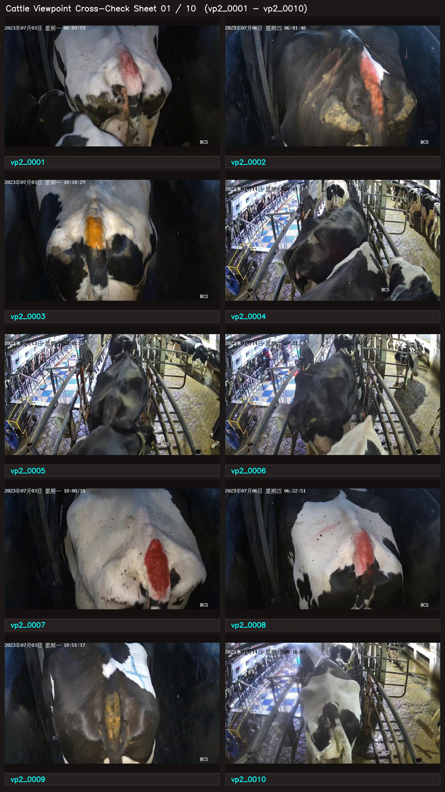
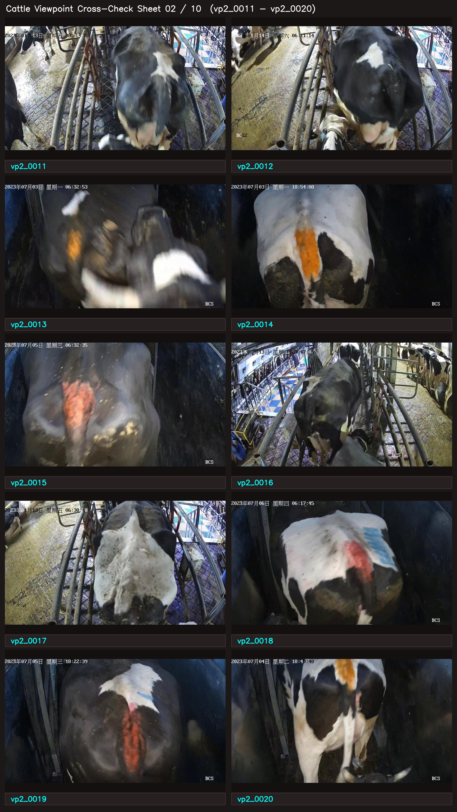
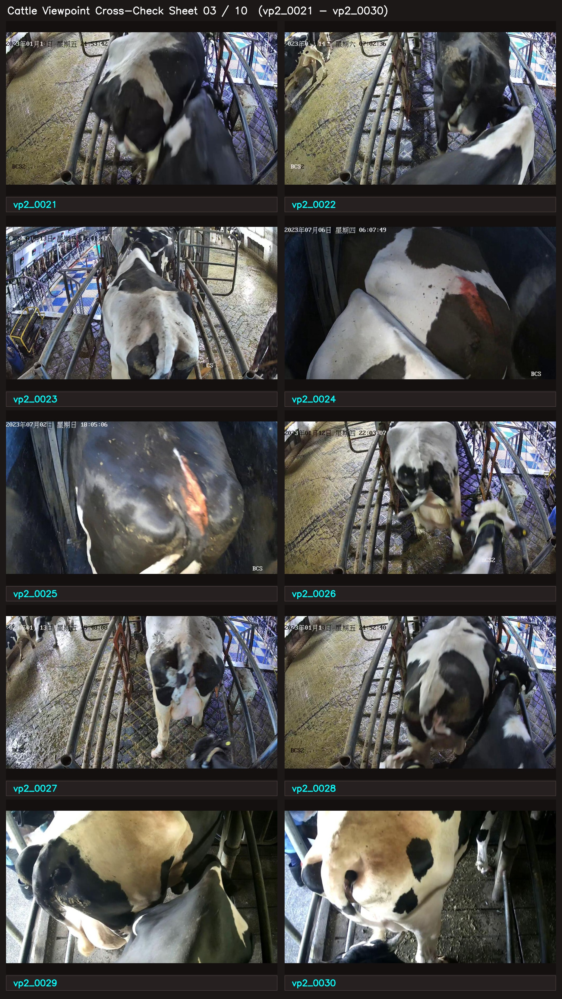
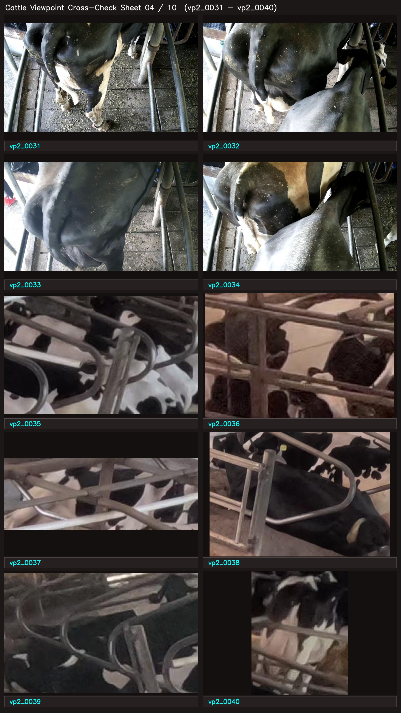
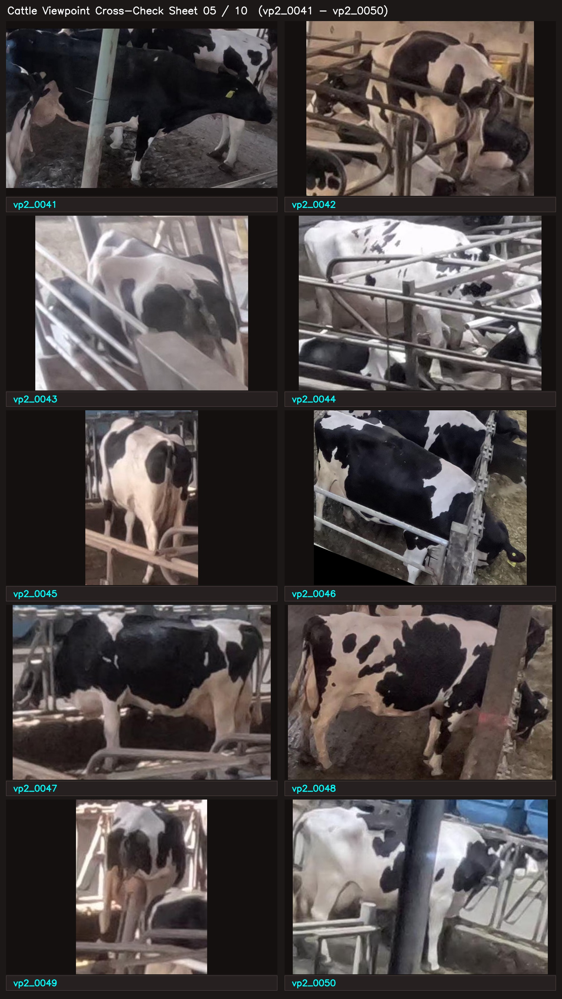
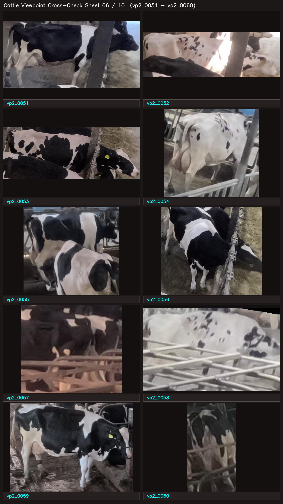
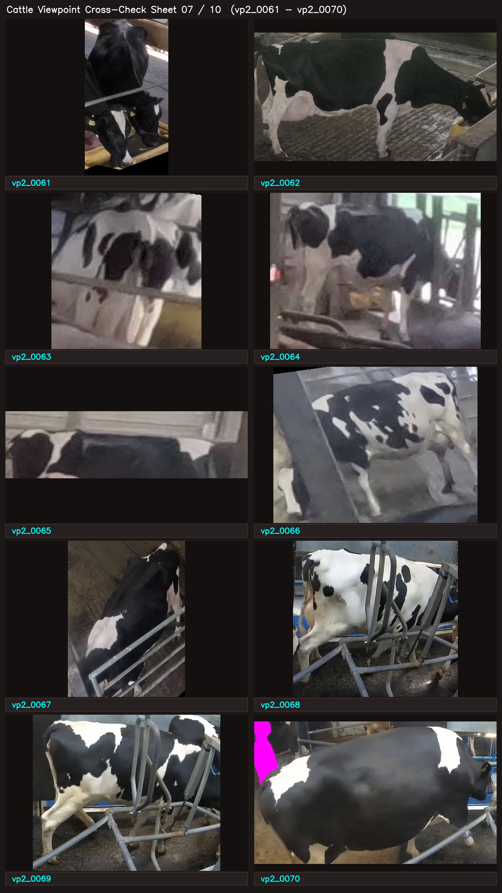
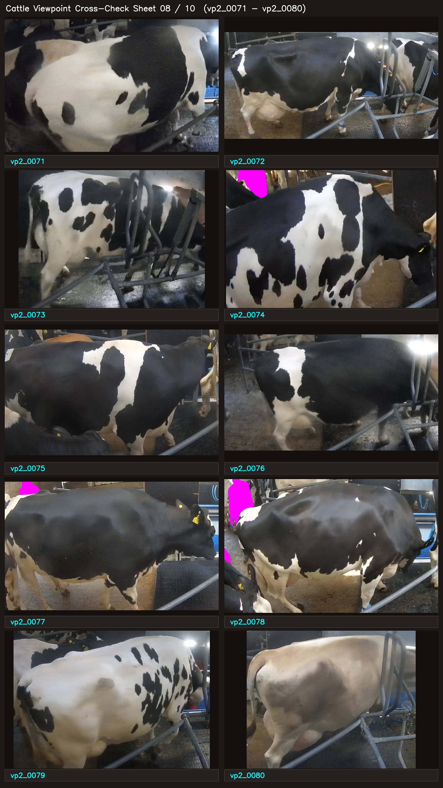
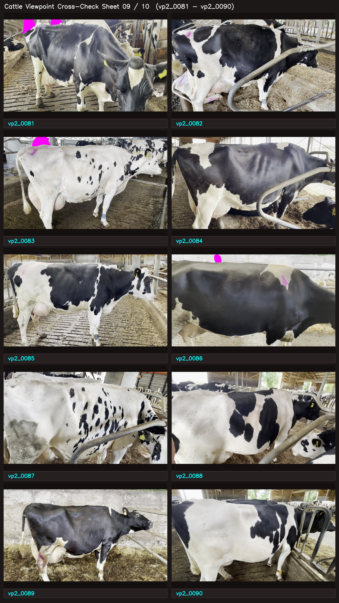
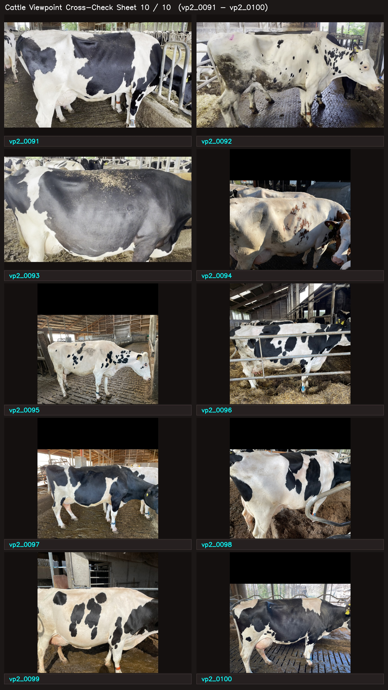

# Phase 3 Cattle Viewpoint Expanded Cross-Check Index (100 Samples)

**Status**: Provisional Agent Visual Labels Pending Independent ChatGPT Vision Cross-Check  
**Date**: 2026-09-20  
**Manifest**: [artifacts/perception_audit/viewpoint_expanded_agent_review_manifest.csv](file:///D:/cattle-health-monitoring-multi-task-model/artifacts/perception_audit/viewpoint_expanded_agent_review_manifest.csv)  
**Asset Directory**: [docs/audits/assets/viewpoint_expanded_crosscheck](file:///D:/cattle-health-monitoring-multi-task-model/docs/audits/assets/viewpoint_expanded_crosscheck)  

---

## 1. Purpose & Provenance

This review pack contains **100 new, non-overlapping cattle images** across our three primary Phase 3 datasets:
- **ScienceDB**: 34 samples (5 BCS classes, 3 farms: GS, YM, STEREO)
- **MmCows**: 33 samples (7 behaviors, 4 cameras, 15 unique cows)
- **SideViewCows2026**: 33 samples (parlor, barn, snapshots across 28 cows)

> [!IMPORTANT]
> **Provisional Review Status**: These 100 labels represent initial visual labeling by the coding/research agent and are **provisional**. They have **NOT** been merged with the human-verified 60-image manifest and do **NOT** constitute final ground truth.
> 
> The 10 contact sheets below are **completely blind**: each image displays **ONLY** its sample ID (`vp2_0001` to `vp2_0100`) with zero metadata, zero bounding boxes, and zero viewpoint hints.
> 
> **Next Step**: An independent ChatGPT vision session will inspect these blind contact sheets, produce blind predictions, and compare against the agent labels to identify consensus and resolve edge cases.

---

## 2. Coarse Viewpoint Taxonomy

- **`rear`**: Cow body is viewed mainly from behind. Hindquarters and tail region face the viewer; head points away.
- **`rear-oblique`**: Three-quarter body orientation viewed from behind. Both rear and one side/flank are clearly visible.
- **`side`**: Dominant whole-body orientation is lateral/broadside.
- **`front-oblique`**: Three-quarter body orientation viewed from the front. Head/chest plus one side/flank are clearly visible.
- **`front`**: Cow body is viewed mainly from the front, with head/chest facing the viewer.
- **`unknown / ambiguous`**: Reserved for severe occlusion, extreme partial crops, or ambiguous orientations where physical orientation cannot be determined reliably.

---

## 3. Blind Contact Sheets for ChatGPT Vision Cross-Check

### Contact Sheet 01 / 10: Samples `vp2_0001` to `vp2_0010`

| Cell Position | Sample ID |
|---|---|
| Row 1, Col 1 | `vp2_0001` |
| Row 1, Col 2 | `vp2_0002` |
| Row 2, Col 1 | `vp2_0003` |
| Row 2, Col 2 | `vp2_0004` |
| Row 3, Col 1 | `vp2_0005` |
| Row 3, Col 2 | `vp2_0006` |
| Row 4, Col 1 | `vp2_0007` |
| Row 4, Col 2 | `vp2_0008` |
| Row 5, Col 1 | `vp2_0009` |
| Row 5, Col 2 | `vp2_0010` |

### Contact Sheet 02 / 10: Samples `vp2_0011` to `vp2_0020`

| Cell Position | Sample ID |
|---|---|
| Row 1, Col 1 | `vp2_0011` |
| Row 1, Col 2 | `vp2_0012` |
| Row 2, Col 1 | `vp2_0013` |
| Row 2, Col 2 | `vp2_0014` |
| Row 3, Col 1 | `vp2_0015` |
| Row 3, Col 2 | `vp2_0016` |
| Row 4, Col 1 | `vp2_0017` |
| Row 4, Col 2 | `vp2_0018` |
| Row 5, Col 1 | `vp2_0019` |
| Row 5, Col 2 | `vp2_0020` |

### Contact Sheet 03 / 10: Samples `vp2_0021` to `vp2_0030`

| Cell Position | Sample ID |
|---|---|
| Row 1, Col 1 | `vp2_0021` |
| Row 1, Col 2 | `vp2_0022` |
| Row 2, Col 1 | `vp2_0023` |
| Row 2, Col 2 | `vp2_0024` |
| Row 3, Col 1 | `vp2_0025` |
| Row 3, Col 2 | `vp2_0026` |
| Row 4, Col 1 | `vp2_0027` |
| Row 4, Col 2 | `vp2_0028` |
| Row 5, Col 1 | `vp2_0029` |
| Row 5, Col 2 | `vp2_0030` |

### Contact Sheet 04 / 10: Samples `vp2_0031` to `vp2_0040`

| Cell Position | Sample ID |
|---|---|
| Row 1, Col 1 | `vp2_0031` |
| Row 1, Col 2 | `vp2_0032` |
| Row 2, Col 1 | `vp2_0033` |
| Row 2, Col 2 | `vp2_0034` |
| Row 3, Col 1 | `vp2_0035` |
| Row 3, Col 2 | `vp2_0036` |
| Row 4, Col 1 | `vp2_0037` |
| Row 4, Col 2 | `vp2_0038` |
| Row 5, Col 1 | `vp2_0039` |
| Row 5, Col 2 | `vp2_0040` |

### Contact Sheet 05 / 10: Samples `vp2_0041` to `vp2_0050`

| Cell Position | Sample ID |
|---|---|
| Row 1, Col 1 | `vp2_0041` |
| Row 1, Col 2 | `vp2_0042` |
| Row 2, Col 1 | `vp2_0043` |
| Row 2, Col 2 | `vp2_0044` |
| Row 3, Col 1 | `vp2_0045` |
| Row 3, Col 2 | `vp2_0046` |
| Row 4, Col 1 | `vp2_0047` |
| Row 4, Col 2 | `vp2_0048` |
| Row 5, Col 1 | `vp2_0049` |
| Row 5, Col 2 | `vp2_0050` |

### Contact Sheet 06 / 10: Samples `vp2_0051` to `vp2_0060`

| Cell Position | Sample ID |
|---|---|
| Row 1, Col 1 | `vp2_0051` |
| Row 1, Col 2 | `vp2_0052` |
| Row 2, Col 1 | `vp2_0053` |
| Row 2, Col 2 | `vp2_0054` |
| Row 3, Col 1 | `vp2_0055` |
| Row 3, Col 2 | `vp2_0056` |
| Row 4, Col 1 | `vp2_0057` |
| Row 4, Col 2 | `vp2_0058` |
| Row 5, Col 1 | `vp2_0059` |
| Row 5, Col 2 | `vp2_0060` |

### Contact Sheet 07 / 10: Samples `vp2_0061` to `vp2_0070`

| Cell Position | Sample ID |
|---|---|
| Row 1, Col 1 | `vp2_0061` |
| Row 1, Col 2 | `vp2_0062` |
| Row 2, Col 1 | `vp2_0063` |
| Row 2, Col 2 | `vp2_0064` |
| Row 3, Col 1 | `vp2_0065` |
| Row 3, Col 2 | `vp2_0066` |
| Row 4, Col 1 | `vp2_0067` |
| Row 4, Col 2 | `vp2_0068` |
| Row 5, Col 1 | `vp2_0069` |
| Row 5, Col 2 | `vp2_0070` |

### Contact Sheet 08 / 10: Samples `vp2_0071` to `vp2_0080`

| Cell Position | Sample ID |
|---|---|
| Row 1, Col 1 | `vp2_0071` |
| Row 1, Col 2 | `vp2_0072` |
| Row 2, Col 1 | `vp2_0073` |
| Row 2, Col 2 | `vp2_0074` |
| Row 3, Col 1 | `vp2_0075` |
| Row 3, Col 2 | `vp2_0076` |
| Row 4, Col 1 | `vp2_0077` |
| Row 4, Col 2 | `vp2_0078` |
| Row 5, Col 1 | `vp2_0079` |
| Row 5, Col 2 | `vp2_0080` |

### Contact Sheet 09 / 10: Samples `vp2_0081` to `vp2_0090`

| Cell Position | Sample ID |
|---|---|
| Row 1, Col 1 | `vp2_0081` |
| Row 1, Col 2 | `vp2_0082` |
| Row 2, Col 1 | `vp2_0083` |
| Row 2, Col 2 | `vp2_0084` |
| Row 3, Col 1 | `vp2_0085` |
| Row 3, Col 2 | `vp2_0086` |
| Row 4, Col 1 | `vp2_0087` |
| Row 4, Col 2 | `vp2_0088` |
| Row 5, Col 1 | `vp2_0089` |
| Row 5, Col 2 | `vp2_0090` |

### Contact Sheet 10 / 10: Samples `vp2_0091` to `vp2_0100`

| Cell Position | Sample ID |
|---|---|
| Row 1, Col 1 | `vp2_0091` |
| Row 1, Col 2 | `vp2_0092` |
| Row 2, Col 1 | `vp2_0093` |
| Row 2, Col 2 | `vp2_0094` |
| Row 3, Col 1 | `vp2_0095` |
| Row 3, Col 2 | `vp2_0096` |
| Row 4, Col 1 | `vp2_0097` |
| Row 4, Col 2 | `vp2_0098` |
| Row 5, Col 1 | `vp2_0099` |
| Row 5, Col 2 | `vp2_0100` |

---

## 4. Cross-Check Protocol

1. Send the 10 blind contact sheet images to ChatGPT without any metadata or agent predictions.
2. Prompt ChatGPT to assign one of the 6 taxonomy classes (`rear`, `rear-oblique`, `side`, `front-oblique`, `front`, `unknown / ambiguous`) to each sample ID.
3. Tabulate agreement, compute Cohen's kappa / raw concordance, and investigate all disagreements.
4. Human user adjudicates remaining edge cases to establish the verified 100-sample cross-checked set.
