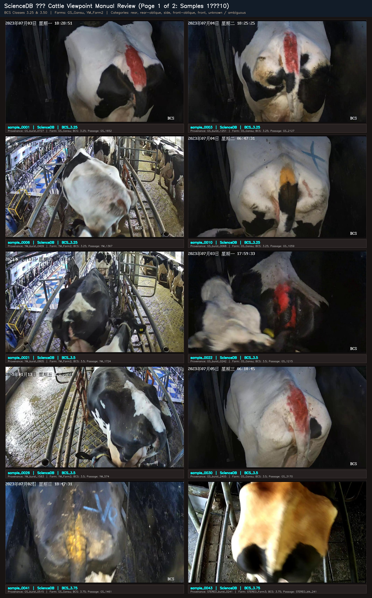
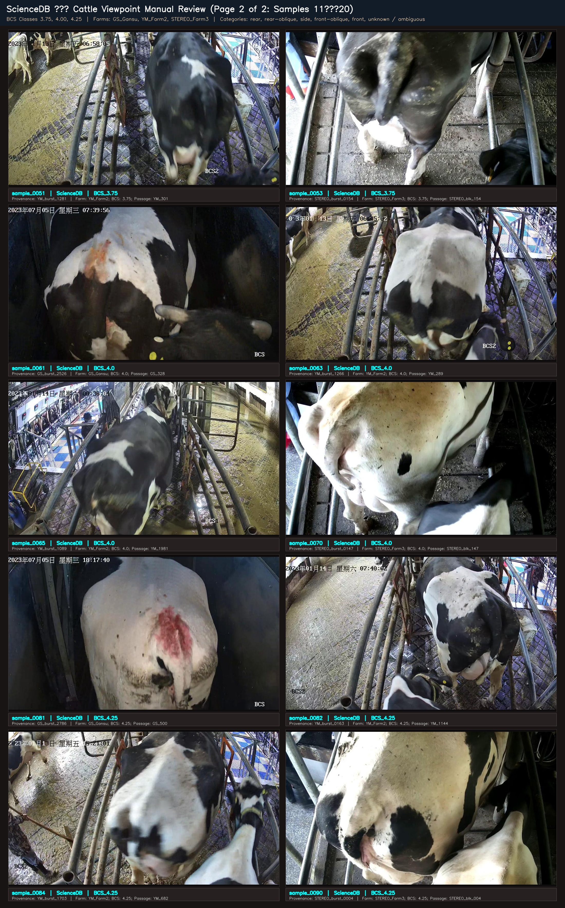
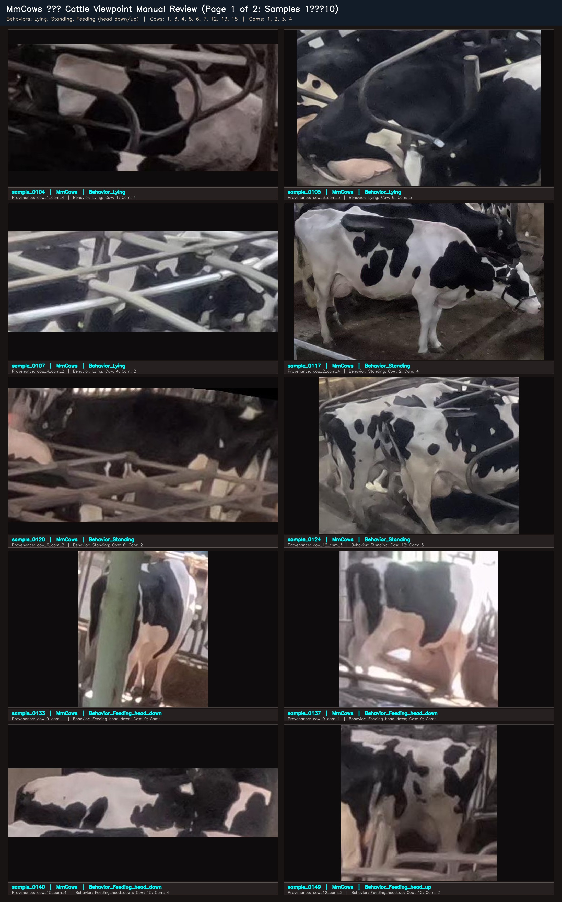
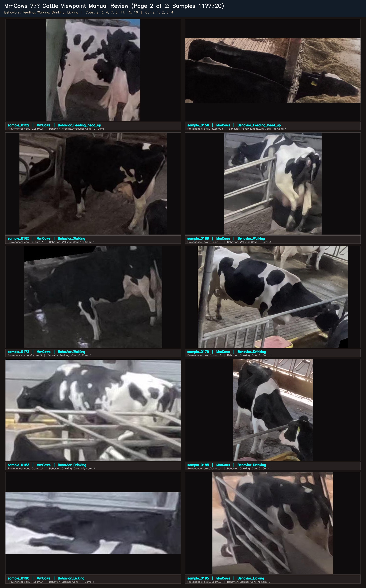
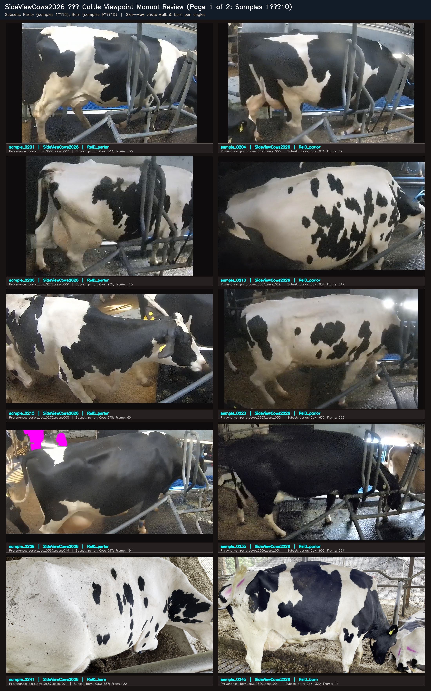
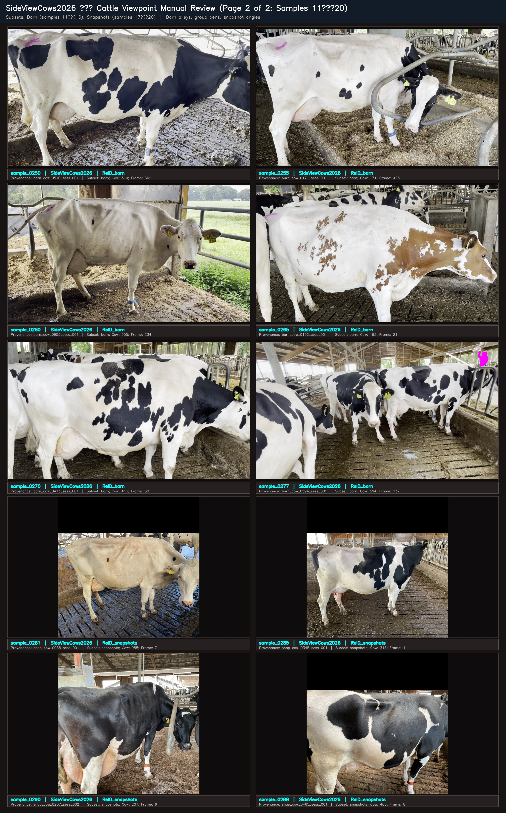

# Phase 3 Viewpoint Visual Review Index (Step 2.4)

**Date**: 2026-09-20  
**Phase**: Phase 3 (Pretrained Perception Feasibility Audit — Step 2.4 Viewpoint Taxonomy Definition)  
**Manifest**: [artifacts/perception_audit/viewpoint_manual_review_manifest.csv](file:///d:/cattle-health-monitoring-multi-task-model/artifacts/perception_audit/viewpoint_manual_review_manifest.csv)  
**Status**: `pending_human_review` (Manual review pack built; no model inference or training performed)  

---

## Viewpoint Taxonomy & Evaluation Guidelines

The objective of Step 2.4 is to determine whether cattle body orientation categories are visually definable and consistently usable across our primary datasets without relying on camera ID shortcuts.

### Candidate Coarse Taxonomy:
1. `rear` — Direct rear view (rump, tailhead, hindquarters facing camera).
2. `rear-oblique` — Three-quarter rear perspective (flank and rear visible).
3. `side` — Broadside profile view (full lateral body profile).
4. `front-oblique` — Three-quarter frontal perspective (head, shoulder, and flank visible).
5. `front` — Direct frontal view (head, chest, snout facing camera).
6. `unknown / ambiguous` — Cases where orientation cannot be definitively determined (heavy occlusion, extreme top-down CCTV angle, tight or partial crop, multiple cows causing ambiguity).

> [!IMPORTANT]
> **Camera ID is NOT viewpoint**: In multi-camera surveillance (MmCows) or fixed chutes, camera position must not be treated as a viewpoint proxy. The true viewpoint is defined strictly by the cow's physical body orientation relative to the camera optical axis.

---

## Contact Sheets for Visual Review

### ScienceDB — Cattle Viewpoint Manual Review (Page 1 of 2: Samples 1–10)
*BCS Classes 3.25 & 3.50  |  Farms: GS_Gansu, YM_Farm2  |  Categories: rear, rear-oblique, side, front-oblique, front, unknown / ambiguous*

- **Samples Included (10 images)**: `sample_0001, sample_0003, sample_0006, sample_0010, sample_0021, sample_0022, sample_0026, sample_0030, sample_0041, sample_0043`
- **Contact Sheet File**: `sciencedb_viewpoint_page1.jpg`

---

### ScienceDB — Cattle Viewpoint Manual Review (Page 2 of 2: Samples 11–20)
*BCS Classes 3.75, 4.00, 4.25  |  Farms: GS_Gansu, YM_Farm2, STEREO_Farm3  |  Categories: rear, rear-oblique, side, front-oblique, front, unknown / ambiguous*

- **Samples Included (10 images)**: `sample_0051, sample_0053, sample_0061, sample_0063, sample_0065, sample_0070, sample_0081, sample_0082, sample_0084, sample_0090`
- **Contact Sheet File**: `sciencedb_viewpoint_page2.jpg`

---

### MmCows — Cattle Viewpoint Manual Review (Page 1 of 2: Samples 1–10)
*Behaviors: Lying, Standing, Feeding (head down/up)  |  Cows: 1, 3, 4, 5, 6, 7, 12, 13, 15  |  Cams: 1, 2, 3, 4*

- **Samples Included (10 images)**: `sample_0104, sample_0105, sample_0107, sample_0117, sample_0120, sample_0124, sample_0133, sample_0137, sample_0140, sample_0149`
- **Contact Sheet File**: `mmcows_viewpoint_page1.jpg`

---

### MmCows — Cattle Viewpoint Manual Review (Page 2 of 2: Samples 11–20)
*Behaviors: Feeding, Walking, Drinking, Licking  |  Cows: 2, 3, 4, 7, 8, 11, 15, 16  |  Cams: 1, 2, 3, 4*

- **Samples Included (10 images)**: `sample_0152, sample_0156, sample_0165, sample_0169, sample_0172, sample_0179, sample_0183, sample_0185, sample_0190, sample_0195`
- **Contact Sheet File**: `mmcows_viewpoint_page2.jpg`

---

### SideViewCows2026 — Cattle Viewpoint Manual Review (Page 1 of 2: Samples 1–10)
*Subsets: Parlor (samples 1–8), Barn (samples 9–10)  |  Side-view chute walk & barn pen angles*

- **Samples Included (10 images)**: `sample_0201, sample_0204, sample_0206, sample_0210, sample_0215, sample_0220, sample_0228, sample_0235, sample_0241, sample_0245`
- **Contact Sheet File**: `sideviewcows2026_viewpoint_page1.jpg`

---

### SideViewCows2026 — Cattle Viewpoint Manual Review (Page 2 of 2: Samples 11–20)
*Subsets: Barn (samples 11–16), Snapshots (samples 17–20)  |  Barn alleys, group pens, snapshot angles*

- **Samples Included (10 images)**: `sample_0250, sample_0255, sample_0260, sample_0265, sample_0270, sample_0277, sample_0281, sample_0285, sample_0290, sample_0298`
- **Contact Sheet File**: `sideviewcows2026_viewpoint_page2.jpg`

---
